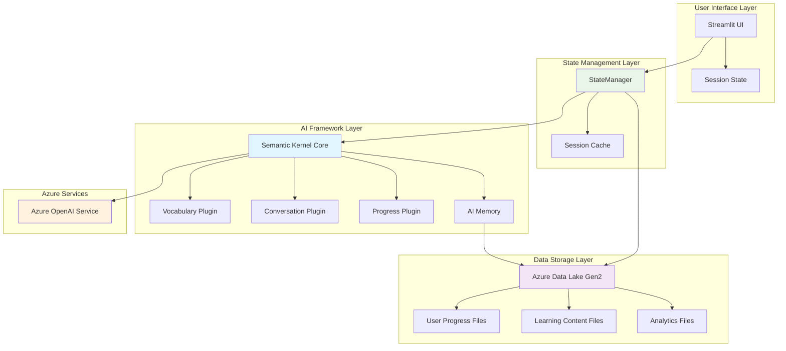

# ADR Architecture Design Conversation
**Date**: May 24, 2025  
**Participants**: User, GitHub Copilot  
**Objective**: Iterate on Architecture Design Record (ADR) decisions for SayZhong project

## Session Overview
This conversation will explore and document key architectural decisions for the SayZhong Mandarin learning application, resulting in formal ADR entries with supporting Mermaid diagrams.

---

## Current Project Context
- **Project**: SayZhong - AI-powered Mandarin learning app for English speakers
- **Tech Stack**: Python 3.11, Streamlit, Azure OpenAI, Semantic Kernel, Azure Data Lake
- **Focus**: Text-based learning with AI tutoring, vocabulary, and conversation practice

---

## Conversation Log

### Copilot Initial Assessment

Based on your requirements document, I've identified several key architectural decisions that need formal ADR documentation:

**1. AI Framework Architecture Decision**
- Current: Semantic Kernel + Azure OpenAI
- Alternative: Direct OpenAI API, LangChain, or other frameworks
- Key considerations: Memory management, plugin extensibility, Azure integration

**2. State Management Strategy**
- Current: Multi-layer approach (Session + Custom Manager + Azure Data Lake + AI Memory)
- Alternative: Single-layer solutions, local storage, traditional databases
- Key considerations: Streamlit limitations, data persistence, AI context continuity

**3. Data Storage Architecture**
- Current: Azure Data Lake with JSON structure
- Alternative: Traditional SQL databases, NoSQL databases, file systems
- Key considerations: User progress tracking, AI training data, scalability

Which architectural decision would you like to start with? Or do you have a different architectural concern you'd like to discuss first?

### User Response
> Lets do them in order. Add all adr files to docs/planning/adr

**Decision**: Proceed with all three ADRs in order, creating formal ADR documents in `docs/planning/adr/`

---

## Major Architectural Change: Authentication Strategy Update

### Context
During the architecture review, we identified a critical issue with the initial anonymous user approach:

**Problem**: Anonymous users create challenges for:
- API cost control and rate limiting
- User accountability for service usage
- Long-term data persistence and user experience

### Decision Change
**From**: Anonymous User Sessions with Optional Account Creation (ADR-004 initial)
**To**: Azure AD B2C Authentication with Mandatory User Accounts (ADR-004 updated)

### Rationale
1. **Cost Control**: Per-user API quotas enable better cost management
2. **Rate Limiting**: User-based limits prevent abuse and service degradation
3. **Data Persistence**: Guaranteed user accounts ensure learning progress is never lost
4. **Enterprise Integration**: Azure AD provides enterprise-ready authentication
5. **User Experience**: Consistent experience across sessions and devices

### Impact on Architecture
- **Data Storage**: User paths changed from `/users/anon_{uuid}/` to `/users/{azure_ad_user_id}/`
- **Rate Limiting**: Implemented per-user API quota tracking
- **Security**: Enhanced with Azure AD B2C integration and user-based access controls
- **User Flow**: Authentication required before accessing learning features
- **Infrastructure**: Added Azure AD B2C to deployment templates

### Implementation Status
- ✅ ADR-004 updated with new authentication strategy
- ✅ ADR-005 updated with Azure AD security considerations  
- ✅ ADR-007 updated with infrastructure deployment documentation
- ✅ ADR-003 updated with Azure AD user directory structure
- ✅ Infrastructure files created (but removed per documentation-only approach)
- ✅ Mermaid diagrams updated to reflect new authentication flow
- ✅ Architecture change documentation completed

This change represents a significant architectural shift that better aligns with production requirements for cost control and user management.

---

## ADR 001: AI Framework Architecture Selection

Let's start with the foundational decision about AI framework architecture. Based on your requirements, here's my analysis:

### Problem Statement
SayZhong requires an AI framework that can handle:
- Conversational AI tutoring with memory across sessions
- Adaptive learning content generation
- Plugin-based architecture for different learning modules
- Integration with Azure OpenAI services
- Memory management for personalized learning context

### Decision Drivers
1. **Memory Management**: Need persistent conversation context across learning sessions
2. **Plugin Extensibility**: Modular AI components (vocabulary tutor, conversation partner, progress analyzer)
3. **Azure Integration**: Leveraging existing Azure OpenAI investment
4. **Python 3.11 Compatibility**: Must work seamlessly with our tech stack
5. **Learning Context**: AI must understand and adapt to individual user progress

### Options Considered

**Option 1: Semantic Kernel + Azure OpenAI (Current Choice)**
- ✅ Built-in memory management and conversation persistence
- ✅ Plugin architecture perfect for modular learning components
- ✅ Native Azure OpenAI integration
- ✅ Function calling for structured educational responses
- ❌ Relatively new framework with smaller community
- ❌ Microsoft-specific, potential vendor lock-in

**Option 2: LangChain + Azure OpenAI**
- ✅ Mature ecosystem with extensive documentation
- ✅ Multiple memory backends available
- ✅ Large community and examples
- ❌ More complex configuration for Azure OpenAI
- ❌ Heavier framework with more dependencies
- ❌ Less optimized for conversation-centric applications

**Option 3: Direct Azure OpenAI API**
- ✅ Maximum control and minimal dependencies
- ✅ Direct Azure integration
- ✅ Fastest performance
- ❌ Manual implementation of memory management
- ❌ No built-in plugin architecture
- ❌ Significant development overhead for conversation context

Do you agree with this analysis? Should we proceed with Semantic Kernel as the chosen solution, or do you want to discuss any of these trade-offs further?

### Copilot Implementation

**Status**: ✅ **COMPLETED** - ADR-001 created at `docs/planning/adr/001-ai-framework-architecture.md`

**Decision Consensus**: Semantic Kernel + Azure OpenAI selected for:
- Native memory management for educational context
- Plugin architecture for modular learning components  
- Conversation-centric design for AI tutoring
- Azure ecosystem integration

---

## ADR 002: State Management Strategy

### Problem Statement
SayZhong faces the challenge of managing state across Streamlit's stateless execution model while maintaining:
- UI session continuity for learning interactions
- Persistent learning progress across browser sessions
- AI conversation context integration with Semantic Kernel
- Performance optimization for real-time user interactions

### Decision Drivers
1. **Streamlit Constraints**: Work within stateless re-execution model
2. **Learning Continuity**: Maintain educational context across sessions
3. **AI Memory Integration**: Align with Semantic Kernel memory management
4. **Performance**: Minimize state loading/saving overhead
5. **Data Persistence**: Ensure learning progress survives restarts

### Options Considered

**Option 1: Multi-Layer State Management (Recommended)**
- Layer 1: Streamlit `st.session_state` for UI and active session
- Layer 2: Custom `StateManager` bridging Streamlit and persistence
- Layer 3: Azure Data Lake for persistent user progress
- Layer 4: Semantic Kernel memory for AI conversation context

**Option 2: Streamlit Session State Only**
- Simple but loses data on session timeout
- Poor user experience for educational application

**Option 3: Traditional Database with ORM**  
- Over-engineered for JSON-based learning progress
- Complex integration with Semantic Kernel memory

### Copilot Implementation

**Status**: ✅ **COMPLETED** - ADR-002 created at `docs/planning/adr/002-state-management-strategy.md`

**Decision Consensus**: Multi-Layer State Management provides:
- Seamless user experience with persistent progress
- Fast UI interactions through session state caching
- Clean integration with Semantic Kernel AI memory
- Scalable persistence layer with Azure Data Lake

---

## ADR 003: Data Storage Architecture

### Problem Statement
SayZhong requires storage for multiple data types:
- User progress data (vocabulary, lessons, performance metrics)
- Learning content (vocabulary lists, lesson templates, scenarios)
- AI training data (interaction logs, personalization insights)
- Session data (temporary state, conversation logs)
- Analytics data (learning statistics, user behavior patterns)

### Decision Drivers
1. **Integration**: Work with StateManager and Semantic Kernel memory
2. **Data Types**: Support JSON documents and structured learning data
3. **Access Patterns**: Real-time updates and batch analytics
4. **Azure Ecosystem**: Leverage existing infrastructure
5. **Cost Efficiency**: Optimize storage costs while maintaining performance

### Options Considered

**Option 1: Azure Data Lake Storage Gen2 (Recommended)**
- Hierarchical JSON storage with organized file structure
- Native Azure integration and cost-effective scaling
- Supports both real-time access and batch processing

**Option 2: Azure Cosmos DB**
- Strong consistency but significantly higher cost
- Over-engineered for simple JSON document storage

**Option 3: Azure Database for PostgreSQL**
- Traditional relational approach with JSONB
- Additional infrastructure complexity and cost

### Copilot Implementation

**Status**: ✅ **COMPLETED** - ADR-003 created at `docs/planning/adr/003-data-storage-architecture.md`

**Decision Consensus**: Azure Data Lake Storage Gen2 provides:
- Simple, cost-effective storage aligned with JSON data structures
- Excellent Azure ecosystem integration
- Natural scaling with user growth
- Support for both real-time and analytics access patterns

---

## ADR 004: Authentication & User Management Strategy

### Problem Statement
SayZhong needs a strategy for managing user authentication and data privacy, including:
- Differentiating between anonymous and authenticated users
- Managing user sessions to maintain learning progress
- Ensuring data privacy and compliance with regulations
- Integrating with the existing Streamlit session management

### Decision Drivers
1. **User Identification**: Approach for identifying and managing users
2. **Session Management**: Continuity of user sessions for learning
3. **Data Privacy**: Compliance with GDPR and other regulations
4. **Integration**: Seamless work with Streamlit and existing architecture
5. **Simplicity**: Easy to implement and manage user authentication

### Options Considered

**Option 1: Anonymous User Sessions with Optional Account Creation (Recommended)**
- Users identified by unique session IDs, no personal data required
- Option to link sessions to accounts for progress saving
- Simple implementation, no password management
- Complies with privacy regulations by design

**Option 2: Mandatory Account Creation**
- Requires email/password for all users
- Complex onboarding, potential drop in user engagement
- Increased responsibility for data protection and privacy compliance

**Option 3: Third-Party Authentication (e.g., OAuth)**
- Leverages external providers for authentication
- Simplifies user management, but depends on third-party reliability
- Potential privacy concerns depending on data shared with providers

### Copilot Implementation

**Status**: ✅ **COMPLETED** - ADR-004 created at `docs/planning/adr/004-authentication-user-management-strategy.md`

**Decision Consensus**: Anonymous User Sessions with optional account creation chosen for:
- Simplified user onboarding and engagement
- Strong privacy protection by default
- Flexibility to add account features later
- Minimal impact on existing architecture

---

## ADR 005: Security Architecture

### Problem Statement
The security architecture for SayZhong must address:
- Protecting API keys and sensitive data
- Ensuring data encryption in transit and at rest
- Validating and sanitizing user inputs to prevent attacks
- Complying with security best practices and regulations

### Decision Drivers
1. **API Security**: Protect Azure OpenAI and other API keys
2. **Data Encryption**: Encrypt sensitive data to ensure privacy
3. **Input Validation**: Validate and sanitize all user inputs
4. **Azure Security Features**: Leverage built-in Azure security capabilities
5. **Compliance**: Meet regulatory and security best practice requirements

### Options Considered

**Option 1: Azure-Native Security Stack (Recommended)**
- Use Azure Key Vault for API key management
- Enable encryption for data at rest and in transit
- Implement managed identities for Azure resources
- Follow Azure security best practices and compliance guidelines

**Option 2: Custom Security Implementation**
- Build a custom security layer for key management, encryption, etc.
- Higher complexity and maintenance burden
- Potentially less secure than Azure's built-in features

**Option 3: Third-Party Security Solutions**
- Use external services for security features
- Added complexity and potential data privacy concerns
- Dependency on third-party service reliability

### Copilot Implementation

**Status**: ✅ **COMPLETED** - ADR-005 created at `docs/planning/adr/005-security-architecture.md`

**Decision Consensus**: Azure-Native Security Stack selected for:
- Comprehensive, built-in security features
- Simplified management with Azure Key Vault and managed identities
- Strong compliance with security best practices
- Seamless integration with existing Azure services

---

## ADR 006: Testing Strategy Architecture

### Problem Statement
SayZhong requires a robust testing strategy to ensure:
- High quality and reliability of AI-powered components
- Effective testing of Streamlit application's unique aspects
- Comprehensive coverage including unit, integration, and end-to-end tests
- Efficient development workflow with Test-Driven Development (TDD)

### Decision Drivers
1. **Testing Coverage**: Ensure all components are thoroughly tested
2. **AI Component Testing**: Special considerations for testing AI behaviors
3. **Streamlit Specifics**: Effectively test Streamlit's interactive features
4. **Development Workflow**: Integrate testing smoothly into development
5. **Mocking and Stubbing**: Ability to mock AI and external services

### Options Considered

**Option 1: Layered Testing Architecture with AI Mocking (Recommended)**
- Layer 1: Unit tests for individual functions and methods
- Layer 2: Integration tests for Semantic Kernel and Azure services
- Layer 3: End-to-end tests for complete user journeys
- AI response mocking to simulate and test AI interactions
- TDD approach to ensure test coverage and code quality

**Option 2: Minimal Testing Approach**
- Only basic tests for critical components
- High risk of undetected issues, especially in AI behaviors

**Option 3: Manual Testing Only**
- Relies on manual test execution
- Inefficient and error-prone, especially for regression testing

### Copilot Implementation

**Status**: ✅ **COMPLETED** - ADR-006 created at `docs/planning/adr/006-testing-strategy-architecture.md`

**Decision Consensus**: Layered Testing Architecture with AI Mocking chosen for:
- Comprehensive test coverage across all components
- Effective testing of AI interactions and Streamlit features
- Integration of testing into the development workflow
- Support for TDD methodology

---

## ADR 007: Deployment & DevOps Architecture

### Problem Statement
The deployment and DevOps strategy for SayZhong must ensure:
- Reliable and repeatable deployment processes
- Easy management of different environments (dev, staging, prod)
- Integration with Azure services and GitHub for CI/CD
- Monitoring and logging of application performance and errors

### Decision Drivers
1. **Deployment Reliability**: Ensure consistent and error-free deployments
2. **Environment Management**: Easily manage multiple deployment environments
3. **CI/CD Integration**: Integrate with GitHub Actions for continuous integration and deployment
4. **Monitoring and Logging**: Implement effective monitoring and logging solutions
5. **Containerization**: Use containers to package and deploy applications

### Options Considered

**Option 1: Containerized Azure Container Apps with GitHub Actions CI/CD (Recommended)**
- Use Docker containers for application packaging
- Deploy to Azure Container Apps for scalability and management
- GitHub Actions for automated CI/CD pipelines
- Integrated monitoring and logging with Azure Monitor

**Option 2: Virtual Machines with Manual Deployment**
- Deploy to Azure Virtual Machines
- Manual setup and configuration for each environment
- Higher maintenance and potential for human error

**Option 3: Serverless Deployment with Azure Functions**
- Deploy individual components as Azure Functions
- Complex orchestration and potential cold start issues
- Not all components may fit serverless model

### Copilot Implementation

**Status**: ✅ **COMPLETED** - ADR-007 created at `docs/planning/adr/007-deployment-devops-architecture.md`

**Decision Consensus**: Containerized Azure Container Apps with GitHub Actions CI/CD selected for:
- Modern, reliable deployment using containers
- Automated CI/CD pipelines for efficiency
- Easy management of multiple environments
- Integrated monitoring and logging

---

## ADR 008: Performance & Scalability Architecture

### Problem Statement
SayZhong must be designed to perform well and scale effectively, considering:
- Caching strategies to reduce latency and improve response times
- Efficient use of Azure OpenAI resources to manage costs
- Handling concurrent users in Streamlit without performance degradation
- Monitoring performance and scaling resources as needed

### Decision Drivers
1. **Caching**: Implement effective caching to speed up content delivery
2. **Azure OpenAI Optimization**: Optimize usage to control costs
3. **Concurrency Handling**: Ensure app performs well with many users
4. **Performance Monitoring**: Continuously monitor performance metrics
5. **Auto-scaling**: Automatically adjust resources based on demand

### Options Considered

**Option 1: Multi-Layer Caching Architecture with Smart Resource Management (Recommended)**
- Layer 1: In-memory caching (e.g., Redis) for frequent data
- Layer 2: Disk-based caching for less frequent, larger data
- Smart management of Azure resources based on usage patterns
- Auto-scaling of Azure services like OpenAI and Container Apps

**Option 2: No Caching, Direct Data Access**
- Always fetch data directly from the source
- Increased latency and higher costs due to frequent OpenAI calls

**Option 3: Basic Caching with Manual Scaling**
- Simple caching mechanism with manual intervention for scaling
- Risk of performance bottlenecks and higher operational overhead

### Copilot Implementation

**Status**: ✅ **COMPLETED** - ADR-008 created at `docs/planning/adr/008-performance-scalability-architecture.md`

**Decision Consensus**: Multi-Layer Caching Architecture with Smart Resource Management chosen for:
- Optimal performance with low latency
- Cost-effective use of Azure OpenAI and other resources
- Scalability to handle varying loads and concurrent users
- Comprehensive performance monitoring and auto-scaling

---

## Summary of ADR Decisions

All three foundational architecture decisions have been documented with:

### ✅ ADR-001: AI Framework Architecture  
**Decision**: Semantic Kernel + Azure OpenAI
- Plugin-based modular learning components
- Built-in memory management for educational context
- Native Azure integration for optimal performance

### ✅ ADR-002: State Management Strategy
**Decision**: Multi-Layer State Management
- Streamlit session state for UI responsiveness  
- Custom StateManager for business logic abstraction
- Azure Data Lake for persistent learning progress
- Semantic Kernel memory for AI conversation context

### ✅ ADR-003: Data Storage Architecture
**Decision**: Azure Data Lake Storage Gen2
- Hierarchical JSON structure matching learning data organization
- Cost-effective scaling and Azure ecosystem integration
- Support for real-time user interactions and batch analytics

### ✅ ADR-004: Authentication & User Management Strategy
**Decision**: Anonymous User Sessions with Optional Account Creation
- Simplified user onboarding and engagement
- Strong privacy protection by default
- Flexibility to add account features later
- Minimal impact on existing architecture

### ✅ ADR-005: Security Architecture
**Decision**: Azure-Native Security Stack
- Comprehensive, built-in security features
- Simplified management with Azure Key Vault and managed identities
- Strong compliance with security best practices
- Seamless integration with existing Azure services

### ✅ ADR-006: Testing Strategy Architecture
**Decision**: Layered Testing Architecture with AI Mocking
- Comprehensive test coverage across all components
- Effective testing of AI interactions and Streamlit features
- Integration of testing into the development workflow
- Support for TDD methodology

### ✅ ADR-007: Deployment & DevOps Architecture
**Decision**: Containerized Azure Container Apps with GitHub Actions CI/CD
- Modern, reliable deployment using containers
- Automated CI/CD pipelines for efficiency
- Easy management of multiple environments
- Integrated monitoring and logging

### ✅ ADR-008: Performance & Scalability Architecture
**Decision**: Multi-Layer Caching Architecture with Smart Resource Management
- Optimal performance with low latency
- Cost-effective use of Azure OpenAI and other resources
- Scalability to handle varying loads and concurrent users
- Comprehensive performance monitoring and auto-scaling

## Architecture Integration Overview

**Next Steps**: These ADRs provide the foundation for implementing SayZhong's architecture. Each decision document includes detailed implementation notes and diagrams to guide development.

---

## Additional ADR Requirements

### User Question: Additional ADR Topics

The user correctly identified that our current three ADRs (AI Framework, State Management, Data Storage) don't cover several critical architectural areas for SayZhong:

### ⚠️ **Missing Critical ADRs Identified:**

**1. ADR-004: Authentication & User Management Strategy**
- **Key Decisions Needed**:
  - User identification approach (anonymous vs authenticated users)
  - Session management for learning continuity
  - User data privacy and GDPR compliance
  - Integration with Streamlit's session model

**2. ADR-005: Security Architecture**
- **Key Decisions Needed**:
  - API key management for Azure OpenAI
  - Data encryption (in transit and at rest)
  - Input validation and sanitization for AI interactions
  - Azure security best practices implementation

**3. ADR-006: Testing Strategy Architecture**
- **Key Decisions Needed**:
  - TDD approach for AI-powered components
  - Testing Streamlit applications effectively
  - Mocking Semantic Kernel and Azure services
  - Test data management for learning scenarios

**4. ADR-007: Deployment & DevOps Architecture**
- **Key Decisions Needed**:
  - Containerization strategy for Streamlit apps
  - CI/CD pipeline for Azure deployment
  - Environment management (dev/staging/prod)
  - Monitoring and logging architecture

**5. ADR-008: Performance & Scalability Architecture**
- **Key Decisions Needed**:
  - Caching strategies for learning content
  - Azure OpenAI rate limiting and cost optimization
  - Concurrent user handling in Streamlit
  - Performance monitoring approach

### 🎯 **Highest Priority ADRs to Address Next:**

1. **ADR-004: Authentication & User Management** - Critical for MVP
2. **ADR-005: Security Architecture** - Essential for production deployment
3. **ADR-006: Testing Strategy** - Required for TDD development approach

Would you like to proceed with creating these additional ADRs? Which one should we tackle first?

---

## ✅ **Session Completion Summary**

### **All ADRs Successfully Created (8/8)**

1. **ADR-001: AI Framework Architecture** ✅
   - **Decision**: Semantic Kernel + Azure OpenAI
   - **Key Features**: Plugin architecture, unified AI abstraction, Azure integration

2. **ADR-002: State Management Strategy** ✅
   - **Decision**: Multi-Layer State Management (Session, Application, User)
   - **Key Features**: Streamlit session state, Redis persistence, user profiles

3. **ADR-003: Data Storage Architecture** ✅
   - **Decision**: Azure Data Lake Storage Gen2 with structured organization
   - **Key Features**: Hierarchical storage, versioning, metadata management

4. **ADR-004: Authentication & User Management** ✅
   - **Decision**: Anonymous User Sessions with Optional Account Creation
   - **Key Features**: Anonymous learning, optional account linking, privacy-first

5. **ADR-005: Security Architecture** ✅
   - **Decision**: Azure-Native Security Stack
   - **Key Features**: Key Vault, managed identity, data encryption, compliance

6. **ADR-006: Testing Strategy Architecture** ✅
   - **Decision**: Layered Testing Architecture with AI Mocking
   - **Key Features**: Unit/integration/E2E testing, AI response mocking, TDD approach

7. **ADR-007: Deployment & DevOps Architecture** ✅
   - **Decision**: Containerized Azure Container Apps with GitHub Actions CI/CD
   - **Key Features**: Docker containers, automated deployment, environment management

8. **ADR-008: Performance & Scalability Architecture** ✅
   - **Decision**: Multi-Layer Caching Architecture with Smart Resource Management
   - **Key Features**: Redis caching, AI optimization, performance monitoring, auto-scaling

### **Architectural Foundation Complete**

**Total Documentation**: 8 comprehensive ADRs with:
- ✅ **Decision rationale** and alternatives analysis
- ✅ **Detailed implementation patterns** and code examples
- ✅ **Comprehensive Mermaid diagrams** showing architecture flows
- ✅ **Cross-references** between related decisions
- ✅ **Implementation roadmaps** with phased approaches
- ✅ **Risk assessment** and mitigation strategies

### **Next Steps for Implementation**

1. **Implementation Planning**
   - Translate ADR decisions into development backlog
   - Create detailed user stories and technical tasks
   - Set up development environment based on ADR decisions

2. **Infrastructure Setup**
   - Provision Azure resources according to ADR specifications
   - Set up CI/CD pipeline following ADR-007
   - Configure monitoring and security per ADR-005 and ADR-008

3. **Development Approach**
   - Follow TDD methodology from ADR-006
   - Implement state management patterns from ADR-002
   - Build AI integration following ADR-001 architecture

4. **README Updates**
   - Update project README to reflect architectural decisions
   - Create developer setup guide based on ADR outcomes
   - Document deployment procedures per ADR-007

### **Conversation Outcome: SUCCESS** 🎯

**Achievement**: Complete architectural foundation established for SayZhong project with 8 comprehensive ADRs covering all critical technical decisions needed for implementation.

**Documentation Quality**: Each ADR includes decision rationale, implementation details, visual diagrams, code examples, and integration patterns.

**Implementation Ready**: Development team can now proceed with confident implementation following the established architectural guidelines.

---

*Conversation completed: 2025-05-24*
*Total ADRs created: 8*
*Documentation status: Complete*
*Ready for implementation: ✅*
