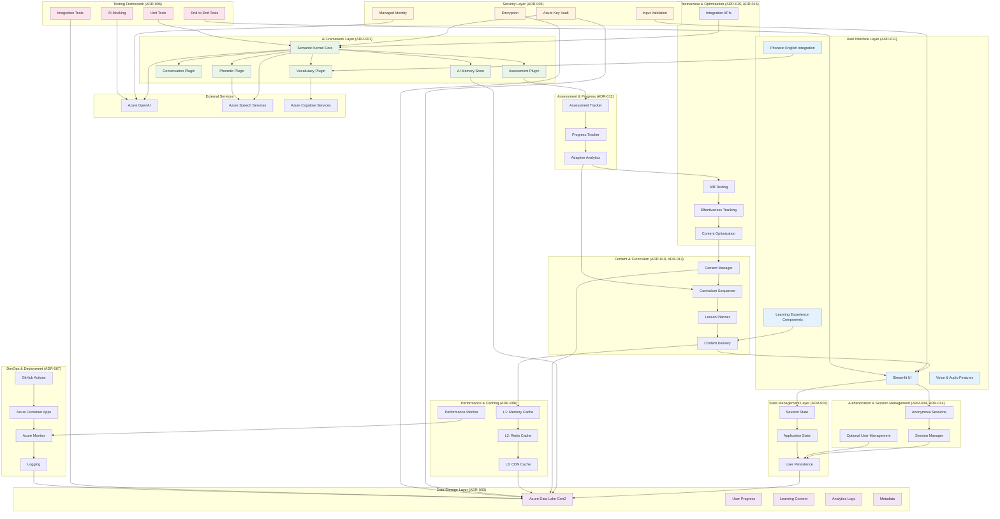

# ADR-000: SayZhong Architecture Overview

**Status**: Summary Document  
**Date**: 2025-05-29  
**Deciders**: Development Team  
**Purpose**: Comprehensive overview of all architectural decisions

## Executive Summary

This document provides a comprehensive overview of the SayZhong Mandarin learning application architecture, summarizing all architectural decisions (ADRs 001-016) and their relationships. SayZhong is an AI-powered, text-based Mandarin learning application designed specifically for English speakers, emphasizing vocabulary, conversation, pronunciation (with phonetic English support), and grammar learning.

## Architecture Philosophy

SayZhong's architecture follows these core principles:
- **AI-Centric Learning**: Leveraging conversational AI for personalized tutoring
- **Phonetic-First Approach**: Focusing on pronunciation with English phonetic approximations
- **Simplified Learning Path**: Concentrating on vocabulary and conversation over character writing
- **Privacy-Preserving**: Anonymous sessions with optional account creation
- **Azure-Native**: Full integration with Azure ecosystem for scalability and security
- **Test-Driven Development**: Comprehensive testing strategy for reliable AI interactions

## System Architecture Overview

## ADR Summary Table

| ADR | Title | Status | Decision | Key Impact |
|-----|-------|--------|----------|------------|
| **001** | AI Framework Architecture | ✅ Accepted | Semantic Kernel + Azure OpenAI | Foundation for all AI interactions |
| **002** | State Management Strategy | ✅ Accepted | Multi-Layer State Management | Session persistence and user experience |
| **003** | Data Storage Architecture | ✅ Accepted | Azure Data Lake Storage Gen2 | Scalable, cost-effective data storage |
| **004** | Authentication & User Management | ✅ Accepted | Anonymous Sessions + Optional Accounts | Privacy-first user experience |
| **005** | Security Architecture | ✅ Accepted | Azure-Native Security Stack | Comprehensive security and compliance |
| **006** | Testing Strategy Architecture | ✅ Accepted | Layered Testing with AI Mocking | Quality assurance for AI components |
| **007** | Deployment & DevOps | ✅ Accepted | Containerized Azure Container Apps | Automated, reliable deployment |
| **008** | Performance & Scalability | ✅ Accepted | Multi-Layer Caching Architecture | Optimal performance and cost efficiency |
| **009** | Learning Effectiveness Feedback | ✅ Accepted | AI-Powered Feedback Loop | Continuous learning improvement |
| **010** | Content Management & Curriculum | ✅ Accepted | Mandarin-Specific Content Models | Structured learning with phonetic support |
| **011** | User Interface & Learning Experience | ✅ Accepted | Adaptive Learning UI | Engaging, accessible learning interface |
| **012** | Assessment & Progress Tracking | ✅ Accepted | Comprehensive Assessment System | Detailed progress monitoring |
| **013** | Lesson Planning & Content Sequencing | ✅ Accepted | AI-Powered Adaptive Sequencing | Personalized learning paths |
| **014** | Real-Time Interaction & Session Management | ✅ Accepted | Real-Time Learning Sessions | Interactive, responsive learning |
| **015** | Content Effectiveness & A/B Testing | ✅ Accepted | Systematic A/B Testing Framework | Data-driven content optimization |
| **016** | Integration & API Architecture | ✅ Accepted | Comprehensive Integration Layer | Seamless system component integration |

## Key Architectural Decisions

### Foundation Layer (ADRs 001-003)
- **AI Framework**: Semantic Kernel provides plugin-based AI architecture with built-in memory management
- **State Management**: Multi-layer approach balancing Streamlit constraints with educational persistence needs
- **Data Storage**: Azure Data Lake offers cost-effective, scalable storage for hierarchical learning data

### User & Security Layer (ADRs 004-005)
- **Authentication**: Anonymous-first approach reduces barriers while maintaining optional account features
- **Security**: Azure-native security stack provides enterprise-grade protection with minimal configuration

### Quality & Operations Layer (ADRs 006-008)
- **Testing**: Comprehensive testing strategy with AI mocking enables reliable development of AI-powered features
- **Deployment**: Containerized deployment with GitHub Actions provides automated, scalable CI/CD
- **Performance**: Multi-layer caching optimizes AI response times and reduces Azure OpenAI costs

### Learning Platform Layer (ADRs 009-016)
- **Content Management**: Mandarin-specific models with phonetic English support for pronunciation learning
- **User Experience**: Adaptive interface focusing on vocabulary, conversation, and pronunciation
- **Assessment**: Comprehensive progress tracking without character writing complexity
- **Lesson Planning**: AI-powered sequencing adapts to individual learning progress
- **Real-Time Interaction**: Responsive session management for engaging learning experiences
- **Content Optimization**: A/B testing framework enables data-driven content improvement
- **Integration**: Unified API layer connects all system components seamlessly

## Architecture Benefits

### For Learners
- **Simplified Learning Path**: Focus on practical communication skills without character writing complexity
- **Phonetic Support**: English phonetic approximations help with pronunciation
- **Personalized Experience**: AI adapts to individual learning patterns and progress
- **Privacy Protection**: Anonymous sessions protect learner privacy by default
- **Responsive Interface**: Fast, engaging learning experience with real-time feedback

### For Developers
- **Modular Architecture**: Plugin-based AI framework enables independent feature development
- **Test-Driven Development**: Comprehensive testing strategy ensures reliable AI interactions
- **Azure Integration**: Native Azure services reduce infrastructure complexity
- **Automated Deployment**: CI/CD pipeline enables rapid, reliable releases
- **Performance Monitoring**: Built-in observability for proactive issue resolution

### For Operations
- **Cost Optimization**: Multi-layer caching reduces Azure OpenAI API costs
- **Scalable Infrastructure**: Auto-scaling Azure Container Apps handle varying loads
- **Security Compliance**: Azure-native security meets enterprise requirements
- **Monitoring & Alerting**: Comprehensive observability for system health
- **Content Optimization**: A/B testing enables data-driven content decisions

## Technology Stack

### Core Technologies
- **Runtime**: Python 3.11
- **UI Framework**: Streamlit
- **AI Framework**: Microsoft Semantic Kernel
- **AI Services**: Azure OpenAI, Azure Speech Services
- **Data Storage**: Azure Data Lake Storage Gen2
- **Caching**: Redis, Azure CDN
- **Authentication**: Azure Active Directory (optional)

### Development & Operations
- **Testing**: pytest, Streamlit testing framework
- **CI/CD**: GitHub Actions
- **Deployment**: Docker, Azure Container Apps
- **Monitoring**: Azure Monitor, Application Insights
- **Security**: Azure Key Vault, Managed Identity

### Architecture Patterns
- **Plugin Architecture**: Modular AI components
- **Multi-Layer State Management**: Session, application, and persistence layers
- **Event-Driven Architecture**: Real-time learning interactions
- **Microservices**: Independent, scalable service components
- **Observer Pattern**: Learning effectiveness feedback loops

## Implementation Roadmap

### Phase 1: Foundation (Weeks 1-4)
1. **Infrastructure Setup** (ADR-007, ADR-008)
   - Azure resource provisioning
   - CI/CD pipeline configuration
   - Monitoring and security setup

2. **Core AI Framework** (ADR-001, ADR-002)
   - Semantic Kernel integration
   - Basic plugin architecture
   - State management implementation

3. **Data Layer** (ADR-003, ADR-005)
   - Azure Data Lake configuration
   - Security controls implementation
   - Basic data models

### Phase 2: Learning Platform (Weeks 5-8)
1. **Content Management** (ADR-010, ADR-013)
   - Mandarin-specific content models
   - Basic curriculum framework
   - Lesson planning system

2. **User Interface** (ADR-011, ADR-014)
   - Streamlit UI implementation
   - Phonetic English integration
   - Real-time interaction features

3. **Assessment System** (ADR-012)
   - Progress tracking implementation
   - Vocabulary assessment tools
   - Basic analytics

### Phase 3: Optimization & Integration (Weeks 9-12)
1. **Effectiveness Tracking** (ADR-009, ADR-015)
   - A/B testing framework
   - Learning effectiveness metrics
   - Content optimization tools

2. **Performance Optimization** (ADR-008)
   - Multi-layer caching implementation
   - Performance monitoring
   - Cost optimization

3. **Integration & APIs** (ADR-016)
   - External service integration
   - API layer implementation
   - Third-party compatibility

### Phase 4: Testing & Launch (Weeks 13-16)
1. **Comprehensive Testing** (ADR-006)
   - Unit test implementation
   - Integration testing
   - End-to-end testing
   - AI mocking framework

2. **Production Readiness**
   - Security audit and compliance
   - Performance testing and optimization
   - Documentation completion
   - User acceptance testing

## Risk Mitigation

### Technical Risks
- **AI Framework Maturity**: Semantic Kernel monitoring and fallback planning
- **Scalability**: Auto-scaling configuration and load testing
- **Data Privacy**: Azure-native security and compliance validation
- **Performance**: Multi-layer caching and monitoring implementation

### Business Risks
- **User Adoption**: Anonymous sessions reduce onboarding friction
- **Content Quality**: A/B testing framework enables rapid content optimization
- **Cost Management**: Caching strategies and usage monitoring control Azure costs
- **Feature Complexity**: Simplified learning path focuses on core communication skills

## Success Metrics

### Technical Metrics
- **Response Time**: <3 seconds for AI interactions
- **Uptime**: 99.5% availability target
- **Test Coverage**: >90% code coverage
- **Security**: Zero security incidents

### Learning Metrics
- **User Engagement**: Session duration and return rates
- **Learning Progress**: Vocabulary acquisition and conversation improvement
- **Content Effectiveness**: A/B testing results and optimization impact
- **User Satisfaction**: Feedback scores and feature usage

## Conclusion

The SayZhong architecture provides a comprehensive, scalable foundation for AI-powered Mandarin learning. By focusing on vocabulary, conversation, and pronunciation with phonetic English support, the platform offers a simplified yet effective learning path for English speakers. The Azure-native approach ensures enterprise-grade security and scalability while maintaining cost efficiency through intelligent caching and optimization strategies.

The modular, plugin-based architecture enables rapid feature development and testing, while the comprehensive monitoring and feedback systems ensure continuous improvement of the learning experience. This architecture positions SayZhong to deliver high-quality, personalized Mandarin education at scale.

## Related Documents

- [Project Requirements](../requirements.md)
- [Technical Research](../../research/)
- [ADR Conversation Log](../../conversations/2025-05-24-adr-architecture-decisions.md)
- Individual ADR documents (001-016)

---

**Next Steps**: Begin Phase 1 implementation following the roadmap outlined above, starting with infrastructure setup and core AI framework integration.
