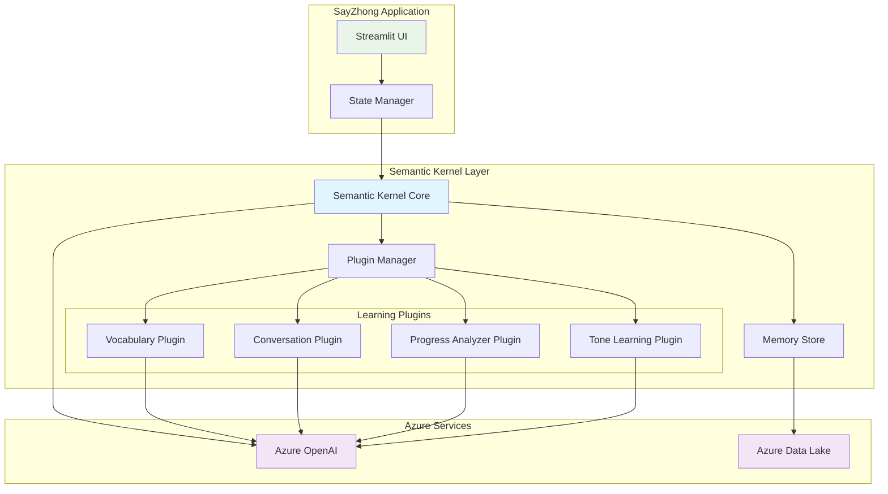

# ADR-001: AI Framework Architecture Selection

**Status**: Proposed  
**Date**: 2025-05-24  
**Deciders**: Development Team  

## Context

SayZhong is an AI-powered Mandarin learning application that requires sophisticated AI capabilities including:
- Conversational AI tutoring with persistent memory across learning sessions
- Adaptive content generation based on user progress
- Plugin-based architecture for modular learning components (vocabulary tutor, conversation partner, progress analyzer)
- Integration with Azure OpenAI services for GPT model access
- Memory management for personalized learning context and conversation continuity

The framework choice is foundational as it will impact development velocity, maintainability, and the application's ability to provide personalized learning experiences.

## Decision Drivers

1. **Memory Management**: Must maintain conversation context and learning progress across sessions
2. **Plugin Extensibility**: Need modular AI components for different learning features
3. **Azure Integration**: Leverage existing Azure OpenAI investment and infrastructure
4. **Python 3.11 Compatibility**: Seamless integration with our technology stack
5. **Learning Personalization**: AI must understand and adapt to individual user progress patterns
6. **Development Velocity**: Framework should accelerate development rather than hinder it
7. **Conversation-Centric Design**: Optimized for educational dialogue and tutoring scenarios

## Options Considered

### Option 1: Semantic Kernel + Azure OpenAI (Recommended)

**Pros:**
- Native memory management with built-in conversation persistence
- Plugin architecture designed for modular AI components
- Native Azure OpenAI integration with optimized configurations
- Function calling support for structured educational responses
- Conversation-centric design perfect for tutoring applications
- Microsoft support and active development
- Clean separation of AI logic from application logic

**Cons:**
- Relatively new framework with smaller community compared to alternatives
- Microsoft-specific solution creating potential vendor lock-in
- Less third-party plugins and extensions available
- Documentation still maturing

### Option 2: LangChain + Azure OpenAI

**Pros:**
- Mature ecosystem with extensive documentation and examples
- Large community with many available integrations
- Multiple memory backend options (Redis, PostgreSQL, etc.)
- Rich ecosystem of tools and extensions
- Framework-agnostic design

**Cons:**
- More complex configuration required for Azure OpenAI integration
- Heavier framework with numerous dependencies
- Less optimized for conversation-centric applications
- Memory management requires additional configuration
- Potential over-engineering for our specific use case

### Option 3: Direct Azure OpenAI API

**Pros:**
- Maximum control over implementation details
- Direct Azure integration with minimal abstraction
- Fastest performance with minimal overhead
- No framework dependencies or learning curve
- Complete customization flexibility

**Cons:**
- Manual implementation of memory management required
- No built-in plugin architecture - must build from scratch
- Significant development overhead for conversation context
- Increased maintenance burden
- Risk of reinventing existing solutions

## Decision

**Choice**: Semantic Kernel + Azure OpenAI

**Rationale**: Semantic Kernel provides the optimal balance of functionality and simplicity for our educational AI use case. Its conversation-centric design, built-in memory management, and plugin architecture align perfectly with SayZhong's requirements for modular learning components and persistent educational context.

## Consequences

### Positive
- Accelerated development of AI-powered learning features
- Built-in memory management reduces complexity
- Plugin architecture enables clean separation of learning modules
- Native Azure integration optimizes performance and cost
- Conversation persistence enhances user learning experience

### Negative
- Vendor lock-in to Microsoft ecosystem
- Smaller community compared to LangChain
- Potential framework limitations as requirements evolve
- Need to monitor framework maturity and stability

### Neutral
- Team needs to learn Semantic Kernel concepts and patterns
- Documentation and community resources more limited than mature alternatives

## Implementation Notes

1. **Plugin Structure**: Create separate plugins for each learning component:
   - VocabularyTutorPlugin
   - ConversationPartnerPlugin
   - ProgressAnalyzerPlugin
   - ToneLearningPlugin

2. **Memory Configuration**: Use Semantic Kernel's memory store with Azure Data Lake backend for persistence

3. **Function Definitions**: Leverage function calling for structured educational responses (flashcard generation, progress assessments, etc.)

4. **Testing Strategy**: Mock Semantic Kernel components for unit testing educational logic

## Architecture Diagram

## Related Decisions

- ADR-002: State Management Strategy (depends on this decision)
- ADR-003: Data Storage Architecture (integrates with this decision)

## References

- [Semantic Kernel Documentation](https://learn.microsoft.com/en-us/semantic-kernel/)
- [Azure OpenAI Service Documentation](https://learn.microsoft.com/en-us/azure/ai-services/openai/)
- [SayZhong Requirements Document](../requirements.md)
