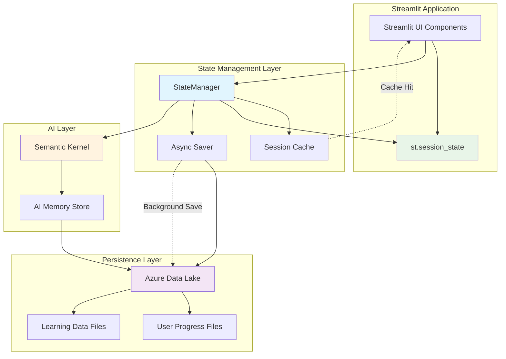
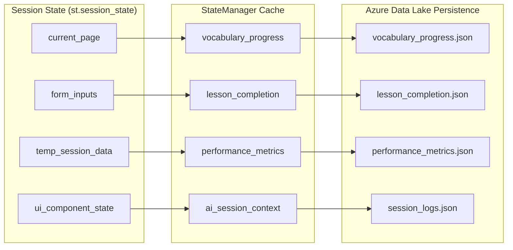

# ADR-002: State Management Strategy

**Status**: Proposed  
**Date**: 2025-05-24  
**Deciders**: Development Team  
**Depends on**: ADR-001 (AI Framework Architecture Selection)

## Context

SayZhong is built on Streamlit, which is inherently stateless - each user interaction triggers a complete script re-execution. However, our Mandarin learning application requires sophisticated state management across multiple layers:

1. **UI Session State**: Current page, form inputs, temporary learning session data
2. **Learning Progress State**: User vocabulary progress, lesson completion, performance metrics
3. **AI Conversation State**: Ongoing dialogue context, personalized learning insights
4. **Persistent User State**: Long-term learning data that survives browser sessions

The challenge is managing state continuity across Streamlit's stateless nature while maintaining performance and providing a seamless learning experience.

## Decision Drivers

1. **Streamlit Constraints**: Work within Streamlit's stateless execution model
2. **Learning Continuity**: Maintain educational context across user sessions
3. **AI Memory Integration**: Align with Semantic Kernel memory management (from ADR-001)
4. **Performance**: Minimize state loading/saving overhead during interactions
5. **Data Persistence**: Ensure learning progress survives browser/server restarts
6. **Scalability**: Support multiple concurrent users efficiently
7. **Development Simplicity**: Minimize complexity for feature development

## Options Considered

### Option 1: Multi-Layer State Management (Recommended)

**Architecture**:
- **Layer 1**: Streamlit `st.session_state` for UI and active session data
- **Layer 2**: Custom `StateManager` class bridging Streamlit and persistence
- **Layer 3**: Azure Data Lake for persistent user progress and learning data
- **Layer 4**: Semantic Kernel memory for AI conversation context

**Pros:**
- Clear separation of concerns between UI, business logic, and persistence
- Leverages Streamlit's built-in session state for UI responsiveness
- Custom StateManager provides abstraction for business logic
- Azure Data Lake offers scalable persistence
- Semantic Kernel handles AI memory automatically
- Supports both synchronous UI updates and asynchronous persistence

**Cons:**
- More complex architecture with multiple state layers
- Requires careful synchronization between layers
- Potential for state inconsistencies if not managed properly
- Higher initial development complexity

### Option 2: Streamlit Session State Only

**Architecture**:
- Store all state in `st.session_state`
- Periodic manual saves to Azure Data Lake
- No dedicated state management layer

**Pros:**
- Simple implementation using only Streamlit built-ins
- Fast access to all state data
- No additional abstractions to learn

**Cons:**
- All state lost on session timeout or browser refresh
- No automatic persistence of learning progress
- Difficult to implement cross-session AI memory
- Poor user experience for educational application
- Scalability issues with large user progress data

### Option 3: Traditional Database with ORM

**Architecture**:
- SQLAlchemy ORM with PostgreSQL/SQLite
- Direct database access from Streamlit components
- Manual session state synchronization

**Pros:**
- Traditional, well-understood approach
- Strong data consistency guarantees
- Rich querying capabilities
- Mature tooling and patterns

**Cons:**
- Requires additional database infrastructure
- ORM overhead for simple key-value operations
- Doesn't integrate well with Semantic Kernel memory
- More complex deployment and maintenance
- Over-engineered for JSON-based learning progress data

## Decision

**Choice**: Multi-Layer State Management

**Rationale**: The multi-layer approach provides the best balance of user experience, development velocity, and architectural flexibility. It leverages Streamlit's strengths while addressing its limitations through targeted abstractions. The integration with Semantic Kernel memory (from ADR-001) creates a cohesive AI-powered learning experience.

## Implementation Strategy

### State Manager Interface
```python
class StateManager:
    def __init__(self, user_id: str):
        self.user_id = user_id
        self._session_cache = {}
        
    # UI State Management
    def get_ui_state(self, key: str, default=None)
    def set_ui_state(self, key: str, value)
    
    # Learning Progress Management  
    def get_progress(self, category: str) -> dict
    def update_progress(self, category: str, data: dict)
    def save_progress_async(self)
    
    # AI Memory Integration
    def get_ai_context(self) -> str
    def update_ai_context(self, context: str)
```

### Data Flow Pattern
1. **Page Load**: StateManager loads user progress from Azure Data Lake into session cache
2. **User Interaction**: Updates flow through StateManager to both session state and cache
3. **AI Interaction**: Semantic Kernel manages conversation context automatically
4. **Background Save**: Periodic async saves of progress data to Azure Data Lake
5. **Session End**: Final save ensures no progress loss

## Consequences

### Positive
- Seamless user experience with persistent learning progress
- Fast UI interactions through session state caching
- Automatic AI memory management via Semantic Kernel
- Scalable persistence layer with Azure Data Lake
- Clean separation of concerns for maintainable code

### Negative
- Increased architectural complexity
- Need to manage state synchronization carefully
- Potential for race conditions in async saves
- More complex testing scenarios

### Neutral
- Developers need to understand multi-layer state patterns
- Additional abstraction layer to learn and maintain

## Architecture Diagram



## State Data Structure



## Related Decisions

- ADR-001: AI Framework Architecture Selection (provides AI memory layer)
- ADR-003: Data Storage Architecture (defines persistence layer structure)

## References

- [Streamlit Session State Documentation](https://docs.streamlit.io/library/api-reference/session-state)
- [Azure Data Lake Storage Documentation](https://learn.microsoft.com/en-us/azure/storage/blobs/data-lake-storage-introduction)
- [Semantic Kernel Memory Documentation](https://learn.microsoft.com/en-us/semantic-kernel/memories/)
