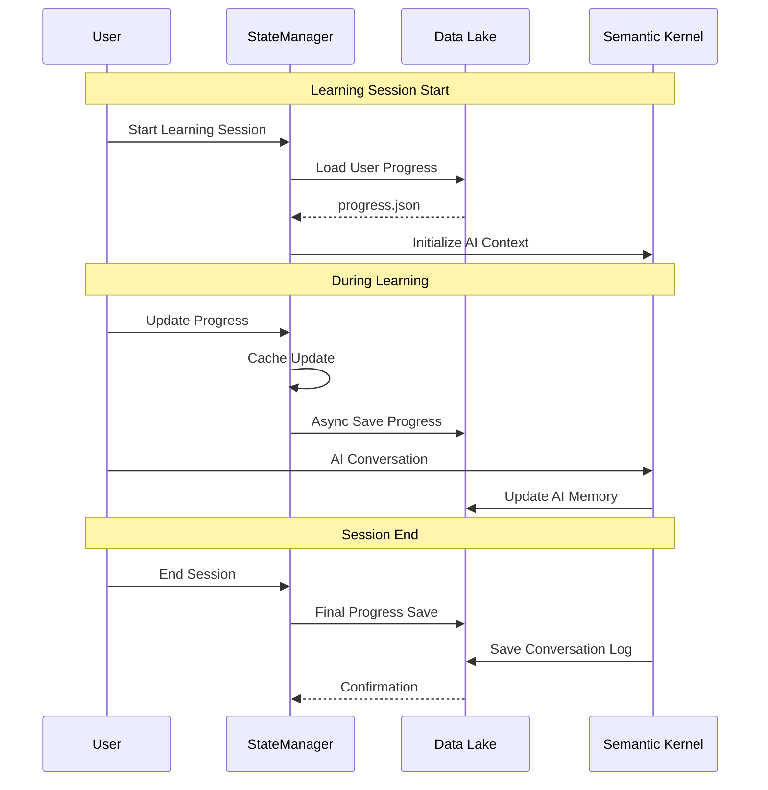

# ADR-003: Data Storage Architecture

**Status**: Proposed  
**Date**: 2025-05-24  
**Deciders**: Development Team  
**Depends on**: ADR-001 (AI Framework), ADR-002 (State Management Strategy)

## Context

SayZhong requires a data storage solution that supports multiple data types and access patterns:

1. **User Progress Data**: Vocabulary learning progress, lesson completion status, performance metrics
2. **Learning Content**: High-frequency vocabulary lists, lesson templates, conversation scenarios
3. **AI Training Data**: User interaction logs, successful learning patterns, personalization insights
4. **Session Data**: Temporary learning session state, conversation logs, real-time progress
5. **Analytics Data**: Aggregated learning statistics, user behavior patterns, system performance metrics

The storage solution must integrate seamlessly with our multi-layer state management (ADR-002) and Semantic Kernel AI framework (ADR-001) while supporting both real-time user interactions and offline analytics.

## Decision Drivers

1. **Integration Requirements**: Must work with StateManager and Semantic Kernel memory
2. **Data Types**: Support for JSON documents, structured learning data, and AI memory
3. **Access Patterns**: Real-time user progress updates and batch analytics processing
4. **Scalability**: Handle multiple concurrent users and growing learning content
5. **Azure Ecosystem**: Leverage existing Azure infrastructure and integrations
6. **Cost Efficiency**: Optimize for storage costs while maintaining performance
7. **Development Velocity**: Minimize complexity for feature development
8. **Backup and Recovery**: Ensure learning progress data is never lost

## Options Considered

### Option 1: Azure Data Lake Storage Gen2 (Recommended)

**Architecture**:
```
/users/{azure_ad_user_id}/
  /progress/
    vocabulary_progress.json      # Vocabulary learning state
    lesson_completion.json        # Completed lessons and scores
    performance_metrics.json      # Learning analytics and trends
    ai_conversation_history.json  # AI tutoring session logs
  /sessions/
    {session_id}_temp.json       # Temporary session data
  /usage/
    api_quota_tracking.json      # User API usage and rate limiting
/content/
  /vocabulary/
    high_frequency_words.json    # Core vocabulary datasets
    hsk_levels.json             # HSK level vocabulary
    lesson_templates.json       # Structured lesson content
  /conversations/
    scenario_templates.json     # Conversation practice scenarios
    dialog_patterns.json        # Common dialogue structures
/analytics/
  /daily/
    {date}_user_activity.json   # Daily aggregated user metrics
  /monthly/
    {month}_learning_trends.json # Monthly learning analytics
  /usage/
    {date}_api_usage.json       # API usage analytics for cost monitoring
```

**Pros:**
- Native JSON support perfect for learning progress data
- Hierarchical namespace matches our data organization needs
- Excellent integration with Azure ecosystem (Semantic Kernel, Analytics)
- Cost-effective for large amounts of learning content
- Built-in backup and versioning capabilities
- Supports both real-time access and batch analytics processing
- Scalable for multiple users without schema changes

**Cons:**
- No ACID transactions (acceptable for learning progress use case)
- Limited querying capabilities compared to traditional databases
- Requires careful file organization and naming conventions
- No built-in data validation (must implement in application layer)

### Option 2: Azure Cosmos DB (NoSQL)

**Architecture**:
- Document-based storage with JSON support
- Separate containers for users, content, sessions, analytics
- Partition key strategy based on user_id and content_type

**Pros:**
- Strong consistency and ACID transaction support
- Rich querying capabilities with SQL-like syntax
- Automatic scaling and global distribution
- Strong integration with Azure ecosystem
- Built-in data validation and indexing

**Cons:**
- Significantly higher cost for educational application use case
- Over-engineered for simple key-value learning progress storage
- Complex pricing model based on Request Units (RUs)
- Learning curve for developers unfamiliar with Cosmos DB concepts
- May be overkill for JSON document storage needs

### Option 3: Azure Database for PostgreSQL

**Architecture**:
- Traditional relational database with JSONB columns for flexible data
- Tables: users, learning_progress, content, sessions, analytics
- JSONB columns for progress data and AI conversation history

**Pros:**
- Strong ACID guarantees and data consistency
- Rich querying with SQL and JSONB operations
- Mature ecosystem with excellent Python support
- Strong backup and recovery capabilities
- Familiar development patterns for most developers

**Cons:**
- Requires complex schema design for flexible learning progress data
- Higher operational overhead (database maintenance, scaling)
- Less optimal for document-style learning content storage
- Additional infrastructure complexity and cost
- Doesn't align well with Semantic Kernel memory patterns

## Decision

**Choice**: Azure Data Lake Storage Gen2

**Rationale**: Azure Data Lake provides the optimal balance of simplicity, cost-effectiveness, and integration for our educational application. The hierarchical JSON storage model naturally aligns with learning progress data structures, while the Azure ecosystem integration supports both our StateManager (ADR-002) and Semantic Kernel (ADR-001) requirements.

## Implementation Strategy

### File Organization Patterns
```python
class DataLakeManager:
    def __init__(self, container_name: str):
        self.container = container_name
        
    # User Progress Management
    def get_user_progress(self, user_id: str, category: str) -> dict
    def save_user_progress(self, user_id: str, category: str, data: dict)
    
    # Learning Content Management
    def get_content(self, content_type: str, content_id: str) -> dict
    def update_content(self, content_type: str, content_id: str, data: dict)
    
    # Analytics Data Management
    def append_analytics(self, metric_type: str, data: dict)
    def get_analytics_range(self, start_date: str, end_date: str) -> list
```

### Data Consistency Strategy
1. **Atomic File Operations**: Use Azure Data Lake's atomic upload capabilities
2. **Optimistic Concurrency**: Include version/timestamp fields in JSON documents
3. **Backup Strategy**: Daily automated backups with 30-day retention
4. **Data Validation**: Application-layer validation before storage

### Integration Points
- **StateManager**: Direct file-based access for user progress data
- **Semantic Kernel**: Memory store backed by Data Lake JSON files
- **Analytics Pipeline**: Batch processing of aggregated learning data

## Consequences

### Positive
- Simple, cost-effective storage solution aligned with our data structures
- Excellent Azure ecosystem integration
- Scales naturally with user growth
- Supports both real-time and analytics access patterns
- Minimal operational overhead
- Natural backup and versioning capabilities

### Negative
- No built-in data validation (must implement in application)
- Limited querying capabilities for complex analytics
- Requires careful file organization and naming conventions
- No ACID transactions for complex multi-document updates

### Neutral
- Developers need to understand file-based data access patterns
- JSON schema evolution must be managed at application level

## Storage Architecture Diagram

```mermaid
graph TB
    subgraph "Application Layer"
        SM[StateManager]
        SK[Semantic Kernel]
        AL[Analytics Layer]
    end
    
    subgraph "Azure Data Lake Storage Gen2"
        subgraph "User Data Container"
            subgraph "User Progress"
                VP[vocabulary_progress.json]
                LC[lesson_completion.json]
                PM[performance_metrics.json]
                AH[ai_conversation_history.json]
            end
            
            subgraph "Session Data"
                ST[session_temp.json]
                SL[session_logs.json]
            end
        end
        
        subgraph "Content Container"
            subgraph "Vocabulary Content"
                HF[high_frequency_words.json]
                HSK[hsk_levels.json]
                LT[lesson_templates.json]
            end
            
            subgraph "Conversation Content"
                CS[scenario_templates.json]
                DP[dialog_patterns.json]
            end
        end
        
        subgraph "Analytics Container"
            DA[daily_analytics.json]
            MA[monthly_analytics.json]
            UT[user_trends.json]
        end
    end
    
    SM --> VP
    SM --> LC
    SM --> PM
    SM --> ST
    
    SK --> AH
    SK --> SL
    
    AL --> DA
    AL --> MA
    AL --> UT
    
    SM -.->|Read Content| HF
    SM -.->|Read Content| LT
    SK -.->|Read Scenarios| CS
    SK -.->|Read Patterns| DP
    
    style VP fill:#e1f5fe
    style LC fill:#e1f5fe
    style PM fill:#e1f5fe
    style HF fill:#e8f5e8
    style CS fill:#fff3e0
```



## Data Access Patterns



## File Naming Conventions

| Data Type | Pattern | Example |
|-----------|---------|---------|
| User Progress | `/users/{azure_ad_user_id}/progress/{category}.json` | `/users/azure-ad-12345/progress/vocabulary_progress.json` |
| Session Data | `/users/{azure_ad_user_id}/sessions/{session_id}.json` | `/users/azure-ad-12345/sessions/sess_20250524_143022.json` |
| API Usage | `/users/{azure_ad_user_id}/usage/{period}.json` | `/users/azure-ad-12345/usage/daily_quota.json` |
| Learning Content | `/content/{type}/{id}.json` | `/content/vocabulary/hsk_level_1.json` |
| Analytics | `/analytics/{period}/{date}_{metric}.json` | `/analytics/daily/20250524_user_activity.json` |

## Related Decisions

- ADR-001: AI Framework Architecture (provides memory integration requirements)
- ADR-002: State Management Strategy (defines data access patterns)

## References

- [Azure Data Lake Storage Gen2 Documentation](https://learn.microsoft.com/en-us/azure/storage/blobs/data-lake-storage-introduction)
- [JSON Data Modeling Best Practices](https://docs.microsoft.com/en-us/azure/cosmos-db/modeling-data)
- [Semantic Kernel Memory Store Documentation](https://learn.microsoft.com/en-us/semantic-kernel/memories/)
