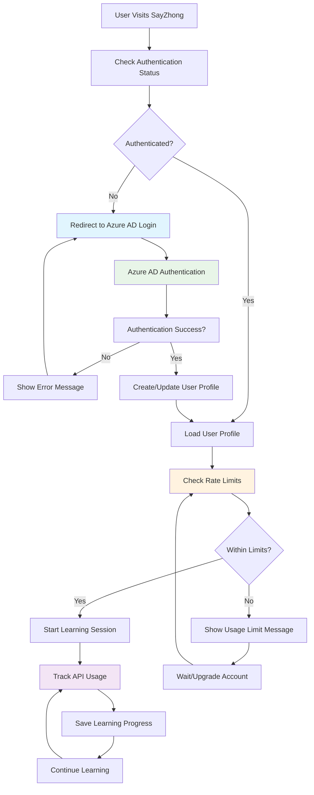

# ADR-004: Authentication & User Management Strategy

**Status**: Proposed  
**Date**: 2025-05-24  
**Deciders**: Development Team  
**Depends on**: ADR-002 (State Management Strategy), ADR-003 (Data Storage Architecture)

## Context

SayZhong is a Mandarin learning application that requires user authentication to manage API costs and provide personalized learning experiences. The application must balance several critical requirements:

1. **Cost Control**: Rate limiting Azure OpenAI API calls requires user accountability
2. **Learning Continuity**: Users need persistent progress tracking across browser sessions
3. **Privacy Compliance**: GDPR and privacy regulations for educational data
4. **User Experience**: Streamlined authentication without friction
5. **Data Persistence**: Integration with our multi-layer state management (ADR-002)
6. **Azure Integration**: Leverage existing Azure ecosystem for authentication

The authentication strategy directly impacts how we implement user identification, rate limiting, progress tracking, and cost management in our Azure-based architecture.

## Decision Drivers

1. **Rate Limiting Control**: Enforce API usage limits to manage Azure OpenAI costs
2. **User Accountability**: Track and manage individual user API consumption
3. **Progress Persistence**: Ensure learning progress survives browser/device changes
4. **Privacy Compliance**: Handle user data according to GDPR and educational privacy standards
5. **Azure Integration**: Leverage Azure AD for seamless ecosystem integration
6. **Cost Management**: Control Azure OpenAI API costs through authenticated user tracking
7. **Scalability**: Support growth with proper user management and resource allocation

## Options Considered

### Option 1: Azure AD Authentication with Mandatory User Accounts (Recommended)

**Architecture**:
- **Azure AD B2C**: Enterprise-grade authentication and user management
- **Required Sign-in**: Users must authenticate before accessing learning features
- **Rate Limiting**: Per-user API usage tracking and enforcement
- **Immediate Persistence**: All progress automatically saved to user accounts
- **Profile Management**: User profiles with learning preferences and usage statistics

**User Flow**:
```
1. User visits SayZhong → Redirected to Azure AD login
2. Authentication completed → User profile loaded
3. Learning progress tracked under authenticated user ID
4. API usage monitored and rate limited per user
```

**Pros**:
- Effective API cost control through user-based rate limiting
- Guaranteed progress persistence across devices
- Enterprise-grade security and compliance
- Seamless Azure ecosystem integration
- Rich user profiles and preferences
- Strong data ownership and privacy controls
- Professional appearance for educational platform

**Cons**:
- Authentication barrier for new users
- Requires Azure AD setup and configuration
- Higher development complexity for authentication flow
- Dependency on Azure AD service availability

### Option 2: Anonymous User Sessions with Optional Account Creation

**Architecture**:
- **Initial Experience**: Generate anonymous user IDs for immediate learning start
- **Progress Tracking**: Store progress using anonymous IDs in Azure Data Lake
- **Optional Registration**: Allow users to claim anonymous sessions via email/simple signup
- **Session Recovery**: Provide recovery codes for anonymous users to access progress

**User Flow**:
```
1. User visits SayZhong → Auto-generated anonymous ID
2. Learning progress tracked under anonymous ID
3. User can optionally "save progress" by providing email
4. Recovery code generated for session restoration
```

**Pros**:
- Zero friction for new users to start learning
- Immediate progress tracking without registration
- Privacy-friendly with minimal data collection
- Simple integration with existing state management
- Users can upgrade to persistent accounts when ready
- GDPR compliant with minimal personal data

**Cons**:
- Risk of lost progress if users don't save sessions
- Slightly more complex user ID management
- Need to handle anonymous-to-authenticated user migration

### Option 2: Required Authentication with Social Login

**Architecture**:
- **Required Sign-in**: Users must authenticate before accessing learning features
- **Social Providers**: Google, Microsoft, Apple login integration
- **Immediate Persistence**: All progress automatically saved to user accounts
- **Profile Management**: User profiles with learning preferences

**Pros**:
- Guaranteed progress persistence across devices
- Rich user profiles and preferences
- Easy account recovery and device switching
- Strong data ownership and privacy controls
- Professional appearance for educational platform

**Cons**:
- Significant barrier to entry for casual learners
- Complex authentication infrastructure required
- Higher development and operational overhead
- May reduce user acquisition and experimentation
- Requires OAUTH integration and security management

### Option 3: Device-Based Local Storage Only

**Architecture**:
- **Local Storage**: Use browser localStorage for all progress tracking
- **No Server State**: All learning data stored client-side
- **Export/Import**: Allow users to manually backup/restore progress
- **No User Accounts**: Completely anonymous learning experience

**Pros**:
- Maximum privacy with no server-side user data
- Simple implementation with no authentication infrastructure
- Fast performance with local data access
- No user management complexity
- GDPR compliant by design

**Cons**:
- Progress lost when clearing browser data
- No cross-device synchronization
- Limited analytics and learning insights
- Difficult to implement AI memory across sessions
- Poor user experience for serious learners

## Decision

**Choice**: Azure AD Authentication with Mandatory User Accounts

**Rationale**: Given the need for rate limiting and API cost control, requiring authentication provides better user accountability and resource management. Azure AD integration leverages our Azure ecosystem while providing enterprise-grade authentication and user management capabilities. This approach ensures we can effectively manage API usage costs and provide personalized learning experiences.

## Implementation Strategy

### Azure AD B2C Integration
```python
from azure.identity import DefaultAzureCredential
from msal import ConfidentialClientApplication
import streamlit as st

class AzureADAuthManager:
    def __init__(self):
        self.authority = st.secrets["azure_ad"]["authority"]
        self.client_id = st.secrets["azure_ad"]["client_id"]
        self.client_secret = st.secrets["azure_ad"]["client_secret"]
        self.scope = ["https://graph.microsoft.com/.default"]
        
    def authenticate_user(self) -> dict:
        """Authenticate user with Azure AD"""
        
    def get_user_profile(self, token: str) -> dict:
        """Get user profile from Azure AD"""
        
    def check_user_permissions(self, user_id: str) -> dict:
        """Check user rate limits and permissions"""
```

### Rate Limiting Integration
```python
class RateLimitManager:
    def __init__(self, auth_manager: AzureADAuthManager):
        self.auth_manager = auth_manager
        self.daily_limit = 100  # API calls per user per day
        
    def check_user_quota(self, user_id: str) -> bool:
        """Check if user has remaining API quota"""
        
    def track_api_usage(self, user_id: str, operation: str):
        """Track API usage per authenticated user"""
        
    def get_usage_stats(self, user_id: str) -> dict:
        """Get current usage statistics for user"""
```

### Data Storage Integration
- **Authenticated Users**: `/users/{azure_ad_user_id}/progress/`
- **Rate Limiting Data**: `/users/{azure_ad_user_id}/usage/`
- **User Profiles**: `/users/{azure_ad_user_id}/profile/`

### Privacy Implementation
1. **Minimal Data Collection**: Only learning progress and preferences
2. **Data Retention**: Automatic cleanup of abandoned anonymous sessions (90 days)
3. **User Control**: Easy progress deletion and account removal
4. **Consent Management**: Clear opt-in for data collection and account creation

## Consequences

### Positive
- **Effective Cost Control**: Rate limiting per user prevents API cost overruns
- **Enterprise-Grade Security**: Azure AD provides robust authentication and compliance
- **Guaranteed Progress Persistence**: All learning data automatically saved and synced
- **Rich User Profiles**: Comprehensive user management and personalization
- **Azure Ecosystem Integration**: Seamless integration with existing Azure infrastructure
- **Professional User Experience**: Enterprise-quality authentication flow
- **GDPR Compliance**: Built-in privacy and data protection features

### Negative
- **Authentication Barrier**: Users must create account before accessing application
- **Azure Dependency**: Increased reliance on Azure AD service availability
- **Implementation Complexity**: More complex authentication flow compared to anonymous access
- **Setup Requirements**: Need to configure Azure AD B2C tenant and application registration

### Risks and Mitigations
- **Risk**: Authentication failures blocking user access
  - **Mitigation**: Implement robust error handling and fallback mechanisms
- **Risk**: Azure AD service outages
  - **Mitigation**: Monitor Azure service health and implement graceful degradation
- **Risk**: User abandonment due to required registration
  - **Mitigation**: Streamline authentication flow and provide clear value proposition

## User Experience Flow



## Data Architecture Integration

```mermaid
graph TB
    subgraph "Authentication Layer"
        AAD[Azure AD B2C]
        AM[Auth Manager]
        RL[Rate Limiter]
        UP[User Profile]
    end
    
    subgraph "State Management (ADR-002)"
        SM[StateManager]
        SC[Session Cache]
        UQ[Usage Quota]
    end
    
    subgraph "Azure Data Lake (ADR-003)"
        subgraph "Authenticated Users"
            AU[/users/{azure_ad_id}/progress/]
            UU[/users/{azure_ad_id}/usage/]
            PR[/users/{azure_ad_id}/profile/]
        end
        subgraph "Rate Limiting Data"
            UD[/usage/daily/]
            UM[/usage/monthly/]
        end
    end
    
    AAD --> AM
    AM --> RL
    AM --> UP
    AM --> SM
    SM --> SC
    SM --> UQ
    
    UP --> PR
    RL --> UU
    UQ --> UD
    UQ --> UM
    SM --> AU
    
    style AAD fill:#e1f5fe
    style SM fill:#e8f5e8
    style AU fill:#f3e5f5
    style UU fill:#fff3e0
```

## Security Considerations

1. **Anonymous ID Generation**: Use cryptographically secure UUIDs
2. **Recovery Codes**: Generate unique, time-limited recovery codes
3. **Data Migration**: Secure transfer of anonymous data to authenticated accounts
4. **Session Validation**: Validate user sessions without exposing internal IDs
5. **Privacy Controls**: Allow users to delete all data at any time

## Related Decisions

- ADR-002: State Management Strategy (defines user data flow patterns)
- ADR-003: Data Storage Architecture (provides user data storage structure)
- ADR-005: Security Architecture (will define detailed security implementations)

## References

- [GDPR Compliance for Educational Applications](https://gdpr.eu/data-protection-impact-assessment-template/)
- [Streamlit Session State Best Practices](https://docs.streamlit.io/library/api-reference/session-state)
- [Azure Data Lake Access Patterns](https://learn.microsoft.com/en-us/azure/storage/blobs/data-lake-storage-access-control)
