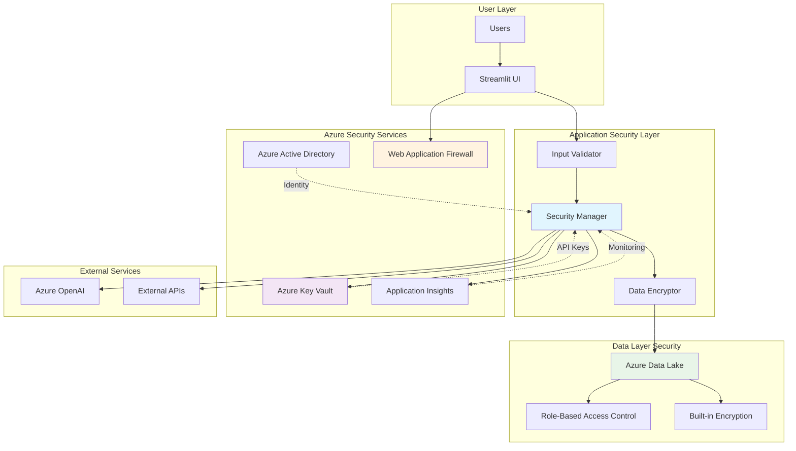

# ADR-005: Security Architecture

**Status**: Proposed  
**Date**: 2025-05-24  
**Deciders**: Development Team  
**Depends on**: ADR-001 (AI Framework), ADR-003 (Data Storage), ADR-004 (Authentication)

## Context

SayZhong handles sensitive educational data and integrates with external AI services, requiring a comprehensive security architecture. The application must protect:

1. **User Learning Data**: Progress, conversation logs, and personal learning patterns
2. **AI Service Integration**: Secure Azure OpenAI API key management and usage
3. **Application Security**: Input validation, data sanitization, and secure communication
4. **Privacy Compliance**: GDPR-compliant data handling and user privacy protection
5. **Infrastructure Security**: Azure Data Lake access controls and data encryption
6. **Authentication Security**: Azure AD B2C integration and user account protection

The security architecture must integrate seamlessly with our Azure AD authentication system (ADR-004) and Azure-based infrastructure while maintaining development simplicity and operational security.

## Decision Drivers

1. **Data Protection**: Secure storage and transmission of educational data
2. **API Security**: Protect Azure OpenAI API keys and prevent abuse
3. **Input Validation**: Sanitize user inputs for AI interactions and data storage
4. **Privacy Compliance**: GDPR and educational data privacy requirements
5. **Development Velocity**: Security measures that don't hinder development workflow
6. **Operational Simplicity**: Manageable security operations for small team
7. **Cost Efficiency**: Security solutions within startup budget constraints
8. **Azure Integration**: Leverage Azure security features and best practices

## Options Considered

### Option 1: Azure-Native Security Stack (Recommended)

**Architecture**:
- **Key Management**: Azure Key Vault for API keys and secrets
- **Data Encryption**: Azure Data Lake built-in encryption (at rest and in transit)
- **Access Control**: Azure RBAC for service access and Managed Identity
- **Input Validation**: Application-layer validation with Azure WAF if needed
- **Monitoring**: Azure Application Insights for security monitoring

**Security Components**:
```python
# Security integration pattern
class SecurityManager:
    def __init__(self):
        self.key_vault = AzureKeyVault()
        self.validator = InputValidator()
        self.encryptor = DataEncryption()
        
    def get_openai_key(self) -> str:
        """Retrieve OpenAI key from Azure Key Vault"""
        
    def validate_user_input(self, input_data: str) -> str:
        """Sanitize and validate user inputs"""
        
    def encrypt_sensitive_data(self, data: dict) -> dict:
        """Encrypt PII before storage"""
```

**Pros**:
- Native Azure integration with existing infrastructure
- Managed services reduce operational overhead
- Built-in compliance features for GDPR
- Cost-effective with Azure credits/startup programs
- Seamless integration with existing Azure Data Lake and OpenAI
- Strong encryption and access controls out-of-the-box

**Cons**:
- Vendor lock-in to Azure ecosystem
- Learning curve for Azure security services
- Potential over-engineering for MVP stage
- Dependency on Azure service availability

### Option 2: Environment-Based Security with Third-Party Tools

**Architecture**:
- **Key Management**: Environment variables with HashiCorp Vault
- **Data Encryption**: Application-layer encryption with libraries like cryptography
- **Access Control**: JWT tokens and custom authentication
- **Input Validation**: Custom validation layers and third-party libraries
- **Monitoring**: Sentry or similar third-party monitoring

**Pros**:
- Platform-agnostic security approach
- Full control over security implementations
- Flexible integration with any cloud provider
- Rich third-party security tool ecosystem

**Cons**:
- Higher operational overhead and complexity
- Need to manage security infrastructure separately
- More potential attack vectors with multiple tools
- Higher development time for security features
- Additional costs for third-party security services

### Option 3: Minimal Security with Local Development Focus

**Architecture**:
- **Key Management**: Environment variables and local configuration
- **Data Encryption**: Basic HTTPS for data in transit only
- **Access Control**: Simple API key rotation
- **Input Validation**: Basic input sanitization
- **Monitoring**: Basic logging with Python logging module

**Pros**:
- Fastest development velocity
- Minimal operational complexity
- Lower initial costs
- Easy local development setup

**Cons**:
- Inadequate for production deployment
- High security risks for user data
- Non-compliant with privacy regulations
- Difficult to scale securely
- Potential legal and reputational risks

## Decision

**Choice**: Azure-Native Security Stack

**Rationale**: The Azure-native approach provides the optimal balance of security, operational simplicity, and cost-effectiveness for SayZhong. It leverages our existing Azure infrastructure investment while providing enterprise-grade security features that scale with our application growth.

## Implementation Strategy

### 1. Azure Key Vault Integration
```python
from azure.keyvault.secrets import SecretClient
from azure.identity import DefaultAzureCredential

class KeyVaultManager:
    def __init__(self):
        credential = DefaultAzureCredential()
        self.client = SecretClient(
            vault_url="https://sayzhong-vault.vault.azure.net/",
            credential=credential
        )
    
    def get_openai_api_key(self) -> str:
        return self.client.get_secret("openai-api-key").value
    
    def get_data_lake_connection_string(self) -> str:
        return self.client.get_secret("datalake-connection-string").value
```

### 2. Input Validation & Sanitization
```python
import bleach
from typing import Dict, Any

class InputValidator:
    def __init__(self):
        # Define allowed tags and attributes for user inputs
        self.allowed_tags = []  # No HTML allowed in learning content
        self.max_input_length = 1000
    
    def sanitize_user_input(self, user_input: str) -> str:
        """Clean and validate user text input"""
        # Remove HTML tags and limit length
        cleaned = bleach.clean(user_input, tags=self.allowed_tags)
        return cleaned[:self.max_input_length]
    
    def validate_ai_prompt(self, prompt: str) -> bool:
        """Validate prompts before sending to AI service"""
        # Check for injection attempts and inappropriate content
        return self._check_prompt_safety(prompt)
```

### 3. Data Encryption Strategy
```python
class DataEncryption:
    def encrypt_pii(self, data: Dict[str, Any]) -> Dict[str, Any]:
        """Encrypt personally identifiable information"""
        # Use Azure Data Lake's built-in encryption
        # Additional encryption for extra-sensitive fields if needed
        return data
    
    def ensure_https_only(self):
        """Enforce HTTPS for all external communications"""
        # Configure Streamlit and Azure clients for HTTPS only
        pass
```

### 4. Security Monitoring
```python
import logging
from azure.monitor.opentelemetry import configure_azure_monitor

class SecurityMonitoring:
    def __init__(self):
        configure_azure_monitor(
            connection_string="InstrumentationKey=your-key"
        )
        self.logger = logging.getLogger("sayzhong.security")
    
    def log_security_event(self, event_type: str, details: Dict[str, Any]):
        """Log security-relevant events for monitoring"""
        self.logger.warning(f"Security Event: {event_type}", extra=details)
```

## Security Controls Implementation

### Azure AD B2C Authentication Security
```python
from azure.identity import DefaultAzureCredential
from msal import PublicClientApplication

class AuthenticationSecurity:
    def __init__(self):
        self.app = PublicClientApplication(
            client_id="your-b2c-client-id",
            authority="https://your-tenant.b2clogin.com/your-tenant.onmicrosoft.com/B2C_1_signupsignin"
        )
    
    def validate_token(self, token: str) -> Dict[str, Any]:
        """Validate and decode Azure AD B2C token"""
        # Implement token validation logic
        return decoded_token
    
    def enforce_rate_limits(self, user_id: str) -> bool:
        """Check user-specific API rate limits"""
        # Implement per-user rate limiting
        return within_limits

### API Security
1. **Azure OpenAI Key Rotation**: Monthly automated key rotation via Azure Key Vault
2. **User-Based Rate Limiting**: Per-user API quotas to prevent abuse and control costs
3. **Request Monitoring**: Log and monitor API usage patterns for anomalies
4. **Error Handling**: Secure error responses that don't leak system information

### Data Protection
1. **Encryption at Rest**: Azure Data Lake Storage built-in encryption
2. **Encryption in Transit**: HTTPS/TLS for all communications
3. **Data Classification**: Classify learning data vs. PII for appropriate handling
4. **Access Controls**: Azure RBAC for data lake access permissions

### Application Security
1. **Input Validation**: Sanitize all user inputs before processing or storage
2. **Output Encoding**: Properly encode data when displaying to prevent XSS
3. **Session Security**: Secure session management with Streamlit best practices
4. **CSRF Protection**: Implement CSRF tokens for state-changing operations

## Consequences

### Positive
- Enterprise-grade security leveraging Azure's mature security services
- Reduced operational overhead with managed security services
- GDPR compliance built into Azure Data Lake and Key Vault
- Seamless integration with existing Azure infrastructure
- Automated security features like key rotation and access logging

### Negative
- Increased dependency on Azure ecosystem
- Learning curve for team members unfamiliar with Azure security services
- Potential over-engineering for early-stage application
- Additional costs for premium Azure security features

### Neutral
- Need to maintain security documentation and procedures
- Regular security reviews and updates required
- Team training on Azure security best practices

## Security Architecture Diagram



## Security Checklist

### Development Phase
- [ ] Azure Key Vault configured for API key storage
- [ ] Input validation implemented for all user inputs
- [ ] HTTPS enforced for all external communications
- [ ] Security logging implemented with Azure Application Insights
- [ ] Data encryption verified for sensitive information

### Pre-Production
- [ ] Security penetration testing completed
- [ ] API rate limiting and abuse prevention configured
- [ ] Access controls and RBAC properly configured
- [ ] Security monitoring and alerting set up
- [ ] Privacy policy and data handling procedures documented

### Production
- [ ] Regular security audits scheduled
- [ ] API key rotation automation verified
- [ ] Incident response procedures documented
- [ ] Security monitoring dashboards operational
- [ ] Compliance documentation maintained

## Compliance Considerations

### GDPR Requirements
1. **Data Minimization**: Collect only necessary learning data
2. **Right to Erasure**: Implement user data deletion capabilities
3. **Data Portability**: Allow users to export their learning data
4. **Consent Management**: Clear opt-in for data collection and processing
5. **Privacy by Design**: Build privacy protections into all features

### Educational Data Privacy
1. **Student Data Protection**: Treat all learning data as educational records
2. **Parental Consent**: Consider requirements for users under 13
3. **Data Retention**: Implement appropriate data retention policies
4. **Third-Party Sharing**: Strict controls on data sharing with external services

## Related Decisions

- ADR-001: AI Framework Architecture (defines AI service integration security)
- ADR-003: Data Storage Architecture (provides foundation for data security)
- ADR-004: Authentication & User Management (defines user identity security)
- ADR-006: Testing Strategy (will include security testing requirements)

## References

- [Azure Security Best Practices](https://learn.microsoft.com/en-us/azure/security/fundamentals/best-practices-and-patterns)
- [Azure Key Vault Documentation](https://learn.microsoft.com/en-us/azure/key-vault/)
- [GDPR Compliance Guide](https://gdpr.eu/checklist/)
- [OWASP Web Application Security Testing Guide](https://owasp.org/www-project-web-security-testing-guide/)
