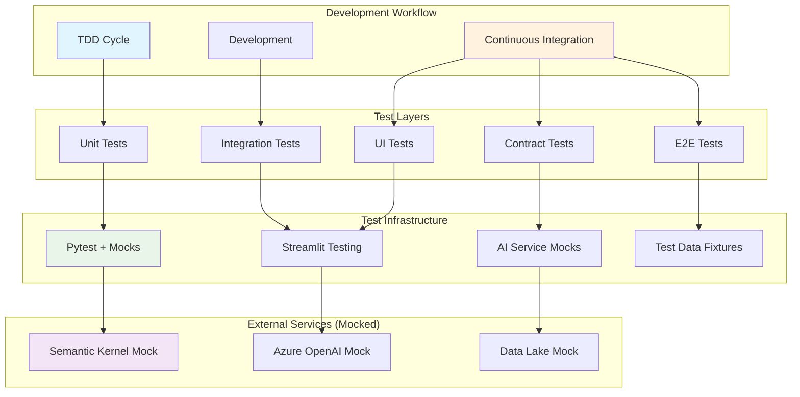

# ADR-006: Testing Strategy Architecture

**Status**: Proposed  
**Date**: 2025-05-24  
**Deciders**: Development Team  
**Depends on**: ADR-001 (AI Framework), ADR-002 (State Management), ADR-004 (Authentication)

## Context

SayZhong requires a comprehensive testing strategy that aligns with Test-Driven Development (TDD) principles while addressing the unique challenges of testing AI-powered educational applications. The testing architecture must handle:

1. **AI Component Testing**: Testing Semantic Kernel plugins and Azure OpenAI integrations
2. **Streamlit Application Testing**: Testing stateful UI components and user interactions
3. **Learning Logic Testing**: Validating educational algorithms and progress tracking
4. **Integration Testing**: Testing multi-layer state management and data persistence
5. **User Experience Testing**: Ensuring educational workflows function correctly

The testing strategy must support rapid development cycles while ensuring reliability for educational content delivery and user progress tracking.

## Decision Drivers

1. **TDD Compliance**: Support Test-Driven Development as required by project guidelines
2. **AI Testing Complexity**: Handle non-deterministic AI responses and conversation flows
3. **Streamlit Constraints**: Work within Streamlit's testing limitations and session state
4. **Educational Quality**: Ensure learning content accuracy and progression logic
5. **Development Velocity**: Fast test execution for rapid development cycles
6. **Production Confidence**: Comprehensive coverage for user-facing educational features
7. **Cost Efficiency**: Testing approach that minimizes external service costs during development
8. **Team Productivity**: Testing tools and patterns accessible to all team members

## Options Considered

### Option 1: Layered Testing Architecture with AI Mocking (Recommended)

**Architecture**:
- **Unit Tests**: Mock AI services, test core learning logic in isolation
- **Integration Tests**: Test component interactions with AI service mocks
- **Contract Tests**: Validate AI service integration contracts
- **UI Tests**: Streamlit component testing with pytest-streamlit
- **End-to-End Tests**: Limited E2E tests with real services for critical paths

**Testing Stack**:
```python
# Core testing dependencies
pytest              # Test framework
pytest-cov          # Coverage reporting
pytest-mock         # Mocking utilities
pytest-asyncio      # Async testing support
streamlit-testing   # Streamlit-specific testing utilities
responses           # HTTP request mocking
faker              # Test data generation
hypothesis         # Property-based testing for learning algorithms
```

**Test Structure**:
```
tests/
├── unit/
│   ├── test_learning_logic.py      # Core educational algorithms
│   ├── test_state_management.py    # StateManager and caching
│   ├── test_user_management.py     # Authentication and user flows
│   └── test_ai_plugins.py          # Semantic Kernel plugins (mocked)
├── integration/
│   ├── test_ai_integration.py      # AI service integration (mocked)
│   ├── test_data_persistence.py    # Data Lake integration
│   └── test_end_to_end_flows.py    # Complete learning workflows
├── ui/
│   ├── test_streamlit_components.py # UI component testing
│   └── test_user_interactions.py   # User workflow testing
├── contracts/
│   └── test_ai_service_contracts.py # API contract validation
└── fixtures/
    ├── learning_data.py            # Test learning content
    ├── user_scenarios.py           # User interaction scenarios
    └── ai_responses.py             # Mocked AI response patterns
```

**Pros**:
- Comprehensive coverage across all application layers
- Fast test execution with mocked external services
- Strong support for TDD workflow
- Educational-specific testing patterns
- Cost-effective development testing
- Good separation of concerns for different test types

**Cons**:
- Complex test setup and maintenance
- Risk of mocks diverging from real AI service behavior
- Requires discipline to maintain test-first development
- Additional tooling and framework learning curve

### Option 2: Minimal Testing with Real AI Services

**Architecture**:
- **Basic Unit Tests**: Core learning logic only
- **Integration Tests**: Direct testing against real Azure OpenAI
- **Manual Testing**: Primary quality assurance method
- **Simple E2E**: Basic Streamlit app functionality testing

**Pros**:
- Simple setup with minimal testing infrastructure
- Tests use real AI services for authentic behavior
- Lower initial development overhead
- Direct feedback on AI service integration

**Cons**:
- High external service costs during development
- Slow test execution due to API calls
- Non-deterministic test results from AI services
- Inadequate coverage for TDD requirements
- Difficult to test edge cases and error conditions
- Poor development velocity for refactoring

### Option 3: Traditional Web Testing Approach

**Architecture**:
- **Selenium/Playwright**: Browser-based UI testing
- **API Testing**: REST API testing frameworks
- **Database Testing**: Direct database interaction testing
- **Load Testing**: Performance testing with load generation

**Pros**:
- Mature testing ecosystem and tooling
- Comprehensive browser testing capabilities
- Industry-standard testing patterns
- Strong performance testing support

**Cons**:
- Poor fit for Streamlit's architecture model
- Over-engineered for educational application needs
- Complex setup for AI service testing
- Doesn't align with our Python-centric development approach
- High maintenance overhead for UI tests

## Decision

**Choice**: Layered Testing Architecture with AI Mocking

**Rationale**: This approach provides the best balance of comprehensive coverage, development velocity, and cost efficiency. It enables true TDD practices while addressing the unique challenges of testing AI-powered educational applications. The layered approach aligns well with our multi-layer architecture decisions.

## Implementation Strategy

### 1. Core Testing Infrastructure
```python
# conftest.py - Central test configuration
import pytest
from unittest.mock import AsyncMock, MagicMock
from src.sayzhong.core.state_manager import StateManager
from src.sayzhong.core.user_manager import UserManager

@pytest.fixture
def mock_semantic_kernel():
    """Mock Semantic Kernel for AI testing"""
    kernel = MagicMock()
    kernel.run_async = AsyncMock()
    return kernel

@pytest.fixture
def mock_azure_openai():
    """Mock Azure OpenAI service responses"""
    mock_client = MagicMock()
    mock_client.chat.completions.create = AsyncMock()
    return mock_client

@pytest.fixture
def test_user_manager():
    """User manager with test configuration"""
    return UserManager(test_mode=True)

@pytest.fixture
def sample_learning_data():
    """Sample vocabulary and lesson data for testing"""
    return {
        "vocabulary": [
            {"chinese": "你好", "pinyin": "nǐ hǎo", "english": "hello"},
            {"chinese": "再见", "pinyin": "zài jiàn", "english": "goodbye"}
        ],
        "lessons": [
            {"id": "lesson_1", "title": "Basic Greetings", "vocabulary": ["你好", "再见"]}
        ]
    }
```

### 2. Learning Logic Testing Patterns
```python
# test_vocabulary_learning.py - Example TDD test
import pytest
from hypothesis import given, strategies as st
from src.sayzhong.learning.vocabulary_manager import VocabularyManager

class TestVocabularyLearning:
    def test_spaced_repetition_scheduling(self):
        """Test spaced repetition algorithm correctness"""
        vocab_manager = VocabularyManager()
        
        # Test correct answer progression
        word = {"chinese": "你好", "difficulty": 1}
        next_review = vocab_manager.schedule_next_review(word, correct=True)
        
        assert next_review > vocab_manager.current_time
        assert word["difficulty"] == 2  # Difficulty increased
    
    @given(st.integers(min_value=1, max_value=10))
    def test_difficulty_progression_properties(self, initial_difficulty):
        """Property-based testing for difficulty progression"""
        vocab_manager = VocabularyManager()
        word = {"chinese": "测试", "difficulty": initial_difficulty}
        
        # Correct answers should increase difficulty
        vocab_manager.update_difficulty(word, correct=True)
        assert word["difficulty"] >= initial_difficulty
        
        # Incorrect answers should decrease difficulty
        vocab_manager.update_difficulty(word, correct=False)
        assert word["difficulty"] <= initial_difficulty + 1
```

### 3. AI Service Testing with Mocks
```python
# test_ai_conversation.py - AI component testing
import pytest
from unittest.mock import AsyncMock, patch
from src.sayzhong.ai.conversation_plugin import ConversationPlugin

class TestAIConversation:
    @pytest.mark.asyncio
    async def test_conversation_response_generation(self, mock_semantic_kernel):
        """Test AI conversation plugin with mocked responses"""
        plugin = ConversationPlugin(mock_semantic_kernel)
        
        # Mock AI response
        mock_semantic_kernel.run_async.return_value = {
            "response": "很好！你的发音很准确。",
            "feedback": "pronunciation_good",
            "next_suggestion": "try_tone_practice"
        }
        
        result = await plugin.generate_response(
            user_input="你好",
            context="greeting_practice"
        )
        
        assert result["response"] is not None
        assert result["feedback"] == "pronunciation_good"
        mock_semantic_kernel.run_async.assert_called_once()
```

### 4. Streamlit UI Testing
```python
# test_streamlit_components.py - UI component testing
import streamlit as st
from streamlit.testing.v1 import AppTest
from src.sayzhong.ui.vocabulary_page import render_vocabulary_page

class TestStreamlitUI:
    def test_vocabulary_flashcard_interaction(self):
        """Test vocabulary flashcard UI component"""
        app = AppTest.from_function(render_vocabulary_page)
        app.run()
        
        # Verify initial state
        assert len(app.text_input) > 0  # Answer input exists
        assert len(app.button) >= 2     # Submit and Skip buttons
        
        # Simulate user interaction
        app.text_input[0].input("你好").run()
        app.button[0].click().run()
        
        # Verify feedback display
        assert any("correct" in str(element).lower() for element in app.markdown)
```

### 5. Integration Testing Patterns
```python
# test_learning_workflow_integration.py - Integration testing
import pytest
from src.sayzhong.core.learning_session import LearningSession

class TestLearningWorkflowIntegration:
    def test_complete_vocabulary_session(self, test_user_manager, sample_learning_data):
        """Test complete vocabulary learning workflow"""
        session = LearningSession(
            user_manager=test_user_manager,
            learning_data=sample_learning_data
        )
        
        # Start session
        session.start_vocabulary_practice()
        assert session.current_word is not None
        
        # Answer questions
        result = session.submit_answer("你好")
        assert result["correct"] is True
        assert session.progress["correct_answers"] == 1
        
        # Complete session
        session_summary = session.end_session()
        assert session_summary["total_questions"] > 0
        assert session_summary["accuracy"] <= 1.0
```

## Testing Workflow Integration

### TDD Cycle Implementation
1. **Red Phase**: Write failing test for new learning feature
2. **Green Phase**: Implement minimal code to pass test
3. **Refactor Phase**: Improve code while maintaining test passage
4. **AI Integration**: Add AI service integration with contract tests

### Continuous Integration
```yaml
# .github/workflows/test.yml - CI pipeline
name: Test Suite
on: [push, pull_request]

jobs:
  test:
    runs-on: ubuntu-latest
    steps:
      - uses: actions/checkout@v3
      - name: Set up Python
        uses: actions/setup-python@v4
        with:
          python-version: '3.11'
      
      - name: Install dependencies
        run: |
          pip install -r requirements-dev.txt
          pip install -e .
      
      - name: Run unit tests
        run: pytest tests/unit/ -v --cov=src/sayzhong
      
      - name: Run integration tests
        run: pytest tests/integration/ -v
      
      - name: Upload coverage reports
        uses: codecov/codecov-action@v3
```

## Consequences

### Positive
- Strong support for TDD development practices
- Comprehensive test coverage across all application layers
- Fast test execution with mocked external services
- Cost-effective development testing approach
- Educational-specific testing patterns and fixtures
- Clear separation between unit, integration, and E2E tests

### Negative
- Significant initial setup and configuration effort
- Need to maintain mocks in sync with real AI service behavior
- Complex test infrastructure requiring team training
- Additional development overhead for comprehensive test coverage

### Neutral
- Team needs to learn testing frameworks and AI mocking patterns
- Regular maintenance of test fixtures and educational content mocks
- Balance between test coverage and development velocity

## Testing Architecture Diagram



## Test Coverage Requirements

### Minimum Coverage Targets
- **Unit Tests**: 90% line coverage for core learning logic
- **Integration Tests**: 80% coverage for component interactions
- **UI Tests**: 70% coverage for critical user workflows
- **Contract Tests**: 100% coverage for external service interfaces

### Critical Test Areas
1. **Learning Algorithms**: Spaced repetition, difficulty progression, progress tracking
2. **User Management**: Authentication, session handling, progress persistence
3. **AI Integration**: Plugin functionality, response handling, error recovery
4. **Data Persistence**: State management, data lake integration, data consistency
5. **Security**: Input validation, data encryption, access controls

## Related Decisions

- ADR-001: AI Framework Architecture (defines AI components to test)
- ADR-002: State Management Strategy (defines state testing requirements)
- ADR-004: Authentication & User Management (defines user flow testing)
- ADR-005: Security Architecture (defines security testing requirements)

## References

- [Pytest Documentation](https://docs.pytest.org/)
- [Streamlit Testing Guide](https://docs.streamlit.io/library/advanced-features/testing)
- [Testing AI Applications Best Practices](https://testing.googleblog.com/2020/12/testing-ai-systems.html)
- [Property-Based Testing with Hypothesis](https://hypothesis.readthedocs.io/)
