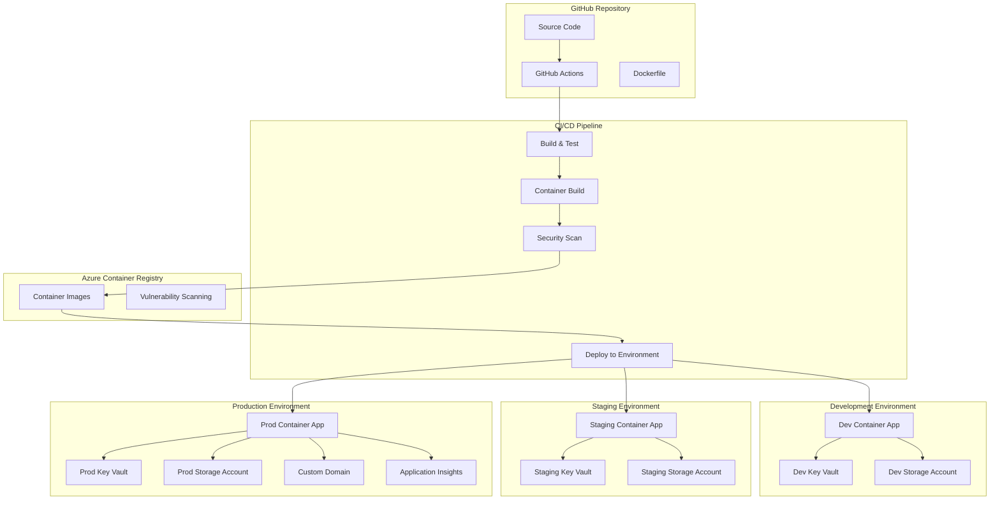
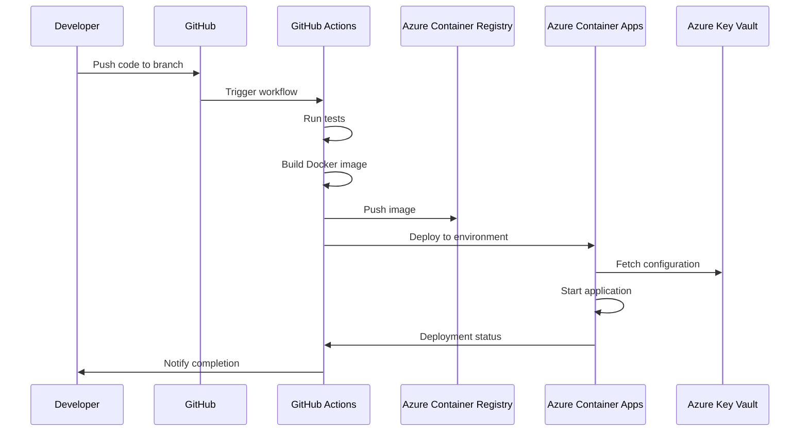
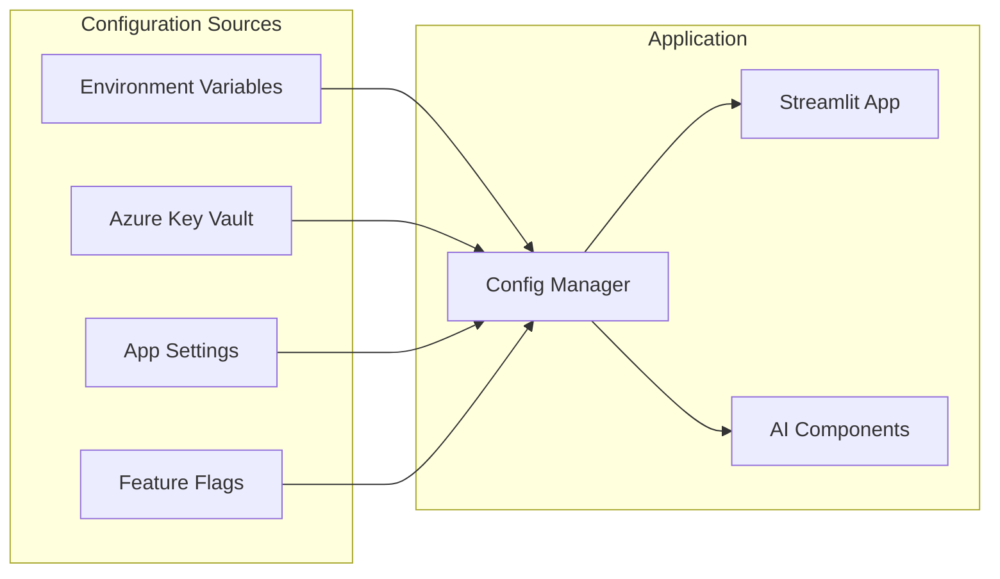

# ADR-007: Deployment & DevOps Architecture

## Status
**ACCEPTED** - 2025-05-24

## Context

SayZhong requires a robust deployment and DevOps architecture that supports:

1. **Streamlit Application Deployment**: Hosting the interactive learning interface
2. **Azure Integration**: Seamless connection to Azure OpenAI and other services
3. **Environment Management**: Development, staging, and production environments
4. **CI/CD Pipeline**: Automated testing, building, and deployment
5. **Monitoring & Observability**: Application health and performance tracking
6. **Cost Optimization**: Efficient resource usage for educational project

### Decision Drivers

- **Simplicity**: Minimize infrastructure complexity for educational project
- **Azure Integration**: Leverage existing Azure ecosystem decisions
- **Developer Experience**: Easy local development and deployment workflow
- **Scalability**: Support growth from prototype to production
- **Cost Efficiency**: Optimize for educational/personal project budget
- **Security**: Secure deployment with proper secret management

## Decision

We will implement a **Containerized Azure Container Apps Architecture** with GitHub Actions CI/CD.

### Core Architecture Components

#### 1. Containerization Strategy
- **Docker** for application containerization
- **Multi-stage builds** for optimized production images
- **Azure Container Registry** for image storage
- **Base image**: Python 3.11 slim for Streamlit apps

#### 2. Deployment Platform
- **Azure Container Apps** as primary hosting platform
- **Consumption-based pricing** for cost optimization
- **Built-in scaling** and health monitoring
- **Integration** with Azure services via managed identity

#### 3. CI/CD Pipeline
- **GitHub Actions** for automation
- **Branch-based deployments**: main → prod, develop → staging
- **Pull request** environments for testing
- **Automated testing** before deployment

#### 4. Environment Management
- **Three environments**: Development, Staging, Production
- **Environment-specific** configuration via Azure Key Vault
- **Feature flags** for gradual rollouts
- **Database migrations** handled via deployment scripts

## Architecture Diagram



## Deployment Workflow



## Configuration Management



## Alternatives Considered

### 1. Azure App Service
**Pros**: Simpler deployment, built-in scaling, good Azure integration
**Cons**: Higher cost, less container control, limited customization
**Why Rejected**: Cost efficiency and flexibility requirements favor Container Apps

### 2. Azure Kubernetes Service (AKS)
**Pros**: Maximum flexibility, enterprise-grade orchestration
**Cons**: High complexity, infrastructure overhead, cost
**Why Rejected**: Overkill for educational project scope

### 3. Virtual Machine Deployment
**Pros**: Full control, traditional deployment model
**Cons**: High maintenance, manual scaling, security overhead
**Why Rejected**: Too much operational complexity

### 4. Streamlit Cloud
**Pros**: Zero infrastructure management, Streamlit-optimized
**Cons**: Limited Azure integration, vendor lock-in, scaling limitations
**Why Rejected**: Poor integration with Azure OpenAI and storage requirements

## Implementation Details

### Docker Configuration

```dockerfile
# Multi-stage build for optimization
FROM python:3.11-slim as builder

WORKDIR /app
COPY requirements.txt .
RUN pip install --no-cache-dir -r requirements.txt

FROM python:3.11-slim as runtime

WORKDIR /app
COPY --from=builder /usr/local/lib/python3.11/site-packages /usr/local/lib/python3.11/site-packages
COPY . .

EXPOSE 8501
HEALTHCHECK CMD curl --fail http://localhost:8501/_stcore/health || exit 1

CMD ["streamlit", "run", "app.py", "--server.port=8501", "--server.address=0.0.0.0"]
```

### GitHub Actions Workflow

```yaml
name: Deploy SayZhong Application

on:
  push:
    branches: [main, develop]
  pull_request:
    branches: [main]

env:
  REGISTRY: sayzhongacr.azurecr.io
  IMAGE_NAME: sayzhong-app

jobs:
  build-and-deploy:
    runs-on: ubuntu-latest
    steps:
      - uses: actions/checkout@v4
      
      - name: Set up Python
        uses: actions/setup-python@v4
        with:
          python-version: '3.11'
      
      - name: Install dependencies
        run: |
          pip install -r requirements.txt
          pip install pytest flake8
      
      - name: Run tests
        run: pytest tests/
      
      - name: Azure Login
        uses: azure/login@v1
        with:
          creds: ${{ secrets.AZURE_CREDENTIALS }}
      
      - name: Log in to Azure Container Registry
        run: az acr login --name sayzhongacr
      
      - name: Build and push Docker image
        run: |
          docker build -t ${{ env.REGISTRY }}/${{ env.IMAGE_NAME }}:${{ github.sha }} .
          docker push ${{ env.REGISTRY }}/${{ env.IMAGE_NAME }}:${{ github.sha }}
      
      - name: Deploy to Container Apps
        uses: azure/container-apps-deploy-action@v1
        with:
          resource-group: sayzhong-${{ github.ref_name }}-rg
          container-app-name: sayzhong-${{ github.ref_name }}-app
          image: ${{ env.REGISTRY }}/${{ env.IMAGE_NAME }}:${{ github.sha }}
```

### Environment Configuration

```python
# config/deployment.py
import os
from azure.keyvault.secrets import SecretClient
from azure.identity import DefaultAzureCredential

class DeploymentConfig:
    def __init__(self):
        self.environment = os.getenv('ENVIRONMENT', 'development')
        self.key_vault_url = os.getenv('KEY_VAULT_URL')
        self._secret_client = None
    
    @property
    def secret_client(self):
        if not self._secret_client and self.key_vault_url:
            credential = DefaultAzureCredential()
            self._secret_client = SecretClient(
                vault_url=self.key_vault_url,
                credential=credential
            )
        return self._secret_client
    
    def get_secret(self, secret_name: str) -> str:
        """Retrieve secret from Azure Key Vault or environment variables."""
        # Try environment variable first (for local development)
        env_value = os.getenv(secret_name)
        if env_value:
            return env_value
        
        # Fall back to Key Vault
        if self.secret_client:
            try:
                secret = self.secret_client.get_secret(secret_name)
                return secret.value
            except Exception as e:
                print(f"Failed to retrieve secret {secret_name}: {e}")
        
        return None
```

## Consequences

### Positive
- **Simplified Infrastructure**: Container Apps reduce operational complexity
- **Cost Efficiency**: Consumption-based pricing optimizes costs
- **Azure Integration**: Native integration with Azure services
- **Developer Productivity**: Streamlined CI/CD workflow
- **Scalability**: Built-in auto-scaling capabilities
- **Security**: Managed identity and Key Vault integration

### Negative
- **Container Complexity**: Requires Docker knowledge
- **Azure Lock-in**: Harder to migrate to other cloud providers
- **Limited Control**: Less flexibility than full Kubernetes
- **Learning Curve**: Team needs to learn Azure Container Apps

### Risks and Mitigations
- **Risk**: Container Apps service limitations
  - **Mitigation**: Thorough testing and fallback to App Service
- **Risk**: CI/CD pipeline failures
  - **Mitigation**: Staged deployments and rollback procedures
- **Risk**: Secret management breaches
  - **Mitigation**: Least privilege access and audit logging

## Related ADRs
- [ADR-001: AI Framework Architecture](./001-ai-framework-architecture.md) - Azure OpenAI integration requirements
- [ADR-003: Data Storage Architecture](./003-data-storage-architecture.md) - Storage connectivity in deployment
- [ADR-005: Security Architecture](./005-security-architecture.md) - Security requirements for deployment
- [ADR-008: Performance & Scalability Architecture](./008-performance-scalability-architecture.md) - Performance monitoring integration

## Implementation Notes

### Phase 1: Basic Deployment (Week 1-2)
1. Create Docker configuration
2. Set up Azure Container Registry
3. Configure basic Container Apps deployment
4. Implement environment variable management

### Phase 2: CI/CD Pipeline (Week 3-4)
1. Create GitHub Actions workflows
2. Set up branch-based deployments
3. Implement automated testing
4. Configure Azure Key Vault integration

### Phase 3: Production Readiness (Week 5-6)
1. Add monitoring and logging
2. Implement health checks
3. Set up custom domain
4. Configure backup and disaster recovery

### Infrastructure as Code (IaC)

We will use **Azure Resource Manager (ARM) Templates** with **Bicep** for infrastructure deployment:

#### Infrastructure Components
- **Azure Container Apps Environment** - Application hosting platform
- **Azure Container Registry** - Container image storage
- **Azure Key Vault** - Secret and configuration management
- **Azure Storage Account** - User data and application assets
- **Azure Application Insights** - Monitoring and telemetry
- **Azure AD B2C** - User authentication and identity management

#### Bicep Template Structure
```
infrastructure/
├── main.bicep                    # Main infrastructure template
├── modules/
│   ├── container-apps.bicep      # Container Apps configuration
│   ├── key-vault.bicep          # Key Vault setup
│   ├── storage.bicep            # Storage account configuration
│   └── monitoring.bicep         # Application Insights setup
└── parameters/
    ├── dev.parameters.json      # Development environment
    ├── staging.parameters.json  # Staging environment
    └── prod.parameters.json     # Production environment
```

#### Deployment Strategy
- **Environment Isolation**: Separate resource groups per environment
- **Parameter-driven**: Environment-specific configurations via parameter files
- **Incremental Deployment**: ARM template deployment mode for updates
- **Validation**: Template validation before deployment
- **Rollback Support**: ARM deployment history for quick rollbacks

#### GitHub Actions Integration
Infrastructure deployment integrated into CI/CD pipeline:
1. **Infrastructure Validation** - Bicep template validation
2. **Environment Deployment** - Deploy infrastructure before application
3. **Configuration Update** - Update Key Vault secrets post-deployment
4. **Health Verification** - Verify infrastructure health before app deployment

### Key Configuration Files
- `Dockerfile` - Container definition
- `.github/workflows/deploy.yml` - CI/CD pipeline
- `docker-compose.yml` - Local development
- `infrastructure/main.bicep` - Infrastructure as Code
- `config/deployment.py` - Deployment configuration management

This architecture provides a solid foundation for deploying SayZhong while maintaining flexibility for future growth and ensuring integration with our chosen Azure ecosystem.
