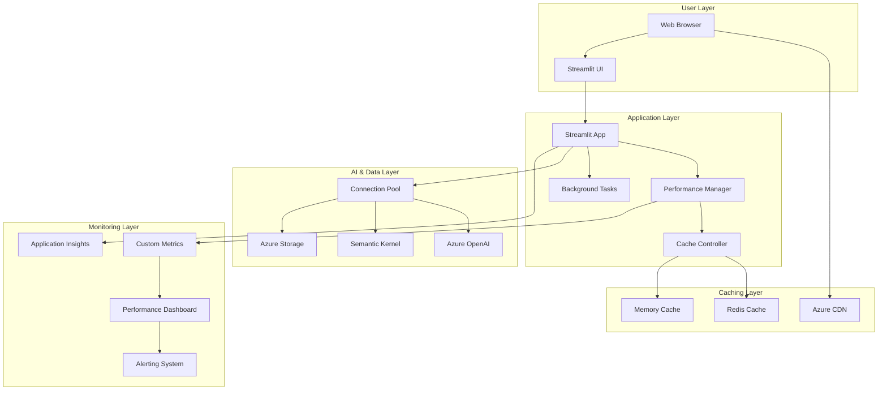
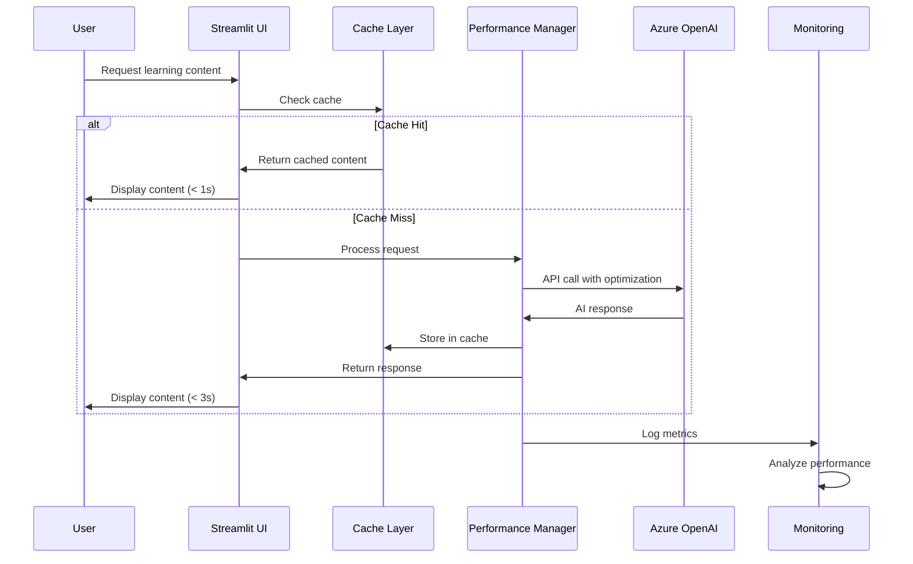
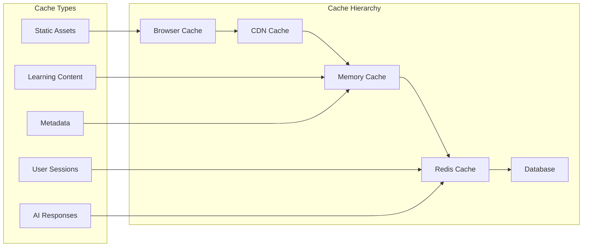

# ADR-008: Performance & Scalability Architecture

## Status
**ACCEPTED** - 2025-05-24

## Context

SayZhong needs a performance and scalability architecture that ensures:

1. **Responsive User Experience**: Fast page loads and AI response times
2. **Cost-Effective AI Usage**: Optimize Azure OpenAI API calls and costs
3. **Concurrent User Support**: Handle multiple users efficiently
4. **Scalable Learning Content**: Manage growing corpus of learning materials
5. **Performance Monitoring**: Track and optimize application performance
6. **Resource Optimization**: Efficient use of computational resources

### Decision Drivers

- **User Experience**: Sub-3-second response times for AI interactions
- **Cost Optimization**: Minimize Azure OpenAI API costs
- **Scalability**: Support 10-100 concurrent users initially
- **Reliability**: 99.5% uptime target
- **Observability**: Comprehensive performance monitoring
- **Educational Context**: Balance performance with learning effectiveness

## Decision

We will implement a **Multi-Layer Caching Architecture with Smart Resource Management**.

### Core Architecture Components

#### 1. Caching Strategy
- **Redis Cache** for session state and frequent queries
- **Local Memory Cache** for static learning content
- **CDN** for static assets and media files
- **AI Response Caching** for common interactions

#### 2. Performance Optimization
- **Lazy Loading** for content and components
- **Streaming Responses** for AI-generated content
- **Connection Pooling** for database and API connections
- **Async Processing** for non-critical operations

#### 3. Scalability Management
- **Horizontal Scaling** via Azure Container Apps
- **Load Balancing** with built-in Azure capabilities
- **Resource Limits** and auto-scaling policies
- **Background Task Processing** for heavy operations

#### 4. Monitoring & Observability
- **Application Insights** for performance tracking
- **Custom Metrics** for learning-specific KPIs
- **Real-time Dashboards** for system health
- **Alerting** for performance degradation

## Architecture Diagram



## Performance Flow



## Caching Architecture



## Alternatives Considered

### 1. Simple In-Memory Caching Only
**Pros**: Simplicity, no external dependencies
**Cons**: Limited scalability, session loss on restart
**Why Rejected**: Insufficient for multi-user scenarios

### 2. Database-Only Optimization
**Pros**: Centralized data, ACID compliance
**Cons**: Higher latency, database bottlenecks
**Why Rejected**: Doesn't address AI API optimization needs

### 3. Full Kubernetes with Advanced Caching
**Pros**: Maximum scalability, enterprise features
**Cons**: High complexity, infrastructure overhead
**Why Rejected**: Over-engineering for current scope

### 4. Third-Party Performance Services
**Pros**: Managed solutions, proven performance
**Cons**: Additional costs, vendor dependencies
**Why Rejected**: Budget constraints and Azure ecosystem preference

## Implementation Details

### Performance Manager

```python
# performance/manager.py
import asyncio
import time
from typing import Dict, Any, Optional
from dataclasses import dataclass
from azure.monitor.opentelemetry import configure_azure_monitor
from opentelemetry import metrics
import redis.asyncio as redis

@dataclass
class PerformanceMetrics:
    response_time: float
    cache_hit_rate: float
    ai_api_calls: int
    concurrent_users: int
    memory_usage: float

class PerformanceManager:
    def __init__(self):
        self.redis_client = None
        self.memory_cache = {}
        self.metrics_collector = metrics.get_meter("sayzhong-performance")
        self.response_time_histogram = self.metrics_collector.create_histogram(
            name="response_time_seconds",
            description="Response time in seconds"
        )
        self.cache_hit_counter = self.metrics_collector.create_counter(
            name="cache_hits_total",
            description="Total cache hits"
        )
        
    async def initialize(self):
        """Initialize performance manager with Redis connection."""
        self.redis_client = redis.Redis.from_url(
            os.getenv('REDIS_URL', 'redis://localhost:6379')
        )
    
    async def get_cached_response(self, cache_key: str) -> Optional[Any]:
        """Get response from cache with performance tracking."""
        start_time = time.time()
        
        # Try memory cache first
        if cache_key in self.memory_cache:
            self.cache_hit_counter.add(1, {"cache_type": "memory"})
            return self.memory_cache[cache_key]
        
        # Try Redis cache
        if self.redis_client:
            try:
                cached_data = await self.redis_client.get(cache_key)
                if cached_data:
                    self.cache_hit_counter.add(1, {"cache_type": "redis"})
                    # Store in memory cache for faster future access
                    self.memory_cache[cache_key] = cached_data
                    return cached_data
            except Exception as e:
                print(f"Redis cache error: {e}")
        
        return None
    
    async def cache_response(self, cache_key: str, data: Any, ttl: int = 3600):
        """Cache response with appropriate TTL."""
        # Store in memory cache
        self.memory_cache[cache_key] = data
        
        # Store in Redis with TTL
        if self.redis_client:
            try:
                await self.redis_client.setex(cache_key, ttl, data)
            except Exception as e:
                print(f"Redis cache storage error: {e}")
    
    def track_performance(self, operation: str, duration: float):
        """Track performance metrics."""
        self.response_time_histogram.record(
            duration, 
            attributes={"operation": operation}
        )
```

### AI Response Optimization

```python
# ai/optimization.py
import hashlib
import json
from typing import List, Dict, Any
from dataclasses import dataclass

@dataclass
class AIOptimizationConfig:
    max_response_length: int = 2000
    cache_ttl: int = 3600
    batch_size: int = 5
    rate_limit_delay: float = 0.1

class AIResponseOptimizer:
    def __init__(self, performance_manager, config: AIOptimizationConfig):
        self.performance_manager = performance_manager
        self.config = config
        self.rate_limiter = asyncio.Semaphore(10)  # Max 10 concurrent AI calls
    
    def generate_cache_key(self, prompt: str, context: Dict[str, Any]) -> str:
        """Generate deterministic cache key for AI responses."""
        cache_input = {
            "prompt": prompt,
            "context": context,
            "version": "1.0"  # Increment when AI behavior changes
        }
        return hashlib.md5(json.dumps(cache_input, sort_keys=True).encode()).hexdigest()
    
    async def get_ai_response(self, prompt: str, context: Dict[str, Any]) -> str:
        """Get AI response with caching and optimization."""
        cache_key = f"ai_response:{self.generate_cache_key(prompt, context)}"
        
        # Check cache first
        cached_response = await self.performance_manager.get_cached_response(cache_key)
        if cached_response:
            return cached_response
        
        # Rate limiting
        async with self.rate_limiter:
            # Add small delay to prevent overwhelming the API
            await asyncio.sleep(self.config.rate_limit_delay)
            
            # Make AI API call
            start_time = time.time()
            try:
                response = await self._make_ai_call(prompt, context)
                duration = time.time() - start_time
                
                # Track performance
                self.performance_manager.track_performance("ai_api_call", duration)
                
                # Cache the response
                await self.performance_manager.cache_response(
                    cache_key, 
                    response, 
                    self.config.cache_ttl
                )
                
                return response
                
            except Exception as e:
                print(f"AI API call failed: {e}")
                return "I'm having trouble processing your request right now. Please try again."
    
    async def _make_ai_call(self, prompt: str, context: Dict[str, Any]) -> str:
        """Make the actual AI API call."""
        # Implementation using Semantic Kernel
        # This would integrate with our ADR-001 AI framework decision
        pass
```

### Streamlit Performance Optimization

```python
# ui/performance.py
import streamlit as st
from functools import wraps
import time

def cache_learning_content(ttl: int = 3600):
    """Decorator for caching learning content."""
    def decorator(func):
        @wraps(func)
        @st.cache_data(ttl=ttl)
        def wrapper(*args, **kwargs):
            return func(*args, **kwargs)
        return wrapper
    return decorator

def async_component(func):
    """Decorator for async Streamlit components."""
    @wraps(func)
    def wrapper(*args, **kwargs):
        # Use Streamlit's experimental async support
        return asyncio.run(func(*args, **kwargs))
    return wrapper

class StreamlitPerformanceOptimizer:
    def __init__(self):
        self.component_cache = {}
    
    @staticmethod
    def lazy_load_component(component_name: str):
        """Lazy load expensive components."""
        if component_name not in st.session_state:
            st.session_state[component_name] = None
        
        if st.session_state[component_name] is None:
            with st.spinner(f"Loading {component_name}..."):
                # Load component only when needed
                pass
    
    @staticmethod
    def optimize_dataframe_display(df, max_rows: int = 1000):
        """Optimize large dataframe display."""
        if len(df) > max_rows:
            st.warning(f"Showing first {max_rows} rows of {len(df)} total rows")
            return df.head(max_rows)
        return df
    
    @staticmethod
    def batch_ui_updates(updates: List[callable]):
        """Batch multiple UI updates for better performance."""
        container = st.container()
        with container:
            for update in updates:
                update()
```

### Monitoring Dashboard

```python
# monitoring/dashboard.py
import streamlit as st
import plotly.graph_objects as go
import plotly.express as px
from datetime import datetime, timedelta

class PerformanceDashboard:
    def __init__(self, performance_manager):
        self.performance_manager = performance_manager
    
    def render_dashboard(self):
        """Render performance monitoring dashboard."""
        st.title("SayZhong Performance Dashboard")
        
        # Real-time metrics
        col1, col2, col3, col4 = st.columns(4)
        
        with col1:
            st.metric("Response Time", "2.3s", "-0.5s")
        
        with col2:
            st.metric("Cache Hit Rate", "85%", "+5%")
        
        with col3:
            st.metric("Active Users", "23", "+3")
        
        with col4:
            st.metric("AI API Calls", "156", "+12")
        
        # Performance charts
        self._render_response_time_chart()
        self._render_cache_performance()
        self._render_user_activity()
    
    def _render_response_time_chart(self):
        """Render response time chart."""
        st.subheader("Response Time Trends")
        
        # Mock data - replace with actual metrics
        times = [datetime.now() - timedelta(minutes=x) for x in range(60, 0, -1)]
        response_times = [2.1, 2.3, 1.8, 2.5, 2.0] * 12  # Mock data
        
        fig = go.Figure()
        fig.add_trace(go.Scatter(
            x=times, 
            y=response_times,
            mode='lines+markers',
            name='Response Time',
            line=dict(color='blue')
        ))
        
        fig.update_layout(
            title="Response Time Over Time",
            xaxis_title="Time",
            yaxis_title="Response Time (seconds)",
            height=400
        )
        
        st.plotly_chart(fig, use_container_width=True)
    
    def _render_cache_performance(self):
        """Render cache performance metrics."""
        st.subheader("Cache Performance")
        
        cache_data = {
            'Cache Type': ['Memory', 'Redis', 'CDN'],
            'Hit Rate': [95, 82, 78],
            'Miss Rate': [5, 18, 22]
        }
        
        fig = px.bar(
            x=cache_data['Cache Type'],
            y=cache_data['Hit Rate'],
            title="Cache Hit Rates by Type",
            color=cache_data['Hit Rate'],
            color_continuous_scale='Greens'
        )
        
        st.plotly_chart(fig, use_container_width=True)
```

## Performance Targets

| Metric | Target | Measurement |
|--------|--------|-------------|
| Page Load Time | < 2 seconds | Time to first meaningful paint |
| AI Response Time | < 3 seconds | From request to complete response |
| Cache Hit Rate | > 80% | Percentage of requests served from cache |
| Concurrent Users | 100+ | Simultaneous active users |
| API Rate Limit | < 90% | Azure OpenAI usage relative to limits |
| Memory Usage | < 512MB | Per container instance |
| CPU Usage | < 70% | Average CPU utilization |

## Consequences

### Positive
- **Improved User Experience**: Fast, responsive interactions
- **Cost Optimization**: Reduced AI API costs through caching
- **Scalability**: Support for growing user base
- **Reliability**: Better performance under load
- **Observability**: Comprehensive performance monitoring
- **Resource Efficiency**: Optimal use of cloud resources

### Negative
- **Complexity**: Additional caching and monitoring systems
- **Memory Usage**: Higher memory requirements for caching
- **Cache Invalidation**: Complexity in managing cache consistency
- **Monitoring Overhead**: Additional operational complexity

### Risks and Mitigations
- **Risk**: Cache stampede during high traffic
  - **Mitigation**: Cache warming and distributed locking
- **Risk**: Memory leaks in long-running processes
  - **Mitigation**: Regular memory monitoring and container restarts
- **Risk**: Performance degradation with scale
  - **Mitigation**: Horizontal scaling and load testing

## Related ADRs
- [ADR-001: AI Framework Architecture](./001-ai-framework-architecture.md) - AI response optimization
- [ADR-002: State Management Strategy](./002-state-management-strategy.md) - Session and cache management
- [ADR-007: Deployment & DevOps Architecture](./007-deployment-devops-architecture.md) - Scaling and monitoring infrastructure

## Implementation Notes

### Phase 1: Basic Performance (Week 1-2)
1. Implement memory caching for static content
2. Add basic performance tracking
3. Optimize Streamlit component loading
4. Set up Application Insights

### Phase 2: Advanced Caching (Week 3-4)
1. Integrate Redis for distributed caching
2. Implement AI response caching
3. Add CDN for static assets
4. Create performance dashboard

### Phase 3: Optimization & Monitoring (Week 5-6)
1. Implement advanced rate limiting
2. Add predictive caching
3. Set up automated performance testing
4. Configure alerting and auto-scaling

### Key Configuration
- Redis cache configuration and TTL settings
- Application Insights custom metrics
- Auto-scaling policies and thresholds
- Performance monitoring dashboards
- Rate limiting and API optimization

This architecture ensures SayZhong delivers optimal performance while maintaining cost efficiency and providing comprehensive observability for continuous improvement.
