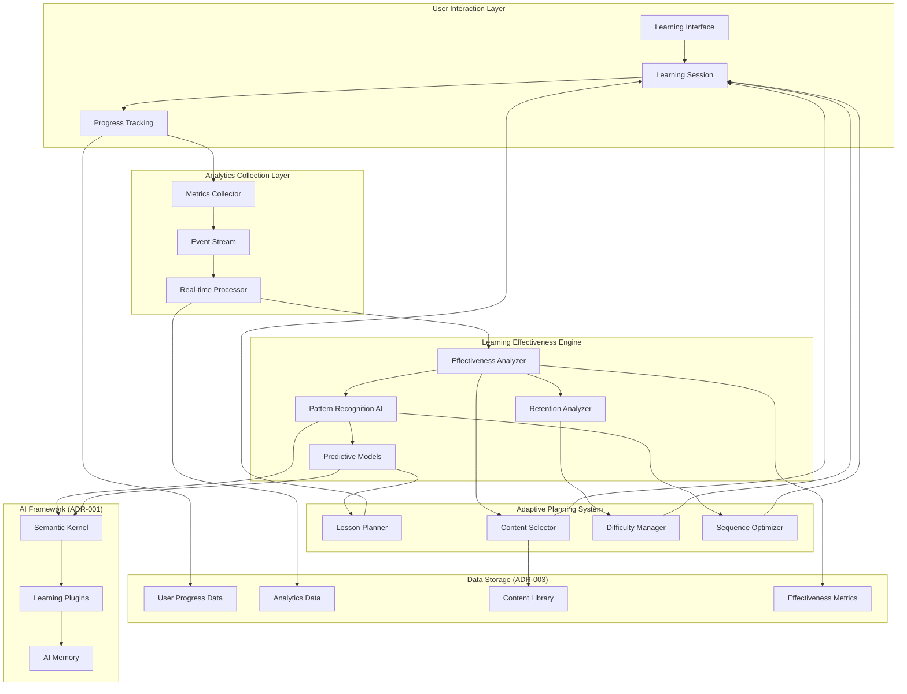

# ADR-009: Learning Effectiveness Feedback Loop Architecture

## Status
**PROPOSED** - 2025-05-24

## Context

SayZhong requires a sophisticated feedback loop system that analyzes learning effectiveness metrics and automatically adapts lesson planning at both individual user and global levels. This system must:

1. **Capture Learning Effectiveness Data**: Track detailed metrics on learning outcomes, retention rates, difficulty progression, and engagement patterns
2. **Analyze Patterns**: Process individual and aggregate data to identify effective learning strategies and content
3. **Adapt Lesson Plans**: Automatically adjust content difficulty, sequencing, and methodology based on effectiveness analysis
4. **Personalize Experiences**: Tailor learning paths to individual user patterns while incorporating global insights
5. **Continuous Improvement**: Create a self-improving system that gets better over time

### Current Architecture Foundation

Based on existing ADRs, we have:
- **ADR-001**: Semantic Kernel AI framework for adaptive learning
- **ADR-002**: Multi-layer state management with Azure Data Lake persistence
- **ADR-003**: Azure Data Lake storage for user progress and analytics
- **ADR-004**: User authentication for individual progress tracking
- **ADR-008**: Performance monitoring and analytics infrastructure

### Decision Drivers

1. **Learning Effectiveness**: Maximize educational outcomes through data-driven adaptation
2. **Personalization**: Individual learning paths while leveraging collective intelligence
3. **Real-time Adaptation**: Dynamic adjustment of lesson plans during learning sessions
4. **Scalability**: Support growing user base with efficient analytics processing
5. **Privacy Compliance**: Analyze patterns while protecting individual user data
6. **Integration**: Seamless integration with existing AI and storage architecture

## Decision

**Choice**: Multi-Layer Adaptive Learning Analytics Architecture

This architecture implements a comprehensive feedback loop with three main components:

### 1. Learning Effectiveness Analytics Engine
- **Real-time Metrics Collection**: Capture learning interactions, outcomes, and behavioral patterns
- **Effectiveness Scoring**: Calculate learning effectiveness scores for content, methods, and sequences
- **Pattern Recognition**: Use AI to identify successful learning patterns and failure modes
- **Retention Analysis**: Track long-term retention and spaced repetition effectiveness

### 2. Adaptive Lesson Planning System
- **Individual Adaptation**: Personalize content based on user-specific learning patterns
- **Global Optimization**: Incorporate insights from aggregate user data
- **Dynamic Sequencing**: Adjust lesson order and difficulty in real-time
- **Content Recommendation**: Suggest optimal content based on effectiveness analysis

### 3. Feedback Integration Framework
- **Continuous Learning Loop**: Real-time feedback between analytics and lesson planning
- **A/B Testing Infrastructure**: Test different approaches and measure effectiveness
- **Predictive Modeling**: Predict learning outcomes and optimize paths proactively
- **Performance Monitoring**: Track system effectiveness and adaptation quality

## Architecture Overview



## Implementation Details

### Learning Effectiveness Metrics

#### Individual User Metrics
```python
@dataclass
class LearningEffectivenessMetrics:
    user_id: str
    session_id: str
    timestamp: datetime
    
    # Immediate Effectiveness
    accuracy_rate: float          # Correct answers / total answers
    response_time: float          # Average time per question
    confidence_score: float       # User-reported or inferred confidence
    engagement_duration: float    # Time spent in focused learning
    
    # Learning Progression
    difficulty_progression: float # Rate of difficulty increase
    retention_rate: float         # Performance on previously learned content
    mastery_speed: float          # Time to achieve mastery
    knowledge_transfer: float     # Application to new contexts
    
    # Behavioral Patterns
    session_frequency: float      # Learning session consistency
    optimal_session_length: float # Most effective session duration
    preferred_content_types: List[str] # Most effective content formats
    peak_learning_times: List[str] # Most effective learning times
    
    # Long-term Outcomes
    spaced_repetition_effectiveness: float
    long_term_retention: float    # Retention after 1 week, 1 month
    skill_transfer_rate: float    # Application to real conversations
```

#### Global Effectiveness Metrics
```python
@dataclass
class GlobalEffectivenessMetrics:
    content_id: str
    methodology: str
    timestamp: datetime
    
    # Content Effectiveness
    average_success_rate: float
    completion_rate: float
    user_satisfaction: float
    time_to_mastery: float
    
    # Methodology Effectiveness
    learning_velocity: float
    retention_durability: float
    transfer_effectiveness: float
    engagement_quality: float
    
    # Cohort Analysis
    beginner_effectiveness: float
    intermediate_effectiveness: float
    advanced_effectiveness: float
    demographic_patterns: Dict[str, float]
```

### Adaptive Lesson Planning Algorithm

```python
class AdaptiveLessonPlanner:
    def __init__(self, effectiveness_engine, user_manager, content_library):
        self.effectiveness_engine = effectiveness_engine
        self.user_manager = user_manager
        self.content_library = content_library
        self.ai_planner = SemanticKernel() # From ADR-001
    
    async def generate_personalized_lesson(self, user_id: str) -> LessonPlan:
        """Generate a personalized lesson plan based on effectiveness analysis."""
        
        # Get user's learning effectiveness profile
        user_profile = await self.effectiveness_engine.get_user_profile(user_id)
        global_insights = await self.effectiveness_engine.get_global_insights()
        
        # Analyze current learning state
        current_knowledge = await self.user_manager.get_knowledge_state(user_id)
        learning_gaps = await self.identify_learning_gaps(user_id)
        
        # Use AI to generate optimal lesson plan
        lesson_plan = await self.ai_planner.generate_lesson_plan({
            "user_profile": user_profile,
            "global_insights": global_insights,
            "current_knowledge": current_knowledge,
            "learning_gaps": learning_gaps,
            "available_content": self.content_library.get_relevant_content()
        })
        
        return self.optimize_lesson_sequence(lesson_plan, user_profile)
    
    async def adapt_lesson_real_time(self, session_id: str, performance_data: dict) -> LessonAdjustment:
        """Adapt lesson plan in real-time based on current performance."""
        
        # Analyze current performance
        effectiveness_score = self.effectiveness_engine.calculate_real_time_effectiveness(performance_data)
        
        # Determine necessary adjustments
        if effectiveness_score < 0.6:  # Struggling
            adjustment = await self.create_support_adjustment(session_id, performance_data)
        elif effectiveness_score > 0.9:  # Excelling
            adjustment = await self.create_challenge_adjustment(session_id, performance_data)
        else:  # On track
            adjustment = await self.create_continuation_adjustment(session_id, performance_data)
        
        return adjustment
```

### Learning Effectiveness Engine

```python
class LearningEffectivenessEngine:
    def __init__(self, data_lake_manager, ai_analyzer):
        self.data_lake = data_lake_manager # From ADR-003
        self.ai_analyzer = ai_analyzer # From ADR-001
        self.pattern_cache = {}
    
    async def analyze_learning_effectiveness(self, user_id: str, timeframe: str = "30d") -> EffectivenessAnalysis:
        """Comprehensive analysis of learning effectiveness for a user."""
        
        # Collect learning data
        learning_sessions = await self.data_lake.get_user_sessions(user_id, timeframe)
        progress_data = await self.data_lake.get_user_progress(user_id, timeframe)
        retention_data = await self.data_lake.get_retention_metrics(user_id, timeframe)
        
        # Calculate effectiveness metrics
        immediate_effectiveness = self.calculate_immediate_effectiveness(learning_sessions)
        retention_effectiveness = self.calculate_retention_effectiveness(retention_data)
        progression_effectiveness = self.calculate_progression_effectiveness(progress_data)
        
        # Use AI to identify patterns
        learning_patterns = await self.ai_analyzer.identify_learning_patterns({
            "sessions": learning_sessions,
            "progress": progress_data,
            "retention": retention_data
        })
        
        return EffectivenessAnalysis(
            immediate_effectiveness=immediate_effectiveness,
            retention_effectiveness=retention_effectiveness,
            progression_effectiveness=progression_effectiveness,
            learning_patterns=learning_patterns,
            recommendations=await self.generate_recommendations(learning_patterns)
        )
    
    async def analyze_global_effectiveness(self) -> GlobalEffectivenessAnalysis:
        """Analyze learning effectiveness across all users to identify best practices."""
        
        # Aggregate data from all users (anonymized)
        global_metrics = await self.data_lake.get_aggregated_metrics()
        content_effectiveness = await self.analyze_content_effectiveness()
        methodology_effectiveness = await self.analyze_methodology_effectiveness()
        
        # Identify successful patterns
        successful_patterns = await self.ai_analyzer.identify_global_patterns({
            "metrics": global_metrics,
            "content_effectiveness": content_effectiveness,
            "methodology_effectiveness": methodology_effectiveness
        })
        
        return GlobalEffectivenessAnalysis(
            global_metrics=global_metrics,
            successful_patterns=successful_patterns,
            best_practices=await self.extract_best_practices(successful_patterns),
            improvement_opportunities=await self.identify_improvements(global_metrics)
        )
```

### Real-time Feedback Loop

```python
class FeedbackLoopOrchestrator:
    def __init__(self, effectiveness_engine, lesson_planner, performance_manager):
        self.effectiveness_engine = effectiveness_engine
        self.lesson_planner = lesson_planner
        self.performance_manager = performance_manager # From ADR-008
        self.feedback_queue = asyncio.Queue()
    
    async def process_learning_interaction(self, interaction: LearningInteraction):
        """Process each learning interaction and trigger adaptations as needed."""
        
        # Collect metrics
        metrics = self.extract_metrics(interaction)
        await self.effectiveness_engine.update_metrics(metrics)
        
        # Real-time effectiveness analysis
        effectiveness_score = await self.effectiveness_engine.calculate_real_time_effectiveness(metrics)
        
        # Trigger adaptations if needed
        if self.should_adapt_lesson(effectiveness_score, interaction):
            adaptation = await self.lesson_planner.adapt_lesson_real_time(
                interaction.session_id, 
                metrics
            )
            await self.apply_adaptation(adaptation)
        
        # Queue for batch processing
        await self.feedback_queue.put(metrics)
        
        # Track performance
        await self.performance_manager.track_feedback_loop_performance(effectiveness_score)
    
    async def run_batch_optimization(self):
        """Periodic batch optimization based on accumulated feedback."""
        
        # Process accumulated feedback
        metrics_batch = []
        while not self.feedback_queue.empty():
            metrics_batch.append(await self.feedback_queue.get())
        
        if not metrics_batch:
            return
        
        # Run comprehensive effectiveness analysis
        global_analysis = await self.effectiveness_engine.analyze_global_effectiveness()
        
        # Update content library based on insights
        await self.update_content_effectiveness_scores(global_analysis)
        
        # Optimize lesson planning algorithms
        await self.optimize_planning_algorithms(global_analysis)
        
        # Update user profiles with new insights
        await self.update_user_profiles(metrics_batch)
```

## Data Storage Structure

Building on ADR-003 (Azure Data Lake), we extend the storage structure:

```
/users/{azure_ad_user_id}/
  /effectiveness/
    learning_effectiveness_metrics.json    # Individual effectiveness data
    learning_patterns.json                 # Identified learning patterns
    adaptation_history.json                # History of lesson adaptations
    retention_tracking.json                # Long-term retention data
  /lessons/
    adaptive_lesson_plans.json             # Personalized lesson plans
    real_time_adaptations.json             # Real-time lesson adjustments
    effectiveness_feedback.json            # Lesson effectiveness scores

/analytics/
  /effectiveness/
    global_effectiveness_metrics.json      # Aggregated effectiveness data
    content_effectiveness_scores.json      # Content performance analysis
    methodology_effectiveness.json         # Learning method analysis
    pattern_library.json                   # Successful learning patterns
  /feedback_loops/
    adaptation_effectiveness.json          # Effectiveness of adaptations
    prediction_accuracy.json               # Model prediction accuracy
    system_performance.json                # Feedback loop performance

/content/
  /effectiveness/
    content_effectiveness_scores.json      # Effectiveness scores per content
    usage_patterns.json                    # How content is most effectively used
    optimization_insights.json             # Content optimization recommendations
```

## Integration with Existing ADRs

### ADR-001: AI Framework Integration
- Use Semantic Kernel for pattern recognition and predictive modeling
- Implement learning effectiveness plugins
- Leverage AI memory for personalization context

### ADR-002: State Management Integration
- Cache effectiveness analysis results for real-time access
- Maintain adaptation state across sessions
- Integrate with existing StateManager for seamless operation

### ADR-003: Data Storage Integration
- Extend existing Azure Data Lake structure
- Leverage existing data access patterns
- Maintain consistency with existing data organization

### ADR-004: Authentication Integration
- Use authenticated user IDs for personalized effectiveness analysis
- Respect privacy settings for data usage
- Integrate with rate limiting for analytics processing

### ADR-008: Performance Integration
- Monitor feedback loop performance metrics
- Cache effectiveness calculations for optimal performance
- Track adaptation effectiveness as a key performance indicator

## Privacy and Ethics Considerations

### Individual Privacy
- **Anonymized Global Analysis**: Remove personally identifiable information from global effectiveness analysis
- **Opt-out Options**: Allow users to opt out of effectiveness analysis
- **Data Retention**: Implement appropriate retention policies for effectiveness data
- **Consent Management**: Clear consent for using learning data to improve the system

### Ethical AI Adaptation
- **Bias Prevention**: Monitor for and prevent algorithmic bias in adaptations
- **Transparency**: Provide users with insight into why lessons are adapted
- **User Control**: Allow users to influence or override adaptations
- **Fairness**: Ensure adaptations don't disadvantage any user groups

## Performance Considerations

### Real-time Processing
- **Streaming Analytics**: Process learning interactions in real-time
- **Caching Strategy**: Cache effectiveness scores and patterns for quick access
- **Async Processing**: Non-blocking effectiveness analysis
- **Batch Optimization**: Balance real-time needs with comprehensive analysis

### Scalability
- **Distributed Processing**: Scale analytics processing across multiple instances
- **Efficient Queries**: Optimize data lake queries for effectiveness analysis
- **Incremental Updates**: Update effectiveness models incrementally
- **Resource Management**: Monitor and manage computational resources

## Implementation Phases

### Phase 1: Foundation (Weeks 1-2)
1. Implement basic learning effectiveness metrics collection
2. Create initial effectiveness analysis engine
3. Set up data storage structure for effectiveness data
4. Implement basic real-time adaptation triggers

### Phase 2: Analytics Engine (Weeks 3-4)
1. Develop comprehensive effectiveness analysis algorithms
2. Implement pattern recognition using Semantic Kernel
3. Create predictive models for learning outcomes
4. Build global effectiveness analysis capabilities

### Phase 3: Adaptive Planning (Weeks 5-6)
1. Implement adaptive lesson planning algorithms
2. Create real-time lesson adjustment system
3. Develop content recommendation engine
4. Integrate with existing AI framework

### Phase 4: Optimization (Weeks 7-8)
1. Implement A/B testing framework for adaptations
2. Create effectiveness prediction and validation system
3. Build comprehensive monitoring and performance tracking
4. Optimize for production scale and performance

## Success Metrics

### Learning Effectiveness Metrics
- **Improvement in Learning Outcomes**: 15% increase in average learning effectiveness scores
- **Faster Mastery**: 20% reduction in time to achieve content mastery
- **Better Retention**: 25% improvement in long-term retention rates
- **Increased Engagement**: 30% increase in session completion rates

### System Performance Metrics
- **Adaptation Accuracy**: 85% of adaptations should improve learning outcomes
- **Real-time Performance**: Adaptations should occur within 500ms of trigger
- **Prediction Accuracy**: Learning outcome predictions should be 80% accurate
- **User Satisfaction**: 90% of users should find adaptations helpful

## Consequences

### Positive
- **Personalized Learning**: Highly personalized learning experiences based on individual effectiveness patterns
- **Continuous Improvement**: Self-improving system that gets better over time
- **Data-Driven Decisions**: All lesson planning based on evidence of effectiveness
- **Scalable Intelligence**: Global insights benefit all users while respecting privacy
- **Adaptive Response**: Real-time adaptation to learning needs and performance

### Negative
- **Complexity**: Significant increase in system complexity and computational requirements
- **Data Requirements**: Need for extensive data collection and storage
- **Cold Start Problem**: New users lack historical data for personalization
- **Computational Cost**: AI analysis and real-time processing require significant resources

### Risks and Mitigations
- **Risk**: Over-adaptation leading to confusion or reduced learning
  - **Mitigation**: Implement adaptation limits and user feedback mechanisms
- **Risk**: Bias in effectiveness analysis favoring certain learning styles
  - **Mitigation**: Regular bias audits and diverse evaluation criteria
- **Risk**: Privacy concerns with extensive data collection
  - **Mitigation**: Strong privacy controls and user consent management
- **Risk**: Performance degradation from complex real-time processing
  - **Mitigation**: Efficient caching and asynchronous processing strategies

## Related ADRs

- [ADR-001: AI Framework Architecture](./001-ai-framework-architecture.md) - AI components for pattern recognition and adaptation
- [ADR-002: State Management Strategy](./002-state-management-strategy.md) - State management for adaptation and effectiveness data
- [ADR-003: Data Storage Architecture](./003-data-storage-architecture.md) - Storage foundation for effectiveness metrics and analysis
- [ADR-004: Authentication & User Management](./004-authentication-user-management.md) - User identification for personalized effectiveness analysis
- [ADR-008: Performance & Scalability Architecture](./008-performance-scalability-architecture.md) - Performance monitoring and optimization for feedback loops

## References

- [Educational Data Mining and Learning Analytics](https://jedm.educationaldatamining.org/)
- [Adaptive Learning Technologies](https://www.educause.edu/research-and-publications/research/learning-technologies)
- [Spaced Repetition and Learning Effectiveness](https://en.wikipedia.org/wiki/Spaced_repetition)
- [AI in Education: Opportunities and Challenges](https://www.nature.com/articles/s42256-020-0172-5)
