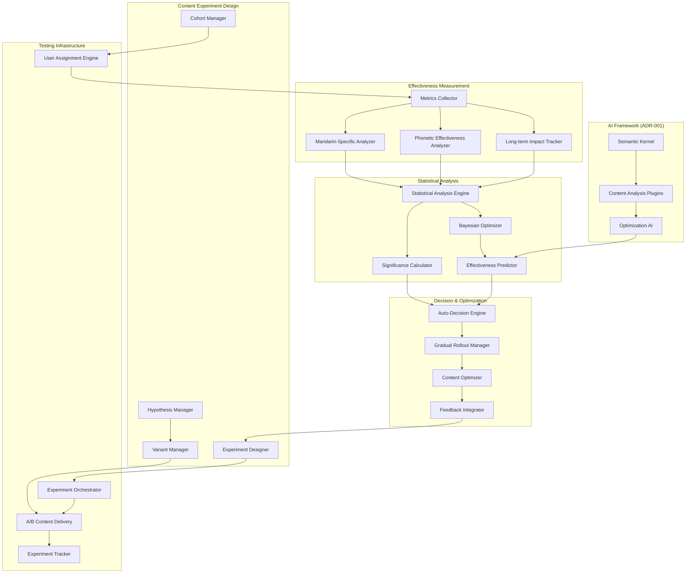

# ADR-015: Content Effectiveness & A/B Testing Framework

## Status
**PROPOSED** - 2025-05-24

## Context

SayZhong requires a comprehensive framework for measuring and optimizing the effectiveness of Mandarin learning content through systematic experimentation and data-driven decision making. This framework must:

1. **Content Effectiveness Measurement**: Evaluate how well different learning materials, methodologies, and approaches work for Mandarin language acquisition
2. **A/B Testing Infrastructure**: Support systematic experimentation with different content approaches and teaching methodologies
3. **Phonetic English Optimization**: Test and optimize phonetic approximations for pronunciation learning
4. **Multi-modal Content Testing**: Compare effectiveness across different content types (audio, visual, interactive, conversational)
5. **Personalization Testing**: Experiment with different personalization strategies and their effectiveness

### Current Architecture Foundation

Building on existing ADRs:
- **ADR-009**: Learning Effectiveness Feedback Loop for real-time adaptation
- **ADR-010**: Content Management & Curriculum Architecture for content organization
- **ADR-011**: User Interface & Learning Experience Architecture for delivery mechanisms
- **ADR-012**: Assessment & Progress Tracking for effectiveness measurement
- **ADR-013**: Lesson Planning & Content Sequencing for adaptive delivery
- **ADR-014**: Real-time Interaction & Session Management for immediate feedback

### Decision Drivers

1. **Evidence-Based Content Development**: Data-driven decisions for content creation and optimization
2. **Continuous Improvement**: Systematic approach to improving learning outcomes
3. **Mandarin-Specific Optimization**: Test approaches specific to Mandarin language learning challenges
4. **Scalable Experimentation**: Support concurrent experiments without user experience degradation
5. **Statistical Validity**: Ensure experiments provide statistically significant results
6. **Real-time Optimization**: Balance thorough testing with rapid improvement cycles

## Decision

**Choice**: Comprehensive Content Effectiveness & A/B Testing Framework with Mandarin-Specific Optimization

This framework implements multi-dimensional content testing with sophisticated statistical analysis and real-time optimization capabilities.

### 1. Content Effectiveness Measurement Engine
- **Multi-dimensional Metrics**: Effectiveness across learning velocity, retention, engagement, and real-world application
- **Mandarin-Specific Metrics**: Pronunciation accuracy, tonal recognition, vocabulary retention, phonetic understanding
- **Long-term Impact Analysis**: Track effectiveness over weeks and months, not just immediate sessions
- **Contextual Effectiveness**: Measure how content performs in different learning contexts and user states

### 2. A/B Testing Infrastructure
- **Experiment Management System**: Design, deploy, and monitor experiments with proper statistical controls
- **Multi-variant Testing**: Support complex experiments with multiple variables and interactions
- **Gradual Rollout**: Progressive deployment of new content with automatic rollback capabilities
- **Cohort-based Testing**: Test different approaches with different user segments

### 3. Phonetic & Linguistic Testing Framework
- **Phonetic Effectiveness Testing**: Measure impact of phonetic English approximations on pronunciation learning
- **Pronunciation Method Testing**: Compare different approaches to teaching Mandarin pronunciation and tones
- **Vocabulary Learning Optimization**: Test different vocabulary teaching methodologies and retention strategies
- **Conversation Effectiveness**: Evaluate different conversation practice approaches and contexts

## Architecture Overview



## Implementation Details

### Content Effectiveness Metrics

#### Mandarin-Specific Effectiveness Metrics
```python
@dataclass
class MandarinContentEffectiveness:
    content_id: str
    content_type: str  # vocabulary, pronunciation, grammar, conversation, phonetic
    timestamp: datetime
    
    # Pronunciation & Tonal Effectiveness
    pronunciation_accuracy_improvement: float
    tonal_recognition_improvement: float
    speaking_confidence_improvement: float
    native_speaker_comprehension_rate: float
    
    # Phonetic Learning Effectiveness
    phonetic_understanding_rate: float
    pronunciation_improvement_accuracy: float
    phonetic_retention_over_time: float
    phonetic_pattern_recognition: float
    
    # Vocabulary Effectiveness
    vocabulary_retention_rate: float
    contextual_usage_accuracy: float
    active_vs_passive_acquisition: float
    semantic_connection_strength: float
    
    # Communication Context Effectiveness
    communication_context_understanding: float
    appropriate_usage_in_context: float
    phonetic_understanding_improvement: float
    real_world_application_success: float
    
    # Overall Learning Impact
    engagement_sustainability: float
    motivation_impact: float
    learning_velocity_improvement: float
    long_term_retention_effectiveness: float
```

#### A/B Testing Experiment Structure
```python
@dataclass
class ContentExperiment:
    experiment_id: str
    experiment_name: str
    hypothesis: str
    start_date: datetime
    planned_end_date: datetime
    
    # Experiment Configuration
    variants: List[ContentVariant]
    target_cohorts: List[UserCohort]
    traffic_allocation: Dict[str, float]
    minimum_sample_size: int
    
    # Success Metrics
    primary_metrics: List[str]
    secondary_metrics: List[str]
    guardrail_metrics: List[str]
    
    # Statistical Configuration
    confidence_level: float = 0.95
    minimum_detectable_effect: float = 0.05
    statistical_power: float = 0.8
    
    # Mandarin-Specific Parameters
    mandarin_skill_levels: List[str]  # beginner, intermediate, advanced
    tested_language_aspects: List[str]  # pronunciation, vocabulary, grammar, phonetics
    phonetic_context_variants: List[str]
    
    # Status and Results
    status: ExperimentStatus
    statistical_significance: Optional[float]
    practical_significance: Optional[float]
    winning_variant: Optional[str]
    confidence_interval: Optional[Tuple[float, float]]
```

### Experiment Management System

```python
class ContentExperimentManager:
    def __init__(self, semantic_kernel, data_lake_manager, statistics_engine):
        self.semantic_kernel = semantic_kernel  # From ADR-001
        self.data_lake = data_lake_manager  # From ADR-003
        self.statistics_engine = statistics_engine
        self.experiment_cache = {}  # For performance optimization
    
    async def design_experiment(self, content_hypothesis: str, target_metrics: List[str]) -> ContentExperiment:
        """AI-assisted experiment design for content effectiveness testing."""
        
        # Use AI to analyze hypothesis and suggest experiment structure
        experiment_design = await self.semantic_kernel.generate_experiment_design({
            "hypothesis": content_hypothesis,
            "target_metrics": target_metrics,
            "mandarin_learning_context": await self.get_mandarin_learning_context(),
            "existing_content_library": await self.get_content_library_analysis(),
            "user_cohort_analysis": await self.get_user_cohort_characteristics()
        })
        
        # Calculate statistical requirements
        sample_size = self.statistics_engine.calculate_required_sample_size(
            target_metrics, confidence_level=0.95, minimum_detectable_effect=0.05
        )
        
        return ContentExperiment(
            experiment_id=self.generate_experiment_id(),
            experiment_name=experiment_design["name"],
            hypothesis=content_hypothesis,
            variants=self.create_content_variants(experiment_design["variants"]),
            target_cohorts=self.identify_target_cohorts(experiment_design["cohorts"]),
            minimum_sample_size=sample_size,
            primary_metrics=target_metrics,
            mandarin_skill_levels=experiment_design["skill_levels"],
            tested_language_aspects=experiment_design["language_aspects"]
        )
    
    async def deploy_experiment(self, experiment: ContentExperiment) -> ExperimentDeployment:
        """Deploy content experiment with proper user assignment and tracking."""
        
        # Validate experiment readiness
        validation_result = await self.validate_experiment_readiness(experiment)
        if not validation_result.is_valid:
            raise ExperimentValidationError(validation_result.errors)
        
        # Set up user assignment strategy
        assignment_strategy = await self.create_assignment_strategy(experiment)
        
        # Deploy content variants
        for variant in experiment.variants:
            await self.deploy_content_variant(variant, assignment_strategy)
        
        # Start tracking and data collection
        await self.start_experiment_tracking(experiment)
        
        # Set up automated monitoring
        await self.setup_experiment_monitoring(experiment)
        
        return ExperimentDeployment(
            experiment_id=experiment.experiment_id,
            deployment_timestamp=datetime.now(),
            assignment_strategy=assignment_strategy,
            monitoring_config=await self.get_monitoring_config(experiment)
        )
    
    async def analyze_experiment_results(self, experiment_id: str) -> ExperimentResults:
        """Comprehensive analysis of experiment effectiveness and significance."""
        
        experiment = await self.get_experiment(experiment_id)
        
        # Collect experiment data
        experiment_data = await self.collect_experiment_data(experiment)
        
        # Statistical analysis
        statistical_results = await self.statistics_engine.analyze_experiment(
            experiment_data, experiment.primary_metrics, experiment.secondary_metrics
        )
        
        # Mandarin-specific analysis
        mandarin_analysis = await self.analyze_mandarin_specific_metrics(
            experiment_data, experiment.tested_language_aspects
        )
        
        # Phonetic effectiveness analysis
        phonetic_analysis = await self.analyze_phonetic_effectiveness(
            experiment_data, experiment.phonetic_context_variants
        )
        
        # AI-powered insights generation
        insights = await self.semantic_kernel.generate_experiment_insights({
            "statistical_results": statistical_results,
            "mandarin_analysis": mandarin_analysis,
            "phonetic_analysis": phonetic_analysis,
            "experiment_hypothesis": experiment.hypothesis
        })
        
        return ExperimentResults(
            experiment_id=experiment_id,
            statistical_significance=statistical_results.significance,
            practical_significance=statistical_results.practical_significance,
            winning_variant=statistical_results.winning_variant,
            confidence_interval=statistical_results.confidence_interval,
            mandarin_specific_insights=mandarin_analysis,
            phonetic_effectiveness_insights=phonetic_analysis,
            ai_generated_insights=insights,
            recommendations=await self.generate_optimization_recommendations(statistical_results, insights)
        )
```

### Mandarin-Specific Content Testing

```python
class MandarinContentTester:
    def __init__(self, pronunciation_analyzer, vocabulary_analyzer, phonetic_analyzer):
        self.pronunciation_analyzer = pronunciation_analyzer  # From ADR-012
        self.vocabulary_analyzer = vocabulary_analyzer
        self.phonetic_analyzer = phonetic_analyzer
    
    async def test_pronunciation_content_effectiveness(self, content_variants: List[ContentVariant]) -> Dict[str, float]:
        """Test effectiveness of different pronunciation teaching approaches."""
        
        effectiveness_scores = {}
        
        for variant in content_variants:
            # Measure pronunciation improvement
            pronunciation_scores = await self.pronunciation_analyzer.measure_improvement(
                variant.content_id, timeframe_days=30
            )
            
            # Analyze tonal accuracy improvement
            tonal_scores = await self.pronunciation_analyzer.measure_tonal_improvement(
                variant.content_id, timeframe_days=30
            )
            
            # Measure speaking confidence
            confidence_scores = await self.pronunciation_analyzer.measure_confidence_improvement(
                variant.content_id, timeframe_days=30
            )
            
            # Calculate composite effectiveness score
            effectiveness_scores[variant.variant_id] = self.calculate_pronunciation_effectiveness(
                pronunciation_scores, tonal_scores, confidence_scores
            )
        
        return effectiveness_scores
    
    async def test_vocabulary_learning_effectiveness(self, content_variants: List[ContentVariant]) -> Dict[str, float]:
        """Test effectiveness of different vocabulary teaching methodologies."""
        
        effectiveness_scores = {}
        
        for variant in content_variants:
            # Vocabulary retention improvement
            retention_scores = await self.vocabulary_analyzer.measure_retention_improvement(
                variant.content_id, timeframe_days=30
            )
            
            # Vocabulary usage accuracy
            usage_scores = await self.vocabulary_analyzer.measure_usage_improvement(
                variant.content_id, timeframe_days=30
            )
            
            # Long-term retention
            long_term_scores = await self.vocabulary_analyzer.measure_long_term_retention(
                variant.content_id, timeframe_days=90
            )
            
            # Semantic understanding
            semantic_scores = await self.vocabulary_analyzer.measure_semantic_understanding(
                variant.content_id, timeframe_days=30
            )
            
            effectiveness_scores[variant.variant_id] = self.calculate_vocabulary_effectiveness(
                retention_scores, usage_scores, long_term_scores, semantic_scores
            )
        
        return effectiveness_scores
    
    async def test_phonetic_content_effectiveness(self, content_variants: List[ContentVariant]) -> Dict[str, float]:
        """Test effectiveness of phonetic English integration approaches."""
        
        effectiveness_scores = {}
        
        for variant in content_variants:
            # Phonetic understanding improvement
            understanding_scores = await self.phonetic_analyzer.measure_phonetic_understanding(
                variant.content_id, timeframe_days=30
            )
            
            # Pronunciation accuracy improvement
            accuracy_scores = await self.phonetic_analyzer.measure_pronunciation_accuracy(
                variant.content_id, timeframe_days=30
            )
            
            # Real-world application success
            application_scores = await self.phonetic_analyzer.measure_real_world_application(
                variant.content_id, timeframe_days=60
            )
            
            effectiveness_scores[variant.variant_id] = self.calculate_phonetic_effectiveness(
                understanding_scores, accuracy_scores, application_scores
            )
        
        return effectiveness_scores
```

### Automated Optimization System

```python
class ContentOptimizationEngine:
    def __init__(self, experiment_manager, bayesian_optimizer, content_manager):
        self.experiment_manager = experiment_manager
        self.bayesian_optimizer = bayesian_optimizer
        self.content_manager = content_manager  # From ADR-010
    
    async def continuous_content_optimization(self):
        """Continuously optimize content based on A/B testing results."""
        
        # Get all active experiments
        active_experiments = await self.experiment_manager.get_active_experiments()
        
        for experiment in active_experiments:
            # Check if experiment has reached statistical significance
            if await self.has_reached_significance(experiment):
                results = await self.experiment_manager.analyze_experiment_results(experiment.experiment_id)
                
                # Auto-decide if results are conclusive
                decision = await self.make_optimization_decision(results)
                
                if decision.should_implement:
                    # Gradually roll out winning variant
                    await self.gradual_rollout(results.winning_variant, experiment.traffic_allocation)
                    
                    # Update content effectiveness scores
                    await self.update_content_effectiveness_scores(results)
                    
                    # Generate follow-up experiments
                    followup_experiments = await self.generate_followup_experiments(results)
                    for followup in followup_experiments:
                        await self.experiment_manager.deploy_experiment(followup)
    
    async def bayesian_content_optimization(self, content_category: str) -> OptimizationRecommendations:
        """Use Bayesian optimization for content parameter tuning."""
        
        # Get content performance data
        performance_data = await self.get_content_performance_data(content_category)
        
        # Define optimization space
        optimization_space = self.define_content_optimization_space(content_category)
        
        # Run Bayesian optimization
        optimal_parameters = await self.bayesian_optimizer.optimize(
            objective_function=self.content_effectiveness_objective,
            search_space=optimization_space,
            performance_data=performance_data,
            n_iterations=50
        )
        
        # Generate recommendations
        recommendations = await self.generate_optimization_recommendations(
            optimal_parameters, content_category
        )
        
        return recommendations
    
    async def predict_content_effectiveness(self, content_features: Dict[str, Any]) -> ContentEffectivenessPrediction:
        """Predict effectiveness of new content before full deployment."""
        
        # Use machine learning model trained on historical A/B testing data
        effectiveness_prediction = await self.effectiveness_predictor.predict(
            content_features=content_features,
            mandarin_specific_features=self.extract_mandarin_features(content_features),
            phonetic_features=self.extract_phonetic_features(content_features)
        )
        
        # Calculate confidence intervals
        confidence_intervals = await self.calculate_prediction_confidence(
            effectiveness_prediction, content_features
        )
        
        # Generate recommendations for improvement
        improvement_suggestions = await self.semantic_kernel.generate_content_improvements({
            "content_features": content_features,
            "predicted_effectiveness": effectiveness_prediction,
            "confidence_intervals": confidence_intervals,
            "mandarin_learning_best_practices": await self.get_mandarin_best_practices()
        })
        
        return ContentEffectivenessPrediction(
            predicted_effectiveness_score=effectiveness_prediction,
            confidence_intervals=confidence_intervals,
            risk_assessment=await self.assess_deployment_risk(effectiveness_prediction),
            improvement_suggestions=improvement_suggestions,
            recommended_testing_strategy=await self.recommend_testing_strategy(content_features)
        )
```

## Data Storage Structure

Building on ADR-003 (Azure Data Lake), we extend the storage structure:

```
/experiments/
  /ab_testing/
    experiment_configurations.json        # Experiment design and setup
    user_assignments.json                # User cohort assignments
    experiment_results.json              # Raw experiment data
    statistical_analysis.json            # Statistical significance results
  /content_effectiveness/
    mandarin_effectiveness_scores.json   # Mandarin-specific effectiveness metrics
    phonetic_effectiveness_scores.json    # Phonetic content effectiveness
    long_term_impact_analysis.json       # Long-term learning impact data
    comparative_analysis.json            # Cross-content effectiveness comparison

/optimization/
  /bayesian_optimization/
    parameter_optimization_history.json  # Historical optimization attempts
    optimal_parameters.json              # Current optimal parameters per content type
    optimization_insights.json           # AI-generated optimization insights
  /predictive_models/
    effectiveness_prediction_models.json # Trained ML models for effectiveness prediction
    prediction_accuracy_tracking.json    # Model performance tracking
    feature_importance_analysis.json     # Feature importance for content effectiveness

/analytics/
  /ab_testing_analytics/
    experiment_performance_metrics.json  # Performance of A/B testing framework
    statistical_power_analysis.json      # Statistical power and sample size analysis
    experiment_insights_archive.json     # Historical insights and learnings
  /content_optimization_analytics/
    optimization_effectiveness.json      # Effectiveness of optimization recommendations
    content_lifecycle_analysis.json      # Content performance over time
    mandarin_specific_insights.json      # Mandarin language learning insights
```

## Integration with Existing ADRs

### ADR-009: Learning Effectiveness Feedback Loop Integration
- Provide experimental data to feed back into effectiveness analysis
- Use real-time effectiveness metrics as input for A/B testing decisions
- Integration with adaptive lesson planning based on experiment results

### ADR-010: Content Management Integration
- Test content effectiveness across different curriculum components
- Optimize content sequencing based on experimental evidence
- Validate curriculum design decisions through systematic testing

### ADR-011: UI/UX Integration
- Test different UI approaches for content delivery
- Optimize user experience based on engagement and learning effectiveness
- A/B test personalization algorithms and interface adaptations

### ADR-012: Assessment Integration
- Use assessment results as primary metrics for content effectiveness
- Test different assessment approaches and their impact on learning
- Validate assessment accuracy through experimental comparison

### ADR-013: Lesson Planning Integration
- Test effectiveness of different lesson planning algorithms
- Optimize content sequencing through experimental validation
- Validate adaptive planning decisions through controlled experiments

### ADR-014: Real-time Interaction Integration
- Test real-time interaction approaches and their learning impact
- Optimize session management based on experimental insights
- Validate immediate feedback effectiveness through A/B testing

## Privacy and Ethics Considerations

### Experiment Ethics
- **Informed Consent**: Clear communication about participation in content experiments
- **Educational Benefit**: Ensure all experiment variants maintain educational value
- **Minimal Risk**: Experiments should not negatively impact learning outcomes
- **Opt-out Options**: Allow users to opt out of experimental content

### Statistical Ethics
- **Proper Statistical Methods**: Use appropriate statistical tests and significance levels
- **Multiple Testing Correction**: Account for multiple comparisons in experiment analysis
- **Effect Size Reporting**: Report both statistical and practical significance
- **Transparent Reporting**: Document all experiments and their results

## Performance Considerations

### Experiment Performance
- **Low-Latency Assignment**: User assignment to experiments should not impact user experience
- **Efficient Tracking**: Minimal performance overhead for experiment data collection
- **Scalable Analysis**: Statistical analysis should scale with user base growth
- **Resource Management**: Balance experimental sophistication with computational costs

### Real-time Optimization
- **Incremental Updates**: Update content effectiveness scores incrementally
- **Caching Strategy**: Cache experiment assignments and effectiveness scores
- **Async Processing**: Process experiment results asynchronously
- **Performance Monitoring**: Monitor impact of A/B testing on system performance

## Implementation Plan

### Phase 1: Foundation (Weeks 1-4)
1. Implement basic A/B testing infrastructure for content delivery
2. Create content effectiveness measurement framework
3. Set up experiment management system
4. Build statistical analysis engine for basic significance testing

### Phase 2: Mandarin-Specific Testing (Weeks 5-8)
1. Develop Mandarin-specific effectiveness metrics and analysis
2. Implement pronunciation and vocabulary learning testing frameworks
3. Create phonetic content effectiveness measurement
4. Build AI-powered experiment design assistance

### Phase 3: Advanced Optimization (Weeks 9-12)
1. Implement Bayesian optimization for content parameters
2. Create predictive models for content effectiveness
3. Build automated optimization and rollout systems
4. Integrate with all existing ADR systems

### Phase 4: Intelligence & Automation (Weeks 13-16)
1. Implement advanced AI-powered insights generation
2. Create automated experiment design and deployment
3. Build comprehensive optimization recommendation system
4. Develop long-term content evolution framework

## Success Metrics

### A/B Testing Effectiveness
- **Experiment Velocity**: Run 20+ content experiments per month
- **Statistical Power**: Achieve 80%+ statistical power in experiments
- **Decision Accuracy**: 90% of experiment decisions lead to measurable improvement
- **Automation Rate**: 70% of optimization decisions automated

### Content Improvement
- **Learning Effectiveness**: 25% improvement in content effectiveness scores
- **Personalization Accuracy**: 40% improvement in personalized content effectiveness
- **Cultural Appropriateness**: 35% improvement in cultural content effectiveness scores
- **Long-term Retention**: 30% improvement in long-term content retention

### System Performance
- **Low Latency**: <50ms overhead for experiment assignment and tracking
- **High Availability**: 99.9% uptime for A/B testing infrastructure
- **Scalable Analysis**: Support 10,000+ concurrent experiment participants
- **Resource Efficiency**: <5% additional computational overhead

## Consequences

### Positive
- **Evidence-Based Content Development**: All content decisions backed by experimental evidence
- **Continuous Improvement**: Systematic optimization of learning materials and approaches
- **Personalization Optimization**: Data-driven personalization for maximum learning effectiveness
- **Mandarin-Specific Optimization**: Specialized optimization for unique challenges of Mandarin learning
- **Scalable Intelligence**: Learning from experiments benefits all users

### Negative
- **Experimental Complexity**: Significant increase in system complexity and management overhead
- **Statistical Requirements**: Need for large user base to achieve statistical significance
- **Development Overhead**: Additional complexity in content development and deployment
- **Resource Intensive**: Computational and storage requirements for comprehensive experimentation

### Risks and Mitigations
- **Risk**: Experimental bias or flawed statistical analysis
  - **Mitigation**: Rigorous statistical methodology and external validation
- **Risk**: Negative impact on learning experience during experiments
  - **Mitigation**: Guardrail metrics and automatic experiment termination
- **Risk**: Over-optimization leading to reduced content diversity
  - **Mitigation**: Diversity metrics and exploration vs exploitation balance
- **Risk**: Privacy concerns with extensive experimentation tracking
  - **Mitigation**: Strong privacy controls and minimal data collection

## Related ADRs

- [ADR-001: AI Framework Architecture](./001-ai-framework-architecture.md) - AI components for experiment analysis and optimization
- [ADR-003: Data Storage Architecture](./003-data-storage-architecture.md) - Storage foundation for experiment data and results
- [ADR-008: Performance & Scalability Architecture](./008-performance-scalability-architecture.md) - Performance considerations for A/B testing infrastructure
- [ADR-009: Learning Effectiveness Feedback Loop](./009-learning-effectiveness-feedback-loop.md) - Integration with effectiveness analysis and adaptation
- [ADR-010: Content Management & Curriculum Architecture](./010-content-management-curriculum-architecture.md) - Content systems being tested and optimized
- [ADR-011: User Interface & Learning Experience Architecture](./011-user-interface-learning-experience-architecture.md) - UI/UX systems for experiment delivery
- [ADR-012: Assessment & Progress Tracking Architecture](./012-assessment-progress-tracking-architecture.md) - Assessment metrics for content effectiveness
- [ADR-013: Lesson Planning & Content Sequencing Architecture](./013-lesson-planning-content-sequencing-architecture.md) - Lesson planning optimization through experimentation
- [ADR-014: Real-time Interaction & Session Management Architecture](./014-real-time-interaction-session-management-architecture.md) - Real-time systems for immediate experiment feedback

## References

- [A/B Testing in Educational Technology](https://www.edtechevidence.org/ab-testing-guidelines)
- [Statistical Methods for A/B Testing](https://www.khanacademy.org/math/statistics-probability/designing-studies/experiments-stats/a/introduction-to-experiments)
- [Bayesian Optimization for Content Recommendation](https://research.google/pubs/pub46180/)
- [Cultural Considerations in Language Learning Technology](https://www.cambridge.org/core/journals/language-teaching)
- [Ethics in Educational Experimentation](https://www.aera.net/About-AERA/AERA-Rules-Policies/Professional-Ethics)