# ADR-016: Integration & API Architecture

## Status
**PROPOSED** - 2025-05-24

## Context

SayZhong requires a comprehensive integration and API architecture that connects all system components seamlessly while providing extensibility for future integrations. This architecture must:

1. **Internal Component Integration**: Orchestrate communication between all architectural components (ADR-009 through ADR-015)
2. **External Service Integration**: Integrate with Azure OpenAI, speech services, translation services, and pronunciation analysis providers
3. **Third-Party Extensions**: Support future integrations with educational platforms, learning management systems, and assessment tools
4. **Real-time Communication**: Enable efficient real-time communication between UI, AI services, and data storage
5. **Scalable API Design**: Provide robust, scalable APIs for internal services and potential external consumers

### Current Architecture Foundation

Building on all previous ADRs:
- **ADR-001**: AI Framework using Semantic Kernel
- **ADR-003**: Data Storage with Azure Data Lake
- **ADR-008**: Performance & Scalability optimization
- **ADR-009**: Learning Effectiveness Feedback Loop
- **ADR-010**: Content Management & Curriculum Architecture
- **ADR-011**: User Interface & Learning Experience Architecture
- **ADR-012**: Assessment & Progress Tracking Architecture
- **ADR-013**: Lesson Planning & Content Sequencing Architecture
- **ADR-014**: Real-time Interaction & Session Management Architecture
- **ADR-015**: Content Effectiveness & A/B Testing Framework

### Decision Drivers

1. **Seamless Integration**: All components must work together without friction
2. **Performance Optimization**: Efficient communication with minimal latency
3. **Scalability**: Support growing user base and feature expansion
4. **Maintainability**: Clear separation of concerns and well-defined interfaces
5. **Extensibility**: Easy integration of new services and capabilities
6. **Security**: Secure communication and proper authentication/authorization
7. **Monitoring & Observability**: Comprehensive tracking of all integrations

## Decision

**Choice**: Microservices API Gateway Architecture with Event-Driven Integration

This architecture implements a sophisticated integration layer with API gateway patterns, event-driven communication, and comprehensive service orchestration.

### 1. API Gateway & Service Mesh
- **Centralized API Gateway**: Single entry point for all external and internal API calls
- **Service Mesh**: Internal service-to-service communication with load balancing and circuit breakers
- **Authentication Hub**: Centralized authentication and authorization for all services
- **Rate Limiting & Throttling**: Protect services from overload with intelligent rate limiting

### 2. Event-Driven Integration Framework
- **Event Bus Architecture**: Asynchronous communication between services using Azure Service Bus
- **Domain Events**: Well-defined events for learning progress, content updates, and system changes
- **Event Sourcing**: Track all significant system events for audit and debugging
- **Saga Pattern**: Manage complex workflows across multiple services

### 3. Real-time Communication Layer
- **WebSocket Management**: Centralized WebSocket handling for real-time learning interactions
- **SignalR Integration**: Azure SignalR for scalable real-time communication
- **Push Notification System**: Comprehensive notification system for learning reminders and achievements
- **Live Session Coordination**: Real-time coordination for collaborative learning and AI interactions

### 4. External Service Integration Hub
- **Azure Services Integration**: Seamless integration with Azure OpenAI, Cognitive Services, and storage
- **Third-Party API Management**: Standardized integration patterns for external educational services
- **Phonetic Analysis APIs**: Integration with pronunciation analysis providers and authentic Mandarin pronunciation resources
- **Assessment Service Integration**: Connect with external assessment and certification systems

## Architecture Overview

```mermaid
graph TB
    subgraph "Client Layer"
        WebUI[Web UI]
        MobileApp[Mobile App]
        AdminDashboard[Admin Dashboard]
        ThirdPartyClients[Third-Party Clients]
    end
    
    subgraph "API Gateway Layer"
        APIGateway[API Gateway]
        AuthService[Authentication Service]
        RateLimiter[Rate Limiter]
        LoadBalancer[Load Balancer]
    end
    
    subgraph "Integration Services"
        EventBus[Event Bus]
        MessageRouter[Message Router]
        ServiceOrchestrator[Service Orchestrator]
        NotificationHub[Notification Hub]
    end
    
    subgraph "Core Learning Services"
        LearningEngine[Learning Engine]
        ContentService[Content Service]
        AssessmentService[Assessment Service]
        ProgressService[Progress Service]
        PlanningService[Lesson Planning Service]
        InteractionService[Real-time Interaction Service]
        EffectivenessService[Effectiveness Analysis Service]
        ExperimentService[A/B Testing Service]
    end
    
    subgraph "AI & ML Services"
        SemanticKernel[Semantic Kernel Hub]
        AIOrchestrator[AI Orchestrator]
        ModelManagement[Model Management]
        AIAnalytics[AI Analytics]
    end
    
    subgraph "External Integration Layer"
        AzureOpenAI[Azure OpenAI]
        CognitiveServices[Azure Cognitive Services]
        SpeechServices[Speech Services]
        TranslationServices[Translation Services]
        PhoneticAnalysisAPIs[Phonetic Analysis APIs]
        EducationalPlatforms[Educational Platforms]
    end
    
    subgraph "Data & Storage Layer"
        DataLake[Azure Data Lake]
        Redis[Redis Cache]
        CosmosDB[Cosmos DB]
        BlobStorage[Blob Storage]
    end
    
    subgraph "Monitoring & Observability"
        APIMonitoring[API Monitoring]
        ServiceHealth[Service Health]
        PerformanceTracker[Performance Tracker]
        ErrorTracker[Error Tracker]
    end
    
    WebUI --> APIGateway
    MobileApp --> APIGateway
    AdminDashboard --> APIGateway
    ThirdPartyClients --> APIGateway
    
    APIGateway --> AuthService
    APIGateway --> RateLimiter
    APIGateway --> LoadBalancer
    
    LoadBalancer --> ServiceOrchestrator
    ServiceOrchestrator --> EventBus
    EventBus --> MessageRouter
    
    MessageRouter --> LearningEngine
    MessageRouter --> ContentService
    MessageRouter --> AssessmentService
    MessageRouter --> ProgressService
    MessageRouter --> PlanningService
    MessageRouter --> InteractionService
    MessageRouter --> EffectivenessService
    MessageRouter --> ExperimentService
    
    LearningEngine --> AIOrchestrator
    ContentService --> AIOrchestrator
    AssessmentService --> AIOrchestrator
    PlanningService --> AIOrchestrator
    
    AIOrchestrator --> SemanticKernel
    SemanticKernel --> ModelManagement
    ModelManagement --> AIAnalytics
    
    AIOrchestrator --> AzureOpenAI
    InteractionService --> CognitiveServices
    InteractionService --> SpeechServices
    ContentService --> TranslationServices
    ContentService --> PhoneticAnalysisAPIs
    
    LearningEngine --> DataLake
    ContentService --> DataLake
    AssessmentService --> DataLake
    ProgressService --> DataLake
    
    ServiceOrchestrator --> Redis
    InteractionService --> CosmosDB
    ContentService --> BlobStorage
    
    APIGateway --> APIMonitoring
    ServiceOrchestrator --> ServiceHealth
    AIOrchestrator --> PerformanceTracker
    EventBus --> ErrorTracker
```



## Implementation Details

### API Gateway Implementation

```python
class SayZhongAPIGateway:
    def __init__(self, service_registry, auth_service, rate_limiter):
        self.service_registry = service_registry
        self.auth_service = auth_service
        self.rate_limiter = rate_limiter
        self.circuit_breakers = {}
        self.health_checker = ServiceHealthChecker()
    
    async def handle_request(self, request: APIRequest) -> APIResponse:
        """Main request handling with authentication, routing, and monitoring."""
        
        # Authentication and authorization
        auth_result = await self.auth_service.authenticate_request(request)
        if not auth_result.is_authenticated:
            return APIResponse.unauthorized(auth_result.error_message)
        
        # Rate limiting
        rate_limit_result = await self.rate_limiter.check_rate_limit(
            auth_result.user_id, request.endpoint
        )
        if rate_limit_result.is_limited:
            return APIResponse.rate_limited(rate_limit_result.retry_after)
        
        # Service routing and load balancing
        target_service = await self.route_request(request)
        if not target_service:
            return APIResponse.not_found("Service not available")
        
        # Circuit breaker pattern
        circuit_breaker = self.get_circuit_breaker(target_service.service_name)
        if circuit_breaker.is_open:
            return APIResponse.service_unavailable("Service temporarily unavailable")
        
        try:
            # Forward request to target service
            response = await self.forward_request(target_service, request, auth_result)
            
            # Track successful request
            circuit_breaker.record_success()
            await self.track_request_metrics(request, response, target_service)
            
            return response
            
        except ServiceException as e:
            # Handle service errors
            circuit_breaker.record_failure()
            await self.track_request_error(request, e, target_service)
            return APIResponse.service_error(str(e))
    
    async def route_request(self, request: APIRequest) -> Optional[ServiceEndpoint]:
        """Route request to appropriate service based on path and load balancing."""
        
        # Determine target service from request path
        service_name = self.extract_service_name(request.path)
        
        # Get healthy service instances
        healthy_instances = await self.service_registry.get_healthy_instances(service_name)
        if not healthy_instances:
            return None
        
        # Load balancing (round-robin with health consideration)
        selected_instance = await self.load_balancer.select_instance(
            healthy_instances, request.user_preferences
        )
        
        return selected_instance
    
    async def forward_request(self, service: ServiceEndpoint, request: APIRequest, auth: AuthResult) -> APIResponse:
        """Forward request to target service with proper headers and context."""
        
        # Prepare service request
        service_request = ServiceRequest(
            path=request.path,
            method=request.method,
            headers=self.prepare_service_headers(request, auth),
            body=request.body,
            query_params=request.query_params,
            user_context=auth.user_context,
            request_id=request.request_id,
            correlation_id=request.correlation_id
        )
        
        # Make service call with timeout and retry
        response = await self.service_client.call_service(
            service, service_request, timeout=30, max_retries=3
        )
        
        return response
```

### Event-Driven Integration Framework

```python
class EventBusManager:
    def __init__(self, azure_service_bus, event_handlers):
        self.service_bus = azure_service_bus
        self.event_handlers = event_handlers
        self.event_processors = {}
        self.saga_coordinator = SagaCoordinator()
    
    async def publish_event(self, event: DomainEvent) -> None:
        """Publish domain event to appropriate topic."""
        
        # Serialize event
        event_message = await self.serialize_event(event)
        
        # Determine target topic
        topic = self.get_event_topic(event.event_type)
        
        # Publish to Service Bus
        await self.service_bus.publish_message(topic, event_message)
        
        # Track event publication
        await self.track_event_publication(event, topic)
    
    async def subscribe_to_events(self, service_name: str, event_types: List[str]) -> None:
        """Subscribe service to specific event types."""
        
        for event_type in event_types:
            topic = self.get_event_topic(event_type)
            subscription = f"{service_name}_{event_type}"
            
            # Create subscription if it doesn't exist
            await self.service_bus.create_subscription(topic, subscription)
            
            # Set up event processor
            processor = EventProcessor(
                service_name=service_name,
                event_type=event_type,
                handler=self.event_handlers.get(event_type)
            )
            
            self.event_processors[subscription] = processor
            
            # Start processing events
            await processor.start_processing(self.service_bus, topic, subscription)
    
    async def handle_domain_event(self, event: DomainEvent) -> None:
        """Handle domain event and trigger appropriate workflows."""
        
        # Learning progress events
        if isinstance(event, LearningProgressEvent):
            await self.handle_learning_progress_event(event)
        
        # Content update events
        elif isinstance(event, ContentUpdateEvent):
            await self.handle_content_update_event(event)
        
        # Assessment completion events
        elif isinstance(event, AssessmentCompletionEvent):
            await self.handle_assessment_completion_event(event)
        
        # Experiment events
        elif isinstance(event, ExperimentEvent):
            await self.handle_experiment_event(event)
        
        # Real-time interaction events
        elif isinstance(event, InteractionEvent):
            await self.handle_interaction_event(event)
    
    async def handle_learning_progress_event(self, event: LearningProgressEvent) -> None:
        """Handle learning progress events and trigger appropriate workflows."""
        
        # Start saga for learning progress workflow
        saga = LearningProgressSaga(
            user_id=event.user_id,
            session_id=event.session_id,
            progress_data=event.progress_data
        )
        
        await self.saga_coordinator.start_saga(saga)
        
        # Trigger effectiveness analysis
        effectiveness_event = EffectivenessAnalysisRequestEvent(
            user_id=event.user_id,
            session_id=event.session_id,
            learning_data=event.progress_data,
            analysis_type="real_time"
        )
        await self.publish_event(effectiveness_event)
        
        # Trigger lesson plan adaptation
        adaptation_event = LessonAdaptationRequestEvent(
            user_id=event.user_id,
            session_id=event.session_id,
            performance_data=event.progress_data,
            adaptation_trigger="progress_update"
        )
        await self.publish_event(adaptation_event)
```

### External Service Integration Hub

```python
class ExternalServiceIntegrationHub:
    def __init__(self, azure_clients, third_party_clients, circuit_breakers):
        self.azure_clients = azure_clients
        self.third_party_clients = third_party_clients
        self.circuit_breakers = circuit_breakers
        self.retry_policies = self.setup_retry_policies()
    
    async def call_azure_openai(self, request: AIRequest) -> AIResponse:
        """Call Azure OpenAI with proper error handling and monitoring."""
        
        circuit_breaker = self.circuit_breakers["azure_openai"]
        if circuit_breaker.is_open:
            raise ServiceUnavailableException("Azure OpenAI service unavailable")
        
        try:
            # Prepare request with proper authentication
            openai_request = self.prepare_openai_request(request)
            
            # Make API call with retry policy
            response = await self.azure_clients.openai.call_api(
                openai_request, retry_policy=self.retry_policies["azure_openai"]
            )
            
            # Track successful call
            circuit_breaker.record_success()
            await self.track_api_usage("azure_openai", request, response)
            
            return AIResponse.from_openai_response(response)
            
        except OpenAIException as e:
            circuit_breaker.record_failure()
            await self.track_api_error("azure_openai", request, e)
            raise AIServiceException(f"Azure OpenAI error: {str(e)}")
    
    async def call_speech_service(self, audio_data: bytes, operation: str) -> SpeechResponse:
        """Call Azure Speech Services for pronunciation analysis and synthesis."""
        
        circuit_breaker = self.circuit_breakers["speech_service"]
        if circuit_breaker.is_open:
            raise ServiceUnavailableException("Speech service unavailable")
        
        try:
            if operation == "pronunciation_assessment":
                response = await self.azure_clients.speech.assess_pronunciation(
                    audio_data=audio_data,
                    reference_text=request.reference_text,
                    language="zh-CN"
                )
            elif operation == "speech_synthesis":
                response = await self.azure_clients.speech.synthesize_speech(
                    text=request.text,
                    voice="zh-CN-XiaoxiaoNeural",
                    output_format="audio-16khz-32kbitrate-mono-mp3"
                )
            else:
                raise ValueError(f"Unsupported speech operation: {operation}")
            
            circuit_breaker.record_success()
            await self.track_api_usage("speech_service", operation, response)
            
            return SpeechResponse.from_azure_response(response)
            
        except SpeechServiceException as e:
            circuit_breaker.record_failure()
            await self.track_api_error("speech_service", operation, e)
            raise e
    
    async def call_phonetic_analysis_api(self, analysis_request: PhoneticAnalysisRequest) -> PhoneticAnalysisResponse:
        """Call external phonetic analysis APIs for pronunciation assistance and Mandarin pronunciation resources."""
        
        # Select appropriate phonetic analysis provider
        provider = await self.select_phonetic_analysis_provider(analysis_request)
        
        circuit_breaker = self.circuit_breakers[f"phonetic_analysis_{provider.name}"]
        if circuit_breaker.is_open:
            # Try alternative provider
            alternative_provider = await self.get_alternative_provider(provider, analysis_request)
            if alternative_provider:
                provider = alternative_provider
                circuit_breaker = self.circuit_breakers[f"phonetic_analysis_{provider.name}"]
            else:
                raise ServiceUnavailableException("No phonetic analysis providers available")
        
        try:
            # Prepare request for external API
            external_request = await self.prepare_phonetic_analysis_request(analysis_request, provider)
            
            # Make API call with authentication and rate limiting
            response = await self.third_party_clients.call_api(
                provider.api_endpoint,
                external_request,
                auth_config=provider.auth_config,
                rate_limit=provider.rate_limit
            )
            
            # Validate and transform response
            validated_response = await self.validate_phonetic_analysis_response(response, provider)
            
            circuit_breaker.record_success()
            await self.track_api_usage(f"phonetic_analysis_{provider.name}", analysis_request, response)
            
            return PhoneticAnalysisResponse.from_external_response(validated_response)
            
        except ExternalAPIException as e:
            circuit_breaker.record_failure()
            await self.track_api_error(f"phonetic_analysis_{provider.name}", analysis_request, e)
            raise PhoneticAnalysisException(f"Phonetic analysis API error: {str(e)}")
```

### Real-time Communication Layer

```python
class RealTimeCommunicationManager:
    def __init__(self, signalr_hub, websocket_manager, notification_service):
        self.signalr_hub = signalr_hub
        self.websocket_manager = websocket_manager
        self.notification_service = notification_service
        self.active_connections = {}
        self.session_coordinators = {}
    
    async def establish_learning_session(self, user_id: str, session_config: SessionConfig) -> SessionConnection:
        """Establish real-time connection for learning session."""
        
        # Create session coordinator
        coordinator = LearningSessionCoordinator(
            user_id=user_id,
            session_config=session_config,
            communication_manager=self
        )
        
        # Set up SignalR connection
        signalr_connection = await self.signalr_hub.create_connection(
            user_id=user_id,
            groups=[f"session_{session_config.session_id}", f"user_{user_id}"]
        )
        
        # Set up WebSocket for audio streaming
        websocket_connection = await self.websocket_manager.create_connection(
            user_id=user_id,
            connection_type="audio_stream",
            session_id=session_config.session_id
        )
        
        # Create session connection
        session_connection = SessionConnection(
            session_id=session_config.session_id,
            user_id=user_id,
            signalr_connection=signalr_connection,
            websocket_connection=websocket_connection,
            coordinator=coordinator
        )
        
        # Register connections
        self.active_connections[session_config.session_id] = session_connection
        self.session_coordinators[session_config.session_id] = coordinator
        
        # Start session coordination
        await coordinator.start_session(session_connection)
        
        return session_connection
    
    async def handle_real_time_interaction(self, session_id: str, interaction: RealTimeInteraction) -> None:
        """Handle real-time learning interaction and coordinate responses."""
        
        coordinator = self.session_coordinators.get(session_id)
        if not coordinator:
            raise SessionNotFoundException(f"Session {session_id} not found")
        
        # Process interaction through coordinator
        response = await coordinator.process_interaction(interaction)
        
        # Send response back to user
        connection = self.active_connections[session_id]
        await self.send_real_time_response(connection, response)
        
        # Trigger events for other services
        interaction_event = InteractionEvent(
            session_id=session_id,
            user_id=interaction.user_id,
            interaction_type=interaction.interaction_type,
            interaction_data=interaction.data,
            response_data=response.data,
            timestamp=datetime.now()
        )
        
        await self.event_bus.publish_event(interaction_event)
    
    async def send_real_time_feedback(self, session_id: str, feedback: LearningFeedback) -> None:
        """Send real-time learning feedback to user."""
        
        connection = self.active_connections.get(session_id)
        if not connection:
            return  # Session no longer active
        
        # Send via SignalR for UI updates
        await self.signalr_hub.send_to_connection(
            connection.signalr_connection,
            "learning_feedback",
            feedback.to_dict()
        )
        
        # Send audio feedback via WebSocket if applicable
        if feedback.has_audio_component:
            await self.websocket_manager.send_audio(
                connection.websocket_connection,
                feedback.audio_data
            )
    
    async def coordinate_collaborative_session(self, session_id: str, participants: List[str]) -> None:
        """Coordinate collaborative learning session with multiple participants."""
        
        # Create collaborative session coordinator
        collaborative_coordinator = CollaborativeLearningCoordinator(
            session_id=session_id,
            participants=participants,
            communication_manager=self
        )
        
        # Set up group communication
        group_name = f"collaborative_{session_id}"
        for participant_id in participants:
            connection = await self.get_user_connection(participant_id)
            if connection:
                await self.signalr_hub.add_to_group(connection.signalr_connection, group_name)
        
        # Register collaborative coordinator
        self.session_coordinators[session_id] = collaborative_coordinator
        
        # Start collaborative session
        await collaborative_coordinator.start_collaborative_session()
```

## Data Storage Structure

Building on ADR-003 (Azure Data Lake), we extend the storage structure:

```
/integration/
  /api_gateway/
    request_logs.json                    # API request and response logs
    authentication_logs.json            # Authentication and authorization logs
    rate_limiting_data.json              # Rate limiting statistics and violations
    service_routing_data.json            # Service routing decisions and load balancing
  /external_services/
    azure_openai_usage.json              # Azure OpenAI API usage tracking
    speech_service_usage.json            # Speech service usage and performance
    phonetic_analysis_api_logs.json      # Phonetic analysis API interaction logs
    third_party_integration_logs.json    # Third-party service integration logs
  /event_bus/
    event_publication_logs.json          # Event publication tracking
    event_processing_logs.json           # Event processing results
    saga_coordination_data.json          # Saga workflow coordination data
    event_replay_data.json               # Event replay and recovery data

/monitoring/
  /api_performance/
    request_response_times.json          # API request/response time metrics
    service_health_data.json             # Service health and availability data
    circuit_breaker_logs.json            # Circuit breaker state changes
    load_balancing_metrics.json          # Load balancing effectiveness metrics
  /integration_health/
    external_service_status.json         # External service availability and performance
    dependency_health_checks.json        # Dependency health check results
    integration_error_logs.json          # Integration error tracking and analysis
    performance_optimization_data.json   # Performance optimization insights

/real_time/
  /connection_management/
    active_connections.json              # Active real-time connections
    session_coordination_data.json       # Session coordination logs
    websocket_performance.json           # WebSocket performance metrics
    signalr_usage_data.json              # SignalR usage and performance data
  /interaction_logs/
    real_time_interactions.json          # Real-time interaction tracking
    collaborative_session_logs.json      # Collaborative session data
    feedback_delivery_logs.json          # Feedback delivery tracking
    notification_delivery_logs.json      # Notification delivery status
```

## Integration with Existing ADRs

### Comprehensive Service Integration
- **ADR-009**: Effectiveness feedback loop integration through event-driven communication
- **ADR-010**: Content management integration through standardized APIs and events
- **ADR-011**: UI/UX integration through real-time communication and API gateway
- **ADR-012**: Assessment integration through service orchestration and event coordination
- **ADR-013**: Lesson planning integration through API calls and event-driven updates
- **ADR-014**: Real-time interaction integration through WebSocket and SignalR coordination
- **ADR-015**: A/B testing integration through experiment event handling and API coordination

### Cross-Cutting Concerns
- **Performance Optimization**: Integrate with ADR-008 performance architecture for monitoring and optimization
- **Security**: Integrate with ADR-005 security architecture for authentication and authorization
- **Data Storage**: Integrate with ADR-003 data storage for consistent data access patterns
- **AI Framework**: Integrate with ADR-001 AI framework for centralized AI service coordination

## Performance Considerations

### API Gateway Performance
- **Request Routing**: <10ms for request routing and load balancing decisions
- **Authentication**: <50ms for authentication and authorization checks
- **Rate Limiting**: <5ms for rate limiting decisions and enforcement
- **Circuit Breaking**: <1ms for circuit breaker state checks

### Event Processing Performance
- **Event Publication**: <20ms for event publication to Service Bus
- **Event Processing**: <100ms for event processing and handler execution
- **Saga Coordination**: <200ms for complex workflow coordination
- **Event Replay**: <500ms for event replay during system recovery

### Real-time Communication Performance
- **Connection Establishment**: <500ms for WebSocket/SignalR connection setup
- **Message Delivery**: <50ms for real-time message delivery
- **Audio Streaming**: <200ms latency for real-time audio processing
- **Collaborative Coordination**: <100ms for multi-user interaction coordination

## Implementation Plan

### Phase 1: Core Integration Infrastructure (Weeks 1-4)
1. Implement API Gateway with basic routing and authentication
2. Set up event bus infrastructure with Azure Service Bus
3. Create service registry and health checking system
4. Build circuit breaker and retry mechanisms

### Phase 2: External Service Integration (Weeks 5-8)
1. Integrate Azure OpenAI and Cognitive Services
2. Set up speech service integration for pronunciation assessment
3. Integrate cultural content APIs and translation services
4. Build external service monitoring and error handling

### Phase 3: Real-time Communication Layer (Weeks 9-12)
1. Implement SignalR hub for real-time UI communication
2. Set up WebSocket management for audio streaming
3. Build session coordination and collaborative learning support
4. Create notification system for learning reminders and achievements

### Phase 4: Advanced Integration Features (Weeks 13-16)
1. Implement advanced saga patterns for complex workflows
2. Build comprehensive monitoring and observability
3. Create automated integration testing and validation
4. Implement advanced performance optimization and caching

## Success Metrics

### Integration Performance
- **API Latency**: <100ms for 95% of API requests
- **Event Processing**: <200ms for 95% of event processing
- **Service Availability**: 99.9% uptime for all critical integrations
- **Error Rate**: <0.1% error rate for all service integrations

### Real-time Communication
- **Connection Success**: >99% successful real-time connection establishment
- **Message Delivery**: <50ms latency for 95% of real-time messages
- **Audio Quality**: <200ms latency for real-time audio processing
- **Collaborative Sessions**: Support 100+ concurrent collaborative sessions

### External Service Integration
- **Azure Service Performance**: <500ms for 95% of Azure service calls
- **Third-Party API Performance**: <1000ms for 95% of third-party API calls
- **Service Reliability**: <0.01% failure rate for critical external services
- **Cost Optimization**: 20% reduction in external service costs through optimization

## Consequences

### Positive
- **Seamless Component Integration**: All system components work together harmoniously
- **Scalable Architecture**: Support for future growth and feature expansion
- **Robust External Integration**: Reliable integration with Azure and third-party services
- **Real-time Capabilities**: Comprehensive real-time communication for enhanced learning experience
- **Comprehensive Monitoring**: Full visibility into all system integrations and performance

### Negative
- **Architecture Complexity**: Significant increase in system complexity and management overhead
- **Integration Overhead**: Additional latency and resource requirements for integration layer
- **Dependency Management**: Complex dependency management across multiple services
- **Debugging Complexity**: More complex debugging across distributed services

### Risks and Mitigations
- **Risk**: Single point of failure in API Gateway
  - **Mitigation**: Multiple API Gateway instances with load balancing and failover
- **Risk**: Event bus performance bottlenecks
  - **Mitigation**: Event partitioning and multiple Service Bus namespaces
- **Risk**: External service dependencies causing system failures
  - **Mitigation**: Circuit breakers, fallback mechanisms, and graceful degradation
- **Risk**: Real-time communication scaling issues
  - **Mitigation**: Azure SignalR scaling and WebSocket connection pooling

## Related ADRs

- [ADR-001: AI Framework Architecture](./001-ai-framework-architecture.md) - AI service integration and orchestration
- [ADR-003: Data Storage Architecture](./003-data-storage-architecture.md) - Data access integration patterns
- [ADR-005: Security Architecture](./005-security-architecture.md) - Security integration and authentication
- [ADR-008: Performance & Scalability Architecture](./008-performance-scalability-architecture.md) - Performance monitoring and optimization
- [ADR-009: Learning Effectiveness Feedback Loop](./009-learning-effectiveness-feedback-loop.md) - Effectiveness analysis integration
- [ADR-010: Content Management & Curriculum Architecture](./010-content-management-curriculum-architecture.md) - Content service integration
- [ADR-011: User Interface & Learning Experience Architecture](./011-user-interface-learning-experience-architecture.md) - UI service integration
- [ADR-012: Assessment & Progress Tracking Architecture](./012-assessment-progress-tracking-architecture.md) - Assessment service integration
- [ADR-013: Lesson Planning & Content Sequencing Architecture](./013-lesson-planning-content-sequencing-architecture.md) - Lesson planning service integration
- [ADR-014: Real-time Interaction & Session Management Architecture](./014-real-time-interaction-session-management-architecture.md) - Real-time service integration
- [ADR-015: Content Effectiveness & A/B Testing Framework](./015-content-effectiveness-ab-testing-framework.md) - Experimentation service integration

## References

- [Microservices Architecture Patterns](https://microservices.io/patterns/microservices.html)
- [API Gateway Pattern](https://docs.microsoft.com/en-us/azure/architecture/microservices/design/gateway)
- [Event-Driven Architecture](https://docs.microsoft.com/en-us/azure/architecture/guide/architecture-styles/event-driven)
- [Circuit Breaker Pattern](https://docs.microsoft.com/en-us/azure/architecture/patterns/circuit-breaker)
- [Azure Service Bus](https://docs.microsoft.com/en-us/azure/service-bus-messaging/)
- [Azure SignalR Service](https://docs.microsoft.com/en-us/azure/azure-signalr/)
- [Saga Pattern for Microservices](https://microservices.io/patterns/data/saga.html)