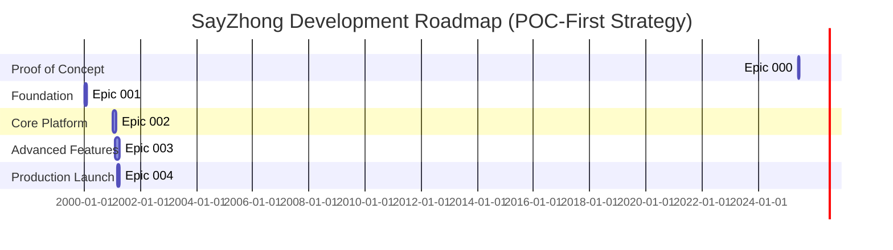

# SayZhong Epic Planning Overview

**Document Version**: 2.0  
**Last Updated**: June 2, 2025  
**Project**: SayZhong AI-Powered Mandarin Learning Platform

## Epic Structure Overview

The SayZhong project follows a proof-of-concept-first development strategy, organized into five strategic epics that deliver incremental, deployable value while building toward a comprehensive AI-powered Mandarin learning platform. Each epic represents a significant milestone with clear business value and technical deliverables.

**Development Philosophy**: We prioritize validating the core learning experience and AI capabilities through a local proof of concept before investing in full infrastructure and platform development.

## Epic Roadmap

**Total Timeline**: 24 weeks (6 months) including 2-week POC validation

## Epic Summary

### Epic 000: Proof of Concept (2 weeks) ⭐ **NEW - START HERE**
**Status**: Ready for Development  
**Business Value**: Validates core learning concepts and AI capabilities before infrastructure investment

**Key Deliverables**:
- Local demonstration of conversational Mandarin learning with phonetic approximations
- 1000 most common spoken words with pinyin and English pronunciation guidance
- 7-10 conversation scenarios with AI tutor (no audio components)
- Speaking confidence analytics and progression tracking
- Stakeholder demo-ready proof of concept (text-based pronunciation learning)
- Technical validation and architecture recommendations for conversational focus

**Success Criteria**:
- 80%+ vocabulary retention within learning session
- 20+ minutes average user engagement time with conversation practice
- 4.5+ star rating for phonetic approximation quality
- Positive stakeholder validation for full conversational platform development

**Critical Path**: This epic blocks all subsequent development and must succeed for project continuation.

### Epic 001: Foundation Infrastructure (4 weeks)
**Status**: Pending POC Validation  
**Business Value**: Establishes secure, scalable technical foundation based on POC learnings

**Key Deliverables**:
- Azure infrastructure with AI framework (Semantic Kernel + Azure OpenAI)
- Multi-layer state management and data storage (Azure Data Lake Gen2)
- Security architecture with Azure Key Vault and compliance
- CI/CD pipeline with automated testing (GitHub Actions + Azure Container Apps)
- Performance monitoring and optimization framework
- Comprehensive testing infrastructure with AI mocking

**Success Criteria**:
- Infrastructure provisioning < 30 minutes
- Test coverage > 90%
- Deployment success rate > 95%
- Security baseline validated

### Epic 002: Core Learning Platform (6 weeks)
**Status**: Architecture Dependent on POC Results  
**Business Value**: Delivers scalable MVP based on validated POC features

**Key Deliverables**:
- **Vocabulary learning system with spaced repetition** (1500 spoken words)
- **Pronunciation learning with English phonetic approximations**  
- **AI conversation scenarios with context awareness**
- **Speaking confidence tracking and analytics dashboard**
- Content management system with A/B testing framework
- Responsive Streamlit UI with accessibility features

**Success Criteria**:
- **Vocabulary retention rate** > 85% (spoken words focus)
- **Session completion rate** > 80% (conversation practice)
- **AI response time** < 3 seconds (conversation scenarios)
- **User satisfaction** > 4.0/5.0 (speaking practice experience)

### Epic 003: Advanced Learning Features (8 weeks)
**Status**: Ready for Planning (Depends on Epic 002)  
**Business Value**: Transforms MVP into comprehensive, adaptive learning system

**Key Deliverables**:
- **Conversational learning effectiveness feedback loop** with AI adaptation
- **Expanded spoken vocabulary library** (2000+ words with phonetic approximations)
- **Advanced speaking assessment and progress tracking**
- **Sophisticated gamification system** for conversation practice
- **AI-powered conversational lesson planning** and optimization
- **Multi-layer performance optimization** for speaking platform

**Success Criteria**:
- **Conversational learning effectiveness improvement** > 15%
- **Time to speaking confidence mastery reduction** > 20%
- **User retention (30-day)** > 85%
- **Cache hit rate** > 90%

### Epic 004: Production Launch Readiness (4 weeks)
**Status**: Ready for Planning (Depends on Epic 003)  
**Business Value**: Enables public launch with enterprise-grade reliability

**Key Deliverables**:
- Production security and compliance framework
- Comprehensive monitoring and observability
- Scalability and performance optimization
- User support and help systems
- Business analytics and reporting
- Legal compliance and operational procedures

**Success Criteria**:
- System uptime > 99.9%
- MTTR < 15 minutes
- Support resolution < 4 hours
- User acquisition cost < $25

## Cross-Epic Dependencies

### Critical Path Dependencies
1. **Epic 000 (POC) → All Other Epics**: POC success is required for project continuation
2. **Epic 000 → Epic 001**: POC learnings inform infrastructure architecture decisions
3. **Epic 001 → Epic 002**: AI framework, data storage, and testing infrastructure
4. **Epic 002 → Epic 003**: Core learning platform with user feedback and baseline metrics
5. **Epic 003 → Epic 004**: Advanced features validated and performance-optimized

### Technical Dependencies
1. **Epic 000**: Validates Azure OpenAI integration patterns and learning algorithms
2. **Epic 001**: Implements POC patterns at scale with production infrastructure
3. **Epic 002**: Scales POC features with proper data persistence and user management
4. **Epic 003**: Builds on validated core platform with advanced AI capabilities
5. **Epic 004**: Operationalizes the complete system for public launch

### Content Dependencies
1. **Epic 000**: Core spoken vocabulary set (1000 most common spoken words) for POC validation
2. **Epic 002**: Expanded spoken vocabulary (1500 words) with phonetic approximations  
3. **Epic 003**: Advanced conversational content (2000+ words) with cultural context
4. **Epic 004**: User documentation and support content for speaking practice platform

### Business Dependencies
1. **Epic 000**: Azure OpenAI API access and stakeholder buy-in
2. **Epic 001**: Azure subscription and service quotas (informed by POC usage)
3. **Epic 002**: User testing program and feedback collection
4. **Epic 003**: Learning effectiveness validation and expert review
5. **Epic 004**: Legal compliance review and marketing strategy

## Resource Allocation

### Team Structure by Epic
| Epic | Duration | Team Size | Key Roles |
|------|----------|-----------|-----------|
| 000 | 2 weeks | 2-3 developers | Full-Stack, AI/ML, Product (POC) |
| 001 | 4 weeks | 2-3 developers | DevOps, Security, AI Framework |
| 002 | 6 weeks | 3-4 developers + 1 content specialist | Learning Experience, UI/UX, Content |
| 003 | 8 weeks | 4-5 developers + 1 data scientist + 1 content specialist | AI/ML, Data Science, Advanced Features |
| 004 | 4 weeks | 3-4 developers + 1 DevOps + 1 Business Analyst | Operations, Security, Business |

### Total Effort Estimation
- **Total Duration**: 24 weeks (6 months) including POC
- **POC Duration**: 2 weeks (critical validation period)
- **Total Effort**: 960 developer hours (including POC)
- **Peak Team Size**: 6-7 people (Epics 003-004)
- **Critical Path**: POC Validation → Foundation → Core Platform → Advanced Features → Production Launch

## Risk Management Framework

### High-Priority Risks Across Epics
1. **POC Validation Risk**: Core learning concepts may not prove effective or technically feasible
2. **AI Service Dependencies**: Azure OpenAI quota and service reliability  
3. **Learning Effectiveness**: Educational content quality and user engagement
4. **Performance at Scale**: System performance under production load
5. **Security and Compliance**: Data protection and regulatory requirements

### Mitigation Strategies
- **POC-First Approach**: Validate core value proposition before infrastructure investment
- **Progressive Development**: Each epic delivers deployable value
- **Comprehensive Testing**: >90% code coverage with AI mocking
- **User Validation**: Continuous feedback collection and integration
- **Performance Monitoring**: Proactive optimization and alerting

## Success Metrics Framework

### Business Metrics
- **User Acquisition**: Cost < $25, Conversion > 15%
- **User Engagement**: Retention > 85%, Session completion > 80%
- **Learning Effectiveness**: Vocabulary retention > 85%, Tone accuracy improvement > 60%
- **Revenue**: Monthly growth > 20%, Customer LTV > $150

### Technical Metrics
- **Performance**: Response time < 3s, Uptime > 99.9%
- **Quality**: Test coverage > 90%, Security incidents = 0
- **Efficiency**: Deployment time < 1 hour, MTTR < 15 minutes
- **Cost**: Azure optimization > 20%, Infrastructure cost predictability

### Educational Metrics
- **HSK Progression**: Level 1 completion in 3 months
- **Content Effectiveness**: A/B test improvements > 15%
- **User Satisfaction**: Support rating > 4.5/5.0
- **Retention**: Long-term engagement > 25% improvement

## Quality Assurance Strategy

### Testing Strategy by Epic
1. **Epic 001**: Infrastructure testing, security validation, performance baseline
2. **Epic 002**: Learning feature testing, AI integration validation, user acceptance testing
3. **Epic 003**: Advanced feature testing, learning effectiveness validation, performance optimization
4. **Epic 004**: Production readiness testing, security audit, compliance validation

### Continuous Quality Measures
- **Test-Driven Development**: All features developed with tests first
- **AI Testing**: Mocking framework for deterministic AI service testing
- **User Testing**: Regular validation with real learners throughout development
- **Performance Testing**: Load testing at each epic completion

## Communication and Governance

### Epic Review Checkpoints
- **Epic Planning**: Architecture review, dependency validation, resource allocation
- **Mid-Epic Review**: Progress assessment, risk mitigation, scope adjustment
- **Epic Completion**: Deliverable validation, metrics achievement, next epic readiness

### Stakeholder Communication
- **Weekly Progress**: Development team updates and blocker resolution
- **Epic Reviews**: Stakeholder demonstration and feedback collection
- **Milestone Communication**: Business value delivery and success metrics

## Next Steps

### Immediate Actions (Week 1) - POC FOCUS 🎯
1. **Epic 000 Execution**: Begin proof of concept development immediately
2. **Azure OpenAI Setup**: Configure API access and development environment
3. **Team Assembly**: Ensure POC team has required skills and access
4. **Success Criteria Definition**: Finalize POC evaluation metrics and demo requirements

### Short-term Goals (Weeks 2-3) - POC VALIDATION
1. **POC Completion**: Finish all POC features and prepare stakeholder demos
2. **Results Analysis**: Evaluate learning effectiveness, technical feasibility, and stakeholder feedback
3. **Go/No-Go Decision**: Determine whether to proceed with full development
4. **Epic 001 Planning**: If POC succeeds, begin detailed infrastructure planning incorporating POC learnings

---

## Epic Documentation

### Individual Epic Documents
- **[Epic 000: Proof of Concept](epic-000-proof-of-concept.md)** ⭐ **START HERE**
- [Epic 001: Foundation Infrastructure](epic-001-foundation-infrastructure.md)
- [Epic 002: Core Learning Platform](epic-002-core-learning-platform.md)
- [Epic 003: Advanced Learning Features](epic-003-advanced-learning-features.md)
- [Epic 004: Production Launch Readiness](epic-004-production-launch-readiness.md)

### Related Documentation
- [Project Requirements](../requirements.md)
- [Architecture Decision Records](../adr/)
- [Research Documents](../../research/)

---

*Last Updated: June 2, 2025 - Added Epic 000 (Proof of Concept) to prioritize validation before infrastructure investment*

## Conclusion

The SayZhong epic structure provides a clear roadmap for delivering a comprehensive AI-powered Mandarin learning platform. Each epic builds upon previous deliverables while providing independent business value, enabling iterative development with continuous user feedback and validation.

The 22-week development timeline balances aggressive feature delivery with quality assurance and user validation, positioning SayZhong for successful market entry and sustained growth in the competitive language learning market.

---

**Document Ownership**: Development Team Lead  
**Review Cycle**: Weekly during active development  
**Update Frequency**: After each epic completion  
**Stakeholder Distribution**: Development Team, Product Management, Business Leadership
